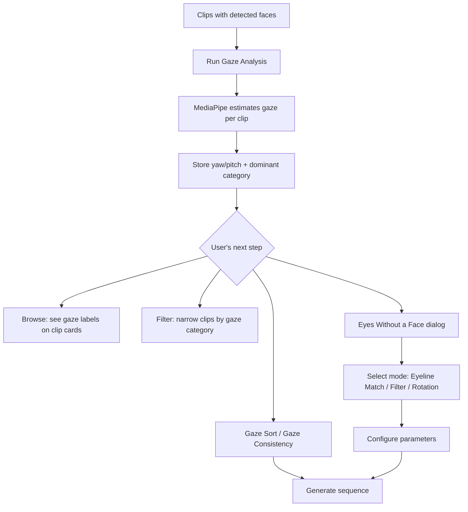

# Gaze Direction Analysis & Eyes Without a Face Sequencer

## Problem Frame

When editing footage of people, the direction subjects are looking is a fundamental compositional element — it determines eyeline matches across cuts, creates visual continuity or contrast, and shapes the viewer's sense of spatial relationships. Currently, Scene Ripper has no way to detect, tag, or sequence by gaze direction, so editors must manually review clips to find eyeline matches or sort by where subjects are looking.

## Requirements

**Analysis**

- R1. Add a gaze direction analysis operation that uses MediaPipe Face Mesh with iris landmarks to estimate where the primary face in each clip is looking
- R2. Store gaze as continuous yaw (horizontal) and pitch (vertical) angles on the Clip model, plus a derived categorical label (at camera, looking left, looking right, looking up, looking down). New gaze fields must be persisted through Clip.to_dict/from_dict so gaze data survives project save/load
- R3. For clips with multiple faces, use the largest face (by bounding box area) as the primary face. Categorize gaze direction per sampled frame, then use the most frequent category as the clip's gaze label. Store the median yaw and pitch angles from frames matching the dominant category as the clip's continuous gaze values
- R4. Register gaze analysis as an analysis operation (operation key: `gaze`, phase: `sequential`) in the existing analysis pipeline, runnable from the Analyze tab like other operations. The Eyes Without a Face algorithm config should declare `required_analysis: ['gaze']`
- R5. Display the categorical gaze label on clip cards and in the clip browser for easy visual scanning

**Sequencer: Eyes Without a Face**

- R6. Add two non-dialog gaze sequencer algorithms following existing codebase patterns:
  - **Gaze Sort**: Order clips by gaze angle — user selects axis (yaw or pitch) and direction (ascending/descending), like brightness or color sort
  - **Gaze Consistency**: Group clips where subjects look in the same direction for montages with unified visual direction
- R7. Create a dialog-based sequencer algorithm called "Eyes Without a Face" with three modes:
  - **Eyeline Match**: Pair clips with complementary gaze angles to create shot-reverse-shot patterns (A looks right → B looks left)
  - **Filter**: Keep only clips matching a selected gaze category (at camera, looking left, etc.)
  - **Rotation**: Sequence clips by progressively changing gaze angle, sweeping through a user-defined range within the realistic gaze span (e.g., -45° to +45° yaw)
- R9. Clips without gaze data are excluded from gaze-based sequencing and appended at the end of the sequence, consistent with how other algorithms handle missing analysis data
- R10. The Eyes Without a Face dialog should let the user select which mode to use and configure mode-specific parameters (angle range, category, tolerance)

**Filtering & Browsing**

- R8. Gaze categories should be available as filter criteria in the Sequence tab's clip filtering, consistent with how other metadata filters work

## User Flow

## Success Criteria

- Gaze analysis produces yaw/pitch angles and categorical labels for clips containing faces
- Categorical labels are visible on clip cards without extra clicks
- Gaze Sort and Gaze Consistency algorithms produce correctly ordered/grouped sequences
- Eyes Without a Face dialog produces meaningful sequences in all three modes
- Eyeline match mode successfully pairs complementary gaze directions
- Rotation mode produces a sequence where gaze angles progress monotonically through the requested range

## Scope Boundaries

- Clips only — no Frame-level gaze analysis in this iteration (planned for later)
- Primary face only — in multi-person clips, only the largest face is analyzed; other faces are ignored (not stored, not sequenceable)
- No real-time/live gaze tracking — batch analysis only
- L2CS-Net is noted as a potential future upgrade for higher-precision gaze estimation, but MediaPipe is the implementation target

## Key Decisions

- **MediaPipe over InsightFace landmarks**: InsightFace's 5 keypoints can estimate head pose but cannot distinguish eye direction from head direction. MediaPipe's iris landmarks provide true gaze estimation at low cost.
- **Dedicated gaze over extending cinematography**: The existing CinematographyAnalysis has a `lead_room` field that acts as a gaze proxy ("space in direction of gaze"), but it is VLM-inferred, qualitative (tight/normal/excessive), and describes composition rather than gaze angle. MediaPipe provides precise, numeric gaze angles suitable for algorithmic sequencing.
- **Continuous angles as the primary data**: Categories derive from angles, not vice versa. This makes the data useful for both human browsing (categories) and algorithmic sequencing (numeric values).
- **Dominant category over averaging**: Per-frame gaze is categorized, then the most frequent category wins. Median angles from matching frames provide the continuous value. This preserves the discrete signal that averaging would wash out (e.g., a left-to-right sweep won't average to "center").
- **Split simple vs. novel sequencer modes**: Gaze Sort and Gaze Consistency follow the existing non-dialog algorithm pattern (like brightness/color sort). The novel modes (Eyeline Match, Filter, Rotation) live in the "Eyes Without a Face" dialog. This follows established codebase patterns while keeping the genuinely unique logic in a dedicated dialog.

## Dependencies / Assumptions

- MediaPipe is a new dependency; should be registered in the feature registry for on-demand installation
- Gaze analysis uses MediaPipe's own face detection (independent of InsightFace) — no prior face detection step is required. Clips where MediaPipe finds no face are skipped and will have no gaze data
- Face detection (InsightFace) and gaze analysis (MediaPipe) are fully separate operations with separate models and separate analysis pipeline entries

## Outstanding Questions

### Deferred to Planning

- [Affects R2][Technical] What angle thresholds should map to each categorical label (e.g., yaw > 15° = looking left)?
- [Affects R7][Technical] For eyeline match mode, what tolerance should be used when pairing complementary angles? Should this be user-configurable?
- [Affects R7][Technical] For rotation mode, how should clips be interpolated when available gaze angles don't evenly cover the requested range?
- [Affects R3][Needs research] What sampling interval works best for MediaPipe gaze estimation on video clips — same as face detection (1 frame/sec) or different?
- [Affects R1][Technical] Should gaze analysis auto-run when face detection runs, or remain a fully separate operation?

## Next Steps

→ `/ce:plan` for structured implementation planning
