# Semantic Clip Search & Enhanced Filtering

## Problem Frame

Scene Ripper's analysis pipeline generates rich metadata across 30+ dimensions per clip (colors, shot types, objects, faces, gaze, brightness, volume, embeddings, OCR text, descriptions, cinematography). But discovery is bottlenecked — the ClipBrowser UI filters by only 6 dimensions (shot type, color palette, transcript, custom query, duration, aspect ratio), and the agent's `filter_clips` tool covers about 10. Users cannot query the full breadth of their analyzed data, making analysis feel less valuable than it is. Multi-source supercuts — combining clips from multiple videos based on criteria — are not possible without manual scanning.

## User Flow

```mermaid
flowchart TB
    A[User imports & analyzes clips] --> B{Discovery method}
    B -->|Visual filters| C[ClipBrowser: combine filters]
    B -->|Natural language| D[Agent chat: describe what you want]
    B -->|Visual similarity| E[Click 'Find Similar' on a clip]
    C --> F[Filtered clip grid]
    D --> F
    E --> F
    F --> G[Select clips in filtered view]
    G --> H[Switch to Sequence tab]
    H --> I[Apply algorithm to selected clips]
```

## Requirements

**Enhanced ClipBrowser Filters**

- R1. Add a gaze direction filter dropdown to ClipBrowser: "All Gaze", "At Camera", "Looking Left", "Looking Right", "Looking Up", "Looking Down" — filters on `clip.gaze_category`
- R2. Add an object detection filter to ClipBrowser: text input that filters clips containing a matching object label in `clip.object_labels` or `clip.detected_objects[].label` (case-insensitive substring match)
- R3. Add a brightness range filter to ClipBrowser: dual-handle slider (0.0–1.0) filtering on `clip.average_brightness`
- R4. Add a description search filter to ClipBrowser: text input with case-insensitive substring matching on `clip.description` (similar to existing transcript search)
- R5. All new filters combine with existing filters using AND logic
- R6. Filters that depend on unanalyzed data show as disabled with a tooltip explaining what analysis is needed (consistent with how algorithm cards handle missing analysis)

**Visual Similarity Search**

- R7. Add a "Find Similar" action on each clip card/thumbnail in ClipBrowser that filters the grid to show the N most visually similar clips, ranked by DINOv2 embedding cosine similarity
- R8. When similarity mode is active, show a visual indicator (e.g., highlight or badge) and a "Clear Similarity" button to return to normal filtering
- R9. Similarity search requires a valid `embedding` field — clips without embeddings or with zero-vector embeddings (from failed thumbnail extraction) are excluded from results. Check `norm(embedding) > 0` in addition to `embedding is not None`

**Enhanced Agent Tool**

- R10. Expand the existing `filter_clips` agent tool with new filter parameters: `gaze_category`, `min_brightness`/`max_brightness`, `search_ocr_text`, `min_volume`/`max_volume`, `search_tags`, `search_notes`, and a curated set of `cinematography_*` fields. Note: `has_object`, `search_description`, `has_faces`, `min_people`/`max_people` already exist — verify behavior before modifying
- R11. Add a `similar_to_clip_id` parameter to `filter_clips` that returns clips ranked by embedding similarity to the given clip, combinable with other filters
- R12. Agent search results should include key metadata fields not currently returned: `average_brightness`, `rms_volume`, `tags`, `notes`, `extracted_texts` (combined text), and cinematography summary fields. Exclude raw embedding vectors from results.

**Cross-Source Discovery**

- R13. Filters work across all clips from all loaded sources — not scoped to a single source. This is the existing ClipBrowser behavior and must be preserved.
- R14. Search results should indicate which source each clip comes from (source filename or label visible in the filtered grid)

## Success Criteria

- Users can find specific clips across multiple sources using any combination of analyzed metadata
- The agent can answer queries like "find all close-ups with warm lighting where someone is looking at the camera" in a single tool call
- Visual similarity search surfaces related clips that a user wouldn't find via metadata filters alone
- Every analysis dimension is searchable via at least one path (UI filter or agent tool parameter)

## Scope Boundaries

- No new tab — all UI changes happen within the existing ClipBrowser widget
- No drag-drop from search results to Sequence (use existing select → switch tab workflow)
- AND-only filter logic (no OR/NOT boolean combinations)
- No saved searches or smart collections in v1
- No text-to-image embedding search (CLIP) — similarity is visual-to-visual only using existing DINOv2 embeddings
- No full-text search indexing (SQLite FTS, Whoosh, etc.) — substring matching is sufficient for the current clip counts
- Cinematography sub-field filters in agent tool only, not in ClipBrowser UI (too many dropdowns — agent handles the long tail)

## Key Decisions

- **Enhance ClipBrowser, not a new tab**: Search lives where clips are already browsed (Cut and Analyze tabs). No context switching.
- **Expand filter_clips, not a new tool**: One tool with more parameters is easier for the agent to learn than a separate search tool. Backward compatible.
- **DINOv2 similarity, not CLIP text-to-image**: Existing infrastructure supports visual similarity without loading a new model. Text-to-image can be a future addition.
- **AND-only filter logic**: Covers 90%+ of use cases, dramatically simpler UI and query engine.
- **Substring matching over full-text search**: Project scale (hundreds to low thousands of clips) doesn't warrant indexing infrastructure.

## Dependencies / Assumptions

- `clip.embedding` (DINOv2 768-dim) is already L2-normalized and stored per clip — similarity is a dot product
- ClipBrowser widget (`ui/clip_browser.py`) already supports the filter pattern — new filters follow the same architecture
- `filter_clips` tool in `core/chat_tools.py` already handles multiple optional filter parameters
- Gaze analysis (`core/analysis/gaze.py`) already populates `gaze_category` with the expected values

## Outstanding Questions

### Deferred to Planning

- [Affects R7][Technical] How many similar clips should "Find Similar" return — fixed N (e.g., 10), a similarity threshold, or all clips sorted by similarity?
- [Affects R2][Technical] Should object search match against `object_labels` (ImageNet classification), `detected_objects` (YOLO), or both? Matching both gives broader coverage but may return different label vocabularies.
- [Affects R3][Resolved] `ui/widgets/range_slider.py` already provides a production-quality `RangeSlider` — used by ClipBrowser for the duration filter. Reuse with `RangeSlider(0.0, 1.0)` and no suffix.
- [Affects R10][Technical] Which `cinematography.*` sub-fields should be exposed as agent filter parameters? All ~20 fields, or a curated subset of the most useful ones?
- [Affects R14][Technical] How should source identification work in the filtered grid — a small label overlay on thumbnails, a grouping header, or a source column?

## Next Steps

→ `/ce:plan` for structured implementation planning
