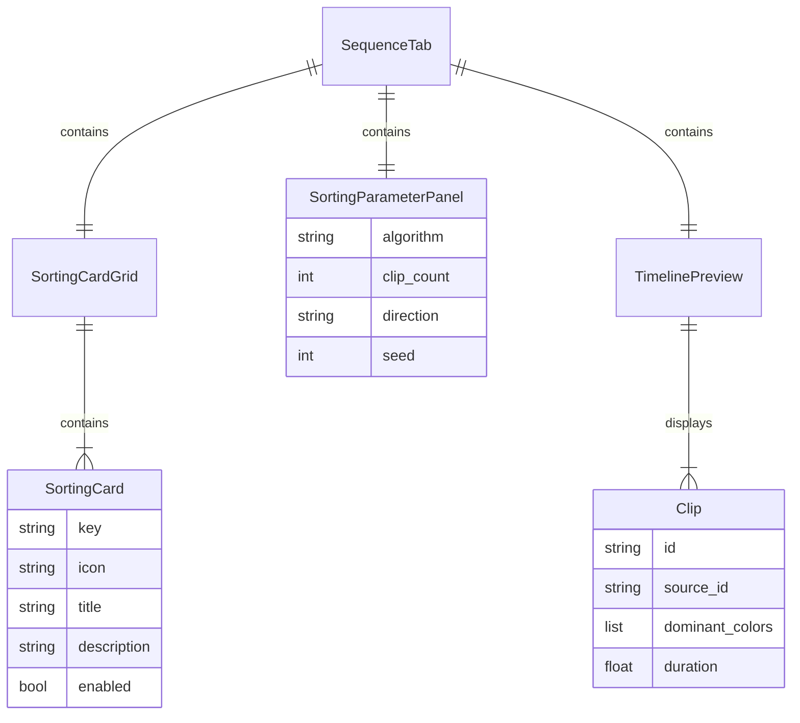

# Redesign Sequence Tab with Card-Based Sorting Experience

## Overview

Transform the Sequence Tab from a single-view timeline into a card-based experience where users first select a sorting algorithm from visual cards, then configure parameters while seeing a live-updating timeline preview. This architecture enables expansion to advanced algorithms (similarity lookup, motion tracking) and full agent integration.

## Problem Statement / Motivation

The current Sequence Tab jumps directly into a timeline view with a dropdown for sorting algorithms. This has several limitations:

1. **Discoverability**: Users don't know what sorting options exist until they click a dropdown
2. **Extensibility**: Adding new algorithms (similarity, motion tracking) would overcrowd the dropdown
3. **Context**: No space to explain what each algorithm does or show its parameters
4. **Agent Integration**: No clean API for agents to select algorithms and set parameters

The card-based approach solves all of these by giving each algorithm its own visual entry point, dedicated parameter panel, and agent-callable API.

## Proposed Solution

### High-Level Architecture

```
┌─────────────────────────────────────────────────────────────────┐
│                        SEQUENCE TAB                              │
├─────────────────────────────────────────────────────────────────┤
│                                                                  │
│  STATE 0: No Clips         STATE 1: Card Grid                   │
│  ┌───────────────────┐     ┌─────────────────────────────────┐  │
│  │                   │     │  ┌─────────┐  ┌─────────┐       │  │
│  │   No clips yet    │     │  │ Color   │  │Duration │       │  │
│  │                   │     │  │  🎨     │  │   ⏱️    │       │  │
│  │   Detect scenes   │     │  └─────────┘  └─────────┘       │  │
│  │   first           │     │  ┌─────────┐  ┌─────────┐       │  │
│  │                   │     │  │ Shuffle │  │Chrono   │       │  │
│  └───────────────────┘     │  │   🎲    │  │   📅    │       │  │
│                            │  └─────────┘  └─────────┘       │  │
│                            └─────────────────────────────────┘  │
│                                                                  │
│  STATE 2: Parameter View                                         │
│  ┌─────────────────────────────────────────────────────────────┐│
│  │ ← Back to Options          [Color Sort]                      ││
│  ├────────────────────────────┬────────────────────────────────┤│
│  │  Parameters                │  Preview Timeline              ││
│  │  ───────────               │  ──────────────────            ││
│  │  Clip Count: [10] ▼        │  ┌──┬──┬──┬──┬──┬──┐          ││
│  │  Direction:  [Rainbow] ▼   │  │  │  │  │  │  │  │          ││
│  │                            │  └──┴──┴──┴──┴──┴──┘          ││
│  │  [Apply to Timeline]       │                                ││
│  └────────────────────────────┴────────────────────────────────┘│
└─────────────────────────────────────────────────────────────────┘
```

### State Machine

```
Tab Inactive
     │
     ▼ (tab activated)
┌────┴────┐
│ Check   │──── no clips ────▶ STATE_NO_CLIPS (EmptyStateWidget)
│ Clips   │                           │
└────┬────┘                    clips added
     │                                │
clips available                       ▼
     │                    ◀───────────┘
     ▼
STATE_CARD_SELECTION (SortingCardGrid)
     │
     │ card clicked
     ▼
STATE_PARAMETER_VIEW (ParameterPanel + TimelinePreview)
     │
     ├── param changed ──▶ debounced preview update (300ms)
     │
     ├── back clicked ──▶ STATE_CARD_SELECTION
     │
     └── apply clicked ──▶ commit to timeline, stay in view
```

## Technical Approach

### New Components

#### 1. `SortingCard` Widget (`ui/widgets/sorting_card.py`)

A clickable card showing algorithm icon, name, and description.

```python
class SortingCard(QFrame):
    """A clickable card for selecting a sorting algorithm."""

    clicked = Signal(str)  # algorithm key

    def __init__(self, key: str, icon: str, title: str, description: str):
        # Follow ClipThumbnail pattern from clip_browser.py:66-305
        # Fixed size: 200x150
        # Hover/selected states via stylesheet
        # Disabled state for unavailable algorithms (e.g., color without analysis)
```

**Styling (follow theme patterns):**
- Normal: `theme().card_background`, `theme().card_border`
- Hover: Lightened border
- Selected: `theme().accent_blue`, `theme().accent_blue_hover` border
- Disabled: Grayed out with tooltip explaining why

#### 2. `SortingCardGrid` Widget (`ui/widgets/sorting_card_grid.py`)

Grid layout containing all sorting cards.

```python
class SortingCardGrid(QWidget):
    """Grid of sorting algorithm cards."""

    algorithm_selected = Signal(str)  # algorithm key

    def __init__(self):
        # QGridLayout with 2 columns
        # Cards for: color, duration_short, shuffle, sequential

    def set_algorithm_availability(self, available: dict[str, bool]):
        """Enable/disable cards based on clip analysis state."""
        # e.g., disable "color" if no clips have dominant_colors
```

#### 3. `SortingParameterPanel` Widget (`ui/widgets/sorting_parameter_panel.py`)

Dynamic parameter controls based on selected algorithm.

```python
class SortingParameterPanel(QWidget):
    """Parameter controls for the selected sorting algorithm."""

    parameters_changed = Signal(dict)  # current parameter values
    apply_clicked = Signal()
    back_clicked = Signal()

    def set_algorithm(self, algorithm: str):
        """Show parameters for the specified algorithm."""
        # Clear existing controls
        # Add algorithm-specific controls (see parameter specs below)

    def get_parameters(self) -> dict:
        """Return current parameter values."""
```

#### 4. `TimelinePreview` Widget (`ui/widgets/timeline_preview.py`)

Lightweight timeline showing sorted clips without full editing controls.

```python
class TimelinePreview(QWidget):
    """Read-only preview of sorted clips."""

    def __init__(self):
        # Simplified TimelineScene without drag-drop
        # Shows clip thumbnails in sequence

    def set_clips(self, clips: list[Clip], sources: dict[str, Source]):
        """Update preview with new clip order."""

    def set_loading(self, loading: bool):
        """Show/hide loading indicator during sort computation."""
```

### Algorithm Parameters

| Algorithm | Key | Parameters |
|-----------|-----|------------|
| **Color** | `color` | `clip_count` (int, 1-100), `direction` (str: "rainbow", "warm_to_cool", "cool_to_warm") |
| **Duration (Short First)** | `duration_short` | `clip_count` (int, 1-100) |
| **Duration (Long First)** | `duration_long` | `clip_count` (int, 1-100) |
| **Shuffle** | `shuffle` | `clip_count` (int, 1-100), `seed` (int, optional for reproducibility) |
| **Sequential** | `sequential` | `clip_count` (int, 1-100) |

**Note:** All algorithms share `clip_count`. Algorithm-specific params are optional.

### Agent Tool Integration

Add to `core/chat_tools.py`:

```python
@tools.register(
    description="List available sorting algorithms and their current availability status",
    requires_project=True,
)
def list_sorting_algorithms(project) -> dict:
    """Returns available algorithms and whether they can be used (e.g., color requires analysis)."""
    return {
        "algorithms": [
            {"key": "color", "name": "Color", "available": True, "reason": None},
            {"key": "shuffle", "name": "Shuffle", "available": True, "reason": None},
            # ...
        ]
    }

@tools.register(
    description="Generate a sequence using a sorting algorithm with parameters. "
                "Returns a preview of the sequence without committing it.",
    requires_project=True,
    modifies_gui_state=True,
)
def generate_remix(
    project,
    gui_state,
    algorithm: str,
    clip_count: int = 10,
    direction: str = None,  # for color sorting
    seed: int = None,  # for shuffle reproducibility
) -> dict:
    """
    Generate a sequence using the specified algorithm.

    Args:
        algorithm: One of "color", "duration_short", "duration_long", "shuffle", "sequential"
        clip_count: Number of clips to include (1-100)
        direction: For color sort: "rainbow", "warm_to_cool", "cool_to_warm"
        seed: For shuffle: random seed for reproducibility

    Returns:
        {"success": True, "preview_clips": [...], "algorithm": "...", "applied": True}
    """
    # 1. Validate algorithm and params
    # 2. Get clips from project
    # 3. Call generate_sequence() from core/remix
    # 4. Update GUI via gui_state
    # 5. Return result

@tools.register(
    description="Get the current state of the sequence tab including selected algorithm, "
                "parameters, and preview clips",
    requires_project=True,
)
def get_remix_state(project, gui_state) -> dict:
    """Returns current sorting state for agent awareness."""
    return {
        "current_algorithm": "color",
        "parameters": {"clip_count": 10, "direction": "rainbow"},
        "preview_clip_count": 10,
        "applied": False,
    }
```

### Modified Files

| File | Changes |
|------|---------|
| `ui/tabs/sequence_tab.py` | Complete rewrite to support card grid + parameter view states |
| `core/remix/__init__.py` | Add `direction` parameter to color sort, `seed` to shuffle |
| `core/chat_tools.py` | Add `list_sorting_algorithms`, `generate_remix`, `get_remix_state` |

### New Files

| File | Purpose |
|------|---------|
| `ui/widgets/sorting_card.py` | Individual sorting option card |
| `ui/widgets/sorting_card_grid.py` | Grid container for cards |
| `ui/widgets/sorting_parameter_panel.py` | Algorithm-specific parameter controls |
| `ui/widgets/timeline_preview.py` | Lightweight read-only timeline preview |

## Implementation Phases

### Phase 1: Core Card Infrastructure

**Tasks:**
- [ ] Create `SortingCard` widget following `ClipThumbnail` patterns
- [ ] Create `SortingCardGrid` with 2x2 layout for 4 MVP algorithms
- [ ] Add card icons and descriptions
- [ ] Implement hover/selected/disabled states
- [ ] Update `SequenceTab` to show card grid when clips available

**Success Criteria:**
- Cards display in 2x2 grid
- Clicking card emits signal with algorithm key
- Cards follow theme styling

### Phase 2: Parameter Panel + Preview

**Tasks:**
- [ ] Create `SortingParameterPanel` with algorithm-specific controls
- [ ] Create `TimelinePreview` (simplified read-only timeline)
- [ ] Wire parameter changes to preview updates (debounced 300ms)
- [ ] Add "Back" button to return to card grid
- [ ] Add "Apply to Timeline" button

**Success Criteria:**
- Selecting card shows parameter panel + preview
- Changing parameters updates preview live
- Apply button commits sequence to main timeline

### Phase 3: Agent Integration

**Tasks:**
- [ ] Add `list_sorting_algorithms` tool
- [ ] Add `generate_remix` tool with full parameter support
- [ ] Add `get_remix_state` tool for agent state awareness
- [ ] Test agent can: select algorithm → set params → apply
- [ ] Add guard flags for GUI-modifying operations (per learnings)

**Success Criteria:**
- Agent can generate sequences via chat
- Agent can query current state
- GUI updates correctly from agent actions

### Phase 4: Polish + Edge Cases

**Tasks:**
- [ ] Handle no-clips state gracefully
- [ ] Disable color card when no clips have `dominant_colors`
- [ ] Add loading spinner during preview computation
- [ ] Add keyboard navigation (Tab/Arrow/Enter)
- [ ] Persist selected algorithm when switching tabs

**Success Criteria:**
- All edge cases handled
- Smooth UX for all user flows
- Keyboard accessible

## Acceptance Criteria

### Functional Requirements

- [ ] Sequence Tab shows card grid when clips are available
- [ ] Four sorting cards displayed: Color, Duration, Shuffle, Sequential
- [ ] Clicking card shows parameter panel and timeline preview
- [ ] Parameters include clip count (all algorithms) + algorithm-specific options
- [ ] Timeline preview updates within 500ms of parameter change
- [ ] "Apply" button commits sequence to main timeline
- [ ] "Back" button returns to card grid
- [ ] Agent can select algorithm via `generate_remix` tool
- [ ] Agent can query state via `get_remix_state` tool

### Non-Functional Requirements

- [ ] Preview updates debounced (300ms) to prevent lag
- [ ] Cards disable gracefully when prerequisites not met (with tooltip)
- [ ] All components follow `theme()` styling
- [ ] Signal handlers use guard flags (per documented learnings)
- [ ] State owned by single source of truth (no duplicate Sequence objects)

### Quality Gates

- [ ] No duplicate state objects (per `timeline-widget-sequence-mismatch` learning)
- [ ] All signal handlers have guard flags (per `qthread-destroyed-duplicate-signal` learning)
- [ ] Model/view sync verified in init (per `qgraphicsscene-missing-items` learning)
- [ ] Worker IDs synced before use (per `pyside6-thumbnail-source-id-mismatch` learning)

## Risk Analysis & Mitigation

| Risk | Impact | Mitigation |
|------|--------|------------|
| Live preview causes lag on 50+ clips | Poor UX | Debounce (300ms), limit preview to 50 clips max, show count indicator |
| Color sort unavailable (no analysis) | User confusion | Disable card with clear tooltip, offer to run analysis |
| Agent/user race conditions | Corrupted state | Use guard flags, mutex on apply operations |
| State lost on tab switch | User frustration | Persist algorithm selection and params in tab state |

## Dependencies & Prerequisites

- Clips must be available from Cut tab analysis
- For color sorting: clips need `dominant_colors` from color analysis
- FFmpeg for thumbnail generation (already available)
- Existing `core/remix/` algorithms (already implemented)

## Future Considerations

This architecture enables expansion to:

1. **Similarity Lookup**: Add card for "Similar to..." with clip selector
2. **Motion Tracking**: Add card for motion-based sorting (requires analysis)
3. **Audio Matching**: Sort clips by audio similarity or beat alignment
4. **Custom Algorithms**: Plugin system for user-defined sorting

Each new algorithm is just a new card + parameter panel + remix function.

## ERD Diagram



## References & Research

### Internal References

- Card UI patterns: `ui/clip_browser.py:66-305` (ClipThumbnail)
- Tab state patterns: `ui/tabs/base_tab.py:1-70`
- Existing remix algorithms: `core/remix/__init__.py:33-78`
- Agent tool patterns: `core/chat_tools.py:171-262`
- Timeline widget: `ui/timeline/timeline_widget.py:1-429`

### Institutional Learnings (Critical)

- State duplication: `docs/solutions/ui-bugs/timeline-widget-sequence-mismatch-20260124.md`
- Signal guard pattern: `docs/solutions/runtime-errors/qthread-destroyed-duplicate-signal-delivery-20260124.md`
- Model/view sync: `docs/solutions/runtime-errors/qgraphicsscene-missing-items-20260124.md`
- Worker ID sync: `docs/solutions/ui-bugs/pyside6-thumbnail-source-id-mismatch.md`

### External References

- PySide6 QStackedWidget: https://doc.qt.io/qtforpython-6/PySide6/QtWidgets/QStackedWidget.html
- PySide6 Signals/Slots: https://doc.qt.io/qtforpython-6/tutorials/basictutorial/signals_and_slots.html
