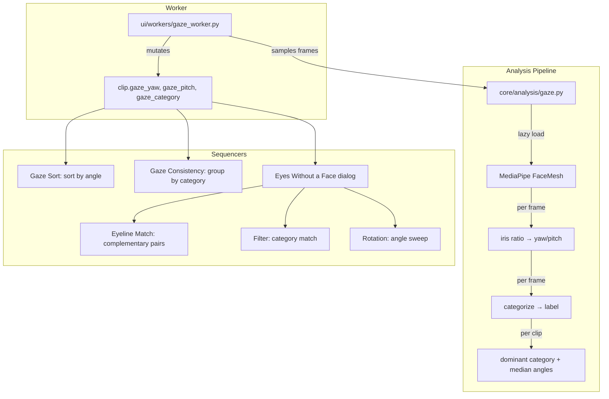

# feat: Add Gaze Direction Analysis & Eyes Without a Face Sequencer

## Overview

Add MediaPipe-based gaze direction analysis that estimates where subjects are looking in video clips, storing continuous yaw/pitch angles and categorical labels on the Clip model. Create three new sequencer algorithms — Gaze Sort (non-dialog), Gaze Consistency (non-dialog), and Eyes Without a Face (dialog with Eyeline Match, Filter, and Rotation modes). Add gaze category filtering in the Sequence tab.

## Problem Frame

When editing footage of people, gaze direction is a fundamental compositional element — it drives eyeline matches, visual continuity, and spatial relationships. Scene Ripper has no way to detect, tag, or sequence by gaze direction, forcing editors to manually review footage. The existing CinematographyAnalysis `lead_room` field is a qualitative VLM-inferred proxy, not a precise numeric signal suitable for algorithmic sequencing. (see origin: `docs/brainstorms/2026-04-03-gaze-direction-analysis-requirements.md`)

## Requirements Trace

**Analysis & Data Model**
- R1. Gaze direction analysis using MediaPipe Face Mesh with iris landmarks
- R2. Store yaw/pitch angles + categorical label on Clip, persisted through to_dict/from_dict
- R3. Largest face by bbox, dominant category approach with median angles

**Pipeline & Registry**
- R4. Register as `gaze` operation, phase `sequential`, required_analysis for algorithms

**UI & Display**
- R5. Display gaze label on clip cards
- R8. Gaze category filter in Sequence tab

**Sequencer Algorithms**
- R6. Gaze Sort + Gaze Consistency non-dialog algorithms
- R7. Eyes Without a Face dialog: Eyeline Match, Filter, Rotation modes
- R9. Clips without gaze data appended at end of sequences
- R10. Dialog mode selection with mode-specific parameters

## Scope Boundaries

- Clips only — no Frame-level gaze analysis
- Primary face only — largest face analyzed, others ignored
- Batch analysis only — no real-time tracking
- MediaPipe iris-ratio method — not solvePnP head pose
- L2CS-Net noted as future upgrade path (see origin)

## Context & Research

### Relevant Code and Patterns

**Analysis pipeline:**
- `core/analysis_operations.py` — `AnalysisOperation` dataclass registry, auto-derives phase groupings
- `core/analysis_availability.py` — `operation_is_complete_for_clip()` completeness check
- `core/analysis_dependencies.py` — maps op_key to feature registry candidates
- `core/cost_estimates.py` — TIME_PER_CLIP, OPERATION_LABELS, METADATA_CHECKS dicts
- `ui/main_window.py:_launch_analysis_worker()` ~line 3274 — if/elif dispatch chain
- `ui/workers/face_detection_worker.py` — closest template (sequential, video sampling, model lifecycle)
- `core/analysis/faces.py` — model loading pattern (lazy singleton, threading.Lock, unload)

**Data model:**
- `models/clip.py` — Clip dataclass with `to_dict()`/`from_dict()`, `_validate_optional_float()` helper

**Sequencer:**
- `core/remix/__init__.py:generate_sequence()` — central dispatcher, brightness sort as template
- `ui/algorithm_config.py` — ALGORITHM_CONFIG single source of truth (no duplicate configs)
- `ui/widgets/sorting_card_grid.py` — hardcoded 4x4 grid positions
- `ui/tabs/sequence_tab.py` — `_DIRECTION_OPTIONS`, card availability, dialog routing
- `ui/dialogs/rose_hobart_dialog.py` — dialog algorithm template (QDialog, inner worker, QStackedWidget)

**Feature registry:**
- `core/feature_registry.py` — `FeatureDeps` dataclass, `FEATURE_DEPS` dict, `_validate_feature_runtime()`

**UI:**
- `ui/clip_browser.py` — shot_type_label badge pattern (~line 203, 448-460)
- `ui/theme.py` — ThemeColors, TypeScale, Spacing, Radii

### Institutional Learnings

- **QThread duplicate signal delivery** (`docs/solutions/runtime-errors/qthread-destroyed-duplicate-signal-delivery-20260124.md`): Use guard flags, `@Slot()` decorators, `Qt.UniqueConnection` on all worker signal handlers
- **Circular import on config** (`docs/solutions/logic-errors/circular-import-config-consolidation.md`): Add algorithm ONLY to `ui/algorithm_config.py`, never duplicate across modules
- **Source ID mismatch** (`docs/solutions/ui-bugs/pyside6-thumbnail-source-id-mismatch.md`): When worker mutates Clip objects, ensure IDs match existing UI state
- **Sequence overwrite gotcha** (CLAUDE.md): Dialog algorithms must be added to both `_on_card_clicked` routing AND `dialog_algorithms` tuple

### External References

- MediaPipe Face Mesh iris landmarks 468-477: iris-to-eye-corner ratio for gaze estimation
- Reliable ranges: ~+/-30° yaw, ~+/-20° pitch
- Legacy `mp.solutions.face_mesh.FaceMesh` API (faster than Tasks API, still supported in 0.10.33)
- `refine_landmarks=True` required for iris landmarks
- Standard `mediapipe` package has native Apple Silicon support since 0.9.3

## Key Technical Decisions

- **Iris ratio method over solvePnP**: solvePnP gives head pose (where face points), iris ratios give actual eye direction (where eyes look). Eye direction is the signal needed for eyeline matching. (see origin)
- **Dominant category over averaging**: Categorize per sampled frame, take most frequent category, store median angles from matching frames. A left-to-right sweep won't average to "center." (see origin)
- **Sign convention**: Positive yaw = looking right (from subject's perspective), negative yaw = looking left. Positive pitch = looking down, negative pitch = looking up. This follows MediaPipe's coordinate system where iris displacement right/down is positive
- **Angle thresholds**: Yaw threshold 10° (left/right), pitch threshold 8° (up/down, tighter because vertical estimation is noisier due to eyelid occlusion). No dead zone — below threshold = at camera. When both yaw and pitch exceed their thresholds, yaw takes priority (horizontal gaze is more editorially significant and more reliably estimated)
- **Scaling factors**: Yaw scaled to +/-30°, pitch to +/-20° based on reliable iris estimation ranges
- **`max_num_faces` > 1 with manual selection**: Set `max_num_faces=5` so MediaPipe returns multiple faces, then select largest by bbox area. Setting `max_num_faces=1` picks most confident detection, not necessarily largest
- **`static_image_mode=True`**: Non-consecutive sampled frames break temporal tracking. Re-detect each frame independently
- **Sampling interval**: Match existing face detection default (1 frame/sec). Adequate for dominant-category approach; can bump to 2 fps if mode is noisy
- **Legacy FaceMesh API**: `mp.solutions.face_mesh.FaceMesh` — faster than Tasks API, no separate model file management, still supported
- **Gaze as fully independent operation**: No coupling to face detection. Separate checkbox in analysis picker. (Resolved from deferred question)
- **Split simple vs novel sequencer modes**: Gaze Sort and Gaze Consistency as non-dialog algorithms following brightness/color sort patterns. Eyes Without a Face as dialog for the three novel modes. (see origin)

## Open Questions

### Resolved During Planning

- **Angle thresholds for categories**: Yaw >10° = left/right, pitch >8° = up/down, else at_camera. Asymmetric because vertical estimation is noisier
- **Eyeline match tolerance**: Default 20° tolerance (complementary = opposite direction +/- tolerance). User-configurable via slider in dialog
- **Rotation interpolation**: Nearest-neighbor — sort clips by angle, select clips closest to evenly spaced target angles within the requested range. If clip density is sparse, the sequence is shorter
- **Sampling interval**: 1 frame/sec (matches face detection). Deferred to implementation: bump to 2 fps if mode accuracy is insufficient
- **Auto-run with face detection**: No — fully independent operation

### Deferred to Implementation

- Exact gaze badge color — follow existing badge pattern, pick a theme color that distinguishes from shot_type
- Whether `max_num_faces` needs tuning beyond 5 for footage with many faces
- Model download size estimate for feature registry — measure actual mediapipe download

## High-Level Technical Design

> *This illustrates the intended approach and is directional guidance for review, not implementation specification. The implementing agent should treat it as context, not code to reproduce.*

## Implementation Units

- [ ] **Unit 0: Fix sequential phase chaining bug**

**Goal:** Fix pre-existing bug where only the first sequential analysis operation launches when multiple are selected

**Requirements:** Prerequisite for R4

**Dependencies:** None

**Files:**
- Modify: `ui/main_window.py`
- Test: `tests/test_analysis_pipeline.py` (if exists, or manual verification)

**Approach:**
- In `_start_next_analysis_phase`, when phase is "sequential", store the ordered list of sequential ops in `self._analysis_sequential_queue`
- Launch only the first op from the queue
- In `_on_analysis_phase_worker_finished`, when current phase is "sequential" and `_analysis_sequential_queue` is not empty, pop the next op and call `_launch_analysis_worker` for it
- Only advance to the next phase when the queue is empty

**Patterns to follow:**
- Existing `_start_next_analysis_phase` and `_on_analysis_phase_worker_finished` in main_window.py

**Test scenarios:**
- Happy path: Selecting transcribe + face_embeddings runs both sequentially to completion
- Edge case: Selecting only one sequential op works as before (no regression)
- Edge case: Cancelling mid-second-sequential-op stops processing and advances to next phase
- Error path: First sequential op errors → second still launches

**Verification:**
- Selecting transcribe + face_embeddings completes both operations without hanging

---

- [ ] **Unit 1: Gaze analysis core module**

**Goal:** Create the gaze estimation engine using MediaPipe Face Mesh iris landmarks

**Requirements:** R1, R3

**Dependencies:** None

**Files:**
- Create: `core/analysis/gaze.py`
- Test: `tests/test_gaze_analysis.py`

**Approach:**
- Follow `core/analysis/faces.py` lazy singleton pattern: `_model`, `threading.Lock`, `_load_face_mesh()`, `unload_model()`, `is_model_loaded()`
- FaceMesh config: `max_num_faces=5`, `refine_landmarks=True`, `static_image_mode=True`, `min_detection_confidence=0.5`
- `extract_gaze_from_frame(face_mesh, frame_bgr)` — process single frame, select largest face by bbox area, compute iris-to-eye-corner ratios, scale to angles (yaw +/-30°, pitch +/-20°), categorize
- `extract_gaze_from_clip(source_path, start_frame, end_frame, fps, sample_interval=1.0)` — open video with cv2.VideoCapture, sample frames at interval, collect per-frame (yaw, pitch, category), return dominant category + median angles from matching frames
- `categorize_gaze(yaw_deg, pitch_deg)` — thresholds: |yaw| > 10° for left/right, |pitch| > 8° for up/down, else at_camera
- Constants: `GAZE_YAW_THRESHOLD = 10.0`, `GAZE_PITCH_THRESHOLD = 8.0`, `MAX_YAW_ANGLE = 30.0`, `MAX_PITCH_ANGLE = 20.0`
- Iris landmark indices: LEFT_IRIS [468-472], RIGHT_IRIS [473-477], eye corners from Face Mesh topology
- `ensure_gaze_runtime_available()` — narrow import check for feature registry validation

**Patterns to follow:**
- `core/analysis/faces.py` — model lifecycle, threading, video frame sampling
- `core/analysis/color.py` — analysis function returning enriched data for clips

**Test scenarios:**
- Happy path: frame with single centered face → returns yaw ~0, pitch ~0, category "at_camera"
- Happy path: frame with face looking left → returns negative yaw, category "looking_left"
- Happy path: frame with face looking right → returns positive yaw, category "looking_right"
- Edge case: frame with no face detected → returns None
- Edge case: frame with multiple faces → selects largest by bbox area
- Edge case: clip where subject looks left for 3 frames, right for 1 → dominant category "looking_left", median angles from left-looking frames
- Edge case: clip with all frames having no face → returns None for all gaze fields
- Error path: invalid video path → raises or returns None gracefully
- Integration: `extract_gaze_from_clip` samples correct number of frames for given interval and duration

**Verification:**
- All gaze estimation functions produce correct angles and categories for synthetic test inputs
- Model loads and unloads cleanly without memory leaks

---

- [ ] **Unit 2: Clip model fields and serialization**

**Goal:** Add gaze fields to the Clip dataclass with proper serialization

**Requirements:** R2

**Dependencies:** None (can parallel with Unit 1)

**Files:**
- Modify: `models/clip.py`
- Modify: `tests/test_clip_model.py` (or existing clip model tests)

**Approach:**
- Add three Optional fields: `gaze_yaw: Optional[float] = None`, `gaze_pitch: Optional[float] = None`, `gaze_category: Optional[str] = None`
- `to_dict()`: Include non-None gaze fields, round floats to 2 decimal places
- `from_dict()`: Use `_validate_optional_float` for yaw/pitch, direct `.get()` for category string
- Backward compatible — existing projects without gaze fields load cleanly (None defaults)

**Patterns to follow:**
- Existing `average_brightness`, `rms_volume` fields — simple Optional[float] with `_validate_optional_float`
- Existing `shot_type` field — simple Optional[str]

**Test scenarios:**
- Happy path: Clip with gaze fields serializes to dict and deserializes back identically
- Happy path: Clip without gaze fields (None) serializes compact dict without gaze keys
- Edge case: from_dict with missing gaze keys → fields default to None (backward compat)
- Edge case: from_dict with invalid gaze_yaw type (string instead of float) → validated to None with warning
- Edge case: from_dict with gaze_category as unexpected value → accepted (no enum validation, categories may expand)

**Verification:**
- Round-trip serialization preserves gaze data
- Old project files without gaze fields load without errors

---

- [ ] **Unit 3: Feature registry and pipeline registration**

**Goal:** Register MediaPipe as an on-demand dependency and wire gaze into the analysis pipeline

**Requirements:** R4

**Dependencies:** Unit 1 (needs `ensure_gaze_runtime_available`)

**Files:**
- Modify: `core/feature_registry.py`
- Modify: `core/analysis_operations.py`
- Modify: `core/analysis_availability.py`
- Modify: `core/analysis_dependencies.py`
- Modify: `core/cost_estimates.py`

**Approach:**
- Feature registry: Add `"gaze_detect"` to `FEATURE_DEPS` — packages=["mediapipe"], size_estimate_mb=50, native_install=False, needs_compiler=False. Add to `_FULL_PACKAGE_REPAIR_FEATURES`. Add validation in `_validate_feature_runtime` calling `ensure_gaze_runtime_available()`
- Analysis operations: Add `AnalysisOperation("gaze", "Detect Gaze", "Estimate gaze direction using iris landmarks", "sequential", False)` to ANALYSIS_OPERATIONS
- Analysis availability: Add `if op_key == "gaze": return clip.gaze_category is not None`
- Analysis dependencies: Add `if op_key == "gaze": return ["gaze_detect"]`
- Cost estimates: Add entries to TIME_PER_CLIP ("gaze": {"local": 1.5}), OPERATION_LABELS, and METADATA_CHECKS (`"gaze": lambda clip: clip.gaze_category is not None`)

**Patterns to follow:**
- `"face_detect"` entry in feature_registry.py
- `"face_embeddings"` entries across analysis_operations, availability, dependencies, cost_estimates

**Test scenarios:**
- Happy path: `"gaze"` appears in ANALYSIS_OPERATIONS and SEQUENTIAL_OPS
- Happy path: `operation_is_complete_for_clip("gaze", clip)` returns False when gaze_category is None, True when set
- Happy path: `get_operation_feature_candidates("gaze", settings)` returns `["gaze_detect"]`
- Edge case: METADATA_CHECKS lambda correctly identifies clips with/without gaze data

**Verification:**
- Gaze analysis appears in the analysis picker dialog under the "Sequential" section
- Feature install prompt works when mediapipe is not installed

---

- [ ] **Unit 4: Gaze analysis worker**

**Goal:** Create background worker for batch gaze analysis of clips

**Requirements:** R1, R3, R4

**Dependencies:** Unit 1, Unit 2, Unit 3

**Files:**
- Create: `ui/workers/gaze_worker.py`
- Test: `tests/test_gaze_worker.py`

**Approach:**
- Inherit `CancellableWorker`. Signals: `progress(int, int)`, `gaze_ready(str, float, float, str)` (clip_id, yaw, pitch, category — emitted only for clips where gaze was detected; clips with no face skip signal emission), `detection_completed()`
- Constructor: clips, sources_by_id, sample_interval=1.0, skip_existing=True
- `run()`: Filter clips needing processing (skip where gaze_category is not None), load model, sort by source for efficient video access, loop with cancellation checks, mutate clip.gaze_yaw/pitch/category in-place, emit signals, unload model on completion
- Use guard flags and `@Slot()` decorators per institutional learnings on duplicate signal delivery

**Patterns to follow:**
- `ui/workers/face_detection_worker.py` — structure, signal pattern, model lifecycle, skip_existing, source sorting

**Test scenarios:**
- Happy path: Worker processes clips and sets gaze fields on each clip
- Happy path: Worker emits progress signals with correct counts
- Edge case: Worker with skip_existing=True skips clips that already have gaze_category
- Edge case: Worker with all clips already analyzed → emits detection_completed immediately
- Edge case: Cancellation mid-processing → partial results preserved on already-processed clips
- Error path: Missing source file for a clip → logs warning, continues to next clip

**Verification:**
- Worker processes a batch of clips and sets gaze fields on each
- Model is loaded once and unloaded after completion

---

- [ ] **Unit 5: Main window pipeline integration**

**Goal:** Wire gaze worker into the analysis dispatch chain and fix sequential phase chaining

**Requirements:** R4

**Dependencies:** Unit 0, Unit 4

**Files:**
- Modify: `ui/main_window.py`

**Approach:**
- Add `elif op_key == "gaze": self._launch_gaze_worker(clips)` to `_launch_analysis_worker()`
- Create `_launch_gaze_worker(clips)` following `_launch_face_detection_worker` pattern — create worker, connect progress/completion/error signals, start
- Create `_on_pipeline_gaze_finished()` slot — call `unload_model()` from `core/analysis/gaze`, then `_on_analysis_phase_worker_finished("gaze")`
- Sequential phase chaining is already fixed in Unit 0

**Patterns to follow:**
- `_launch_face_detection_worker` and `_on_pipeline_face_detection_finished` in main_window.py

**Test scenarios:**
- Happy path: Selecting "Detect Gaze" in analysis picker triggers gaze worker and completes
- Happy path: Selecting face_embeddings + gaze runs both sequentially (one after the other)
- Integration: Sequential phase with 3 ops (transcribe, face_embeddings, gaze) — all three run in order
- Edge case: Cancelling during gaze analysis stops the worker and preserves partial results
- Error path: If gaze worker errors, pipeline continues to next phase

**Verification:**
- Gaze analysis runs from the Analyze tab and populates clip gaze fields
- Multiple sequential operations run one after another without hanging

---

- [ ] **Unit 6: Clip card gaze badge**

**Goal:** Display gaze category label on clip cards for visual scanning

**Requirements:** R5

**Dependencies:** Unit 2

**Files:**
- Modify: `ui/clip_browser.py`
- Modify: `ui/theme.py` (add gaze badge color if needed)
- Modify: `ui/clip_details_sidebar.py`

**Approach:**
- Add `gaze_label` QLabel to clip card, positioned near the shot_type_label badge
- `set_gaze(category)` method updates text and visibility. Display as short text: "L", "R", "U", "D", "C" (for left/right/up/down/camera) or small arrow icons if space allows
- Style as a pill badge following shot_type_label pattern with a distinct theme color
- In clip_details_sidebar: add read-only "Gaze" section showing category, yaw, and pitch values

**Patterns to follow:**
- `shot_type_label` creation, `set_shot_type()`, `_apply_shot_type_badge_style()` in clip_browser.py
- Cinematography badges container pattern for supplementary metadata

**Test scenarios:**
- Happy path: Clip with gaze_category="looking_left" shows "L" badge on card
- Happy path: Clip with gaze_category=None shows no gaze badge
- Happy path: Sidebar shows gaze yaw, pitch, and category when available
- Edge case: Badge updates when gaze analysis completes on an already-displayed clip

**Verification:**
- Gaze badges are visible on clip cards after running gaze analysis
- Sidebar shows gaze detail for selected clip

---

- [ ] **Unit 7: Non-dialog sequencer algorithms (Gaze Sort + Gaze Consistency)**

**Goal:** Add two simple gaze-based sequencer algorithms following established patterns

**Requirements:** R6, R9

**Dependencies:** Unit 2

**Files:**
- Modify: `core/remix/__init__.py`
- Modify: `ui/algorithm_config.py`
- Modify: `ui/widgets/sorting_card_grid.py`
- Modify: `ui/tabs/sequence_tab.py`
- Test: `tests/test_remix.py` (or existing remix tests)

**Approach:**
- **Algorithm config**: Add `"gaze_sort"` and `"gaze_consistency"` to ALGORITHM_CONFIG with `required_analysis: ["gaze"]`, appropriate icons, labels, descriptions
- **Grid positions**: Expand to row 4 — add gaze_sort at (4, 0) and gaze_consistency at (4, 1)
- **Direction options**: Add `"gaze_sort": [("Left to Right", "left_to_right"), ("Right to Left", "right_to_left"), ("Up to Down", "up_to_down"), ("Down to Up", "down_to_up")]` to `_DIRECTION_OPTIONS`
- **Header dropdown**: Add `gaze_sort` and `gaze_consistency` to the `_dropdown_keys` list in `_create_header` so they appear in the timeline header algorithm dropdown for re-generation
- **generate_sequence (Gaze Sort)**: Follow the color algorithm's split-and-append pattern (not the brightness auto-compute pattern, since gaze requires MediaPipe which may not be installed). Split clips into with_gaze and without_gaze lists, sort with_gaze by `clip.gaze_yaw` (for left/right directions) or `clip.gaze_pitch` (for up/down directions), append without_gaze at end per R9
- **generate_sequence (Gaze Consistency)**: Group clips by gaze_category, then within each group sort by the dominant angle. Clips without gaze appended at end
- **Card availability**: Add availability checks based on `any(clip.gaze_category is not None for clip in clips)`

**Patterns to follow:**
- Brightness sort in `generate_sequence()` — sorting with None handling
- `_DIRECTION_OPTIONS` dict in sequence_tab.py
- Card availability pattern in `_update_card_availability`

**Test scenarios:**
- Happy path: Gaze Sort left_to_right orders clips by ascending gaze_yaw
- Happy path: Gaze Sort right_to_left orders clips by descending gaze_yaw
- Happy path: Gaze Sort up_to_down orders clips by ascending gaze_pitch (or descending, depending on convention)
- Happy path: Gaze Consistency groups clips by category, all "looking_left" clips together
- Edge case: Mixed clips with and without gaze data — gaze clips sorted, no-gaze clips appended at end
- Edge case: All clips have same gaze_category — Gaze Sort returns stable order, Consistency returns single group
- Edge case: No clips have gaze data — returns clips in original order (all appended)

**Verification:**
- Both algorithm cards appear in the grid and are enabled when clips have gaze data
- Gaze Sort produces correctly ordered sequences
- Gaze Consistency groups clips by direction

---

- [ ] **Unit 8: Eyes Without a Face dialog**

**Goal:** Create dialog-based sequencer with Eyeline Match, Filter, and Rotation modes

**Requirements:** R7, R9, R10

**Dependencies:** Unit 2, Unit 7 (for algorithm config infrastructure)

**Files:**
- Create: `ui/dialogs/eyes_without_a_face_dialog.py`
- Modify: `ui/algorithm_config.py` (add eyes_without_a_face entry)
- Modify: `ui/widgets/sorting_card_grid.py` (add grid position)
- Modify: `ui/tabs/sequence_tab.py` (add dialog routing)
- Create: `core/remix/gaze.py` (gaze sequencing logic)
- Test: `tests/test_eyes_without_a_face.py`

**Approach:**
- **Dialog structure**: Follow Rose Hobart pattern — QDialog with `sequence_ready = Signal(list)`, QStackedWidget (config page + progress page), inner CancellableWorker
- **Mode selection**: QComboBox at top of config page with three modes. Below it, a QStackedWidget showing mode-specific parameters
- **Eyeline Match params**: Tolerance slider (5°-30°, default 20°). Logic in `core/remix/gaze.py`: pair clips with approximately negated yaw values — `abs(clip_a.gaze_yaw + clip_b.gaze_yaw) <= tolerance`. This matches editorial intent (person A looks left, person B looks right). Greedy best-match pairing by smallest yaw sum. Unmatched clips appended at end per R9
- **Filter params**: Category dropdown (at camera, looking left, right, up, down). Logic: keep clips matching selected category, append non-matching at end
- **Rotation params**: Axis selector (yaw/pitch), range start/end sliders (constrained to realistic range: -30° to +30° yaw, -20° to +20° pitch), direction toggle (ascending/descending). Logic: compute evenly spaced target angles, for each target select nearest clip by angle, produce monotonically progressing sequence
- **Algorithm config**: Add `"eyes_without_a_face": { "is_dialog": True, "required_analysis": ["gaze"], ... }` and grid position at (4, 2)
- **Dialog routing**: Add `elif algorithm == "eyes_without_a_face": self._show_eyes_without_a_face_dialog(clips)` to `_on_card_clicked`. Replace the hardcoded `dialog_algorithms` tuple in `generate_and_apply` with a dynamic computation from ALGORITHM_CONFIG: `tuple(k for k, v in ALGORITHM_CONFIG.items() if v.get('is_dialog'))` — the existing tuple is incomplete (missing shuffle, signature_style, rose_hobart, staccato)

**Patterns to follow:**
- `ui/dialogs/rose_hobart_dialog.py` — full dialog pattern with inner worker
- `core/analysis/faces.py:order_matched_clips()` — shared ordering function pattern

**Test scenarios:**
- Happy path: Eyeline Match pairs clips looking left with clips looking right within tolerance
- Happy path: Filter mode with "looking_left" returns only left-looking clips (plus appendage)
- Happy path: Rotation mode with yaw -30° to +30° produces monotonically increasing sequence
- Edge case: Eyeline Match with odd number of clips — unpaired clip appended at end
- Edge case: Eyeline Match with no complementary pairs — all clips appended (empty match set)
- Edge case: Rotation with sparse clip coverage — shorter sequence, only nearest matches used
- Edge case: Filter with category that has zero matching clips — empty sequence (only appended clips)
- Integration: Dialog emits sequence_ready signal → sequence tab populates timeline
- Integration: Dialog completion does not trigger generic handler (sequence overwrite gotcha)

**Verification:**
- Eyes Without a Face card appears in grid, opens dialog on click
- Each mode produces a valid sequence
- Dialog results populate the timeline correctly

---

- [ ] **Unit 9: Sequence tab gaze filtering**

**Goal:** Add gaze category as a filter criterion in the Sequence tab

**Requirements:** R8

**Dependencies:** Unit 2

**Files:**
- Modify: `ui/tabs/sequence_tab.py`
- Test: `tests/test_sequence_tab.py` (if exists)

**Approach:**
- Add `apply_gaze_filter(gaze_category: str | None) -> int` following `apply_shot_type_filter` pattern (programmatic method for agent tools)
- Add gaze category filter dropdown to the timeline header row, after the direction dropdown — options: All, At Camera, Looking Left, Looking Right, Looking Up, Looking Down. Note: no existing filter panel exists in the Sequence tab; the shot_type filter is programmatic-only. This adds the first visible metadata filter control to the header

**Patterns to follow:**
- `apply_shot_type_filter()` method and its UI trigger in sequence_tab.py

**Test scenarios:**
- Happy path: Selecting "Looking Left" filters to only clips with gaze_category="looking_left"
- Happy path: Selecting "All" shows all clips regardless of gaze
- Edge case: Filter with no matching clips — shows empty state or "no clips match" message
- Edge case: Filter applied, then gaze analysis completes — filter re-evaluates with new data

**Verification:**
- Gaze filter dropdown appears in Sequence tab
- Filtering correctly narrows visible clips

---

- [ ] **Unit 10: Agent tool integration**

**Goal:** Expose gaze analysis and sequencing through the chat agent

**Requirements:** Implicit (agent-native parity per CLAUDE.md)

**Dependencies:** Units 1-9

**Files:**
- Modify: `core/chat_tools.py` (add gaze-related tool definitions)
- Modify: `core/tool_executor.py` (add gaze tool execution)
- Modify: `core/gui_state.py` (include gaze data in state)

**Approach:**
- Add `analyze_gaze` tool — triggers gaze analysis on selected clips
- Add gaze data to clip state reporting in gui_state
- Gaze Sort/Consistency/Eyes Without a Face modes accessible through existing `set_sorting_algorithm` and dialog tools
- Follow existing tool patterns for analysis operations

**Patterns to follow:**
- Existing analysis tools in chat_tools.py (describe, detect_objects, etc.)
- `set_sorting_algorithm` tool for sequencer access

**Test scenarios:**
- Happy path: Agent triggers gaze analysis via tool, clips get gaze data
- Happy path: Agent queries clip gaze data via state
- Happy path: Agent sets sorting algorithm to gaze_sort

**Verification:**
- Agent can trigger and query gaze analysis
- Agent can use gaze-based sequencer algorithms

## System-Wide Impact

- **Interaction graph:** Gaze worker → main_window dispatch → analysis pipeline completion chain. Dialog → sequence_tab sequence population. Sequential phase chaining fix affects all sequential operations (transcribe, face_embeddings, gaze)
- **Error propagation:** Worker errors emit `error(str)` signal → main_window shows error toast → pipeline continues to next op/phase
- **State lifecycle risks:** Worker mutates clips in-place (per face_detection_worker pattern). Cached properties (`clips_by_id`, `clips_by_source`) are not affected since clip identity doesn't change
- **API surface parity:** Agent tools must mirror GUI capabilities — gaze analysis trigger, gaze data query, gaze-based sequencing
- **Integration coverage:** Sequential phase chaining (3 ops), dialog sequence population, clip card badge updates after analysis
- **Unchanged invariants:** Existing face detection (InsightFace) is completely unaffected. Existing sequencer algorithms unchanged. Project save/load backward compatible (None defaults)

## Risks & Dependencies

| Risk | Mitigation |
|------|------------|
| MediaPipe iris accuracy insufficient for reliable categories | Thresholds are configurable constants; easy to tune. Dominant-category approach is robust to per-frame noise |
| Sequential phase chaining bug fix has side effects | Test with existing sequential ops (transcribe + face_embeddings) before adding gaze |
| MediaPipe conflicts with existing ML stack (PyTorch) | mediapipe is TFLite-based, no PyTorch dependency. Separate process space. Feature registry handles install isolation |
| 5-row algorithm grid doesn't fit on small screens | 19 cards across 5 rows (row 4 has 3 cards). Grid container may need QScrollArea wrapping if it overflows on small screens — verify during implementation |
| Eyeline match produces poor results with limited footage | Tolerance is user-configurable. Empty match = clips appended, not error |

## Sources & References

- **Origin document:** [docs/brainstorms/2026-04-03-gaze-direction-analysis-requirements.md](docs/brainstorms/2026-04-03-gaze-direction-analysis-requirements.md)
- MediaPipe Face Mesh iris landmarks: [google-ai-edge/mediapipe](https://github.com/google-ai-edge/mediapipe)
- Iris ratio gaze estimation: [Asadullah-Dal17/Eyes-Position-Estimator-Mediapipe](https://github.com/Asadullah-Dal17/Eyes-Position-Estimator-Mediapipe)
- Institutional learnings: `docs/solutions/runtime-errors/qthread-destroyed-duplicate-signal-delivery-20260124.md`, `docs/solutions/logic-errors/circular-import-config-consolidation.md`
