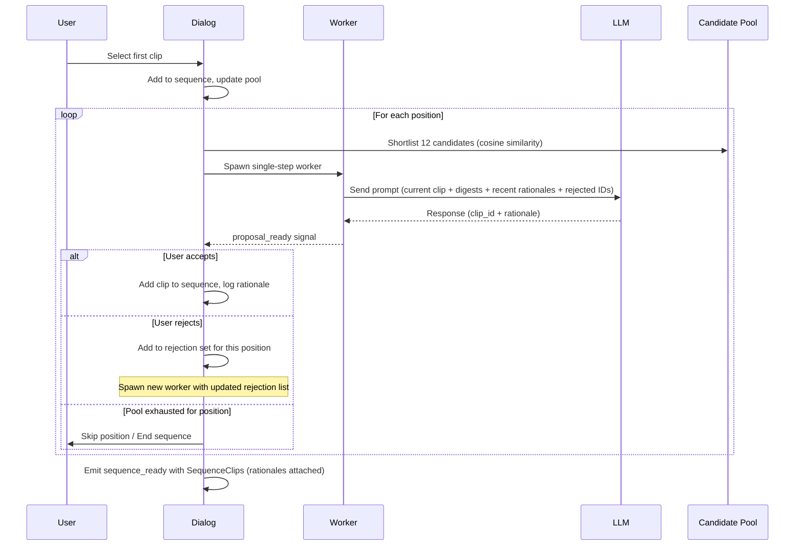

# feat: Add Free Association sequencer

## Overview

Add a new LLM-powered sequencer algorithm called "Free Association" that builds a clip sequence one transition at a time through an interactive accept/reject dialog. The user selects a first clip, and the LLM proposes each subsequent clip based on clip metadata, providing a rationale for each transition. This is the first iterative, human-in-the-loop sequencer in the app.

## Problem Frame

Scene Ripper has 16 sequencer algorithms, including two LLM-powered ones (Storyteller, Exquisite Corpus), but all operate in batch mode — the user configures and generates a complete sequence at once. Free Association fills a gap: a step-by-step sequencer where the editor collaborates with the LLM one transition at a time, reviewing metadata-grounded rationales for each choice. (see origin: `docs/brainstorms/2026-04-12-free-association-sequencer-requirements.md`)

## Requirements Trace

- R1. User-selected first clip with iterative one-at-a-time proposal
- R2. Tiered metadata strategy (total ~800 tokens/step): full metadata for current clip, compact digests for 12 shortlisted candidates, last 3-5 rationale entries for sequence context
- R3. Last 3-5 rationale entries serve as sequence context so the LLM avoids repetitive transitions
- R4. Each proposal includes a metadata-grounded rationale
- R5. Scrollable side panel log displaying rationale entries
- R6. Accept adds clip to sequence and triggers next proposal
- R7. Reject proposes a different clip with rejection memory per position
- R8. Rejected clips return to pool for future positions
- R9. Ends when all clips placed or user stops early
- R10. Rationale log persists with the sequence via `SequenceClip.rationale` field

## Scope Boundaries

- No abstract/poetic mode — rationales reference actual metadata values
- No multi-candidate selection — single proposal with re-roll
- No regenerate-from-midpoint — step-by-step only
- No new analysis types (the `SequenceClip.rationale` field is added, but no new clip-level metadata)
- The compact digest and recent-rationales prompt window are ephemeral generation artifacts. The final rationale text for each accepted clip **is** persisted on `SequenceClip.rationale` (see R10).

## Context & Research

### Relevant Code and Patterns

- `core/remix/storyteller.py` — LLM sequencer pattern: `litellm.completion()`, short ID mapping (c1/c2/...), JSON response parsing, markdown fence stripping
- `core/remix/exquisite_corpus.py` — Alternative LLM sequencer with same call pattern
- `core/remix/similarity_chain.py` — `_cosine_distance_matrix()` for embedding similarity, L2-normalized vectors
- `ui/dialogs/storyteller_dialog.py` — Dialog + QThread worker pattern: `QStackedWidget` pages, `sequence_ready` signal, preview with reorder
- `ui/algorithm_config.py` — Algorithm registration with `is_dialog: True`, zero-dependency module
- `ui/tabs/sequence_tab.py` — Dialog routing at `_on_card_clicked()`, `_apply_dialog_sequence()` for applying results
- `models/sequence.py` — `Sequence` and `SequenceClip` dataclasses with `to_dict`/`from_dict`
- `ui/workers/base.py` — `CancellableWorker` base class
- `core/settings.py` — Model/temperature settings pattern (see `exquisite_corpus_model`)

### Institutional Learnings

- **QThread finished signal duplication** (`docs/solutions/runtime-errors/qthread-destroyed-duplicate-signal-delivery-20260124.md`): Qt `finished` signal can fire twice. Use guard flags + `Qt.UniqueConnection`. Critical for iterative worker pattern.
- **Sequence overwrite** (`docs/solutions/ui-bugs/timeline-widget-sequence-mismatch-20260124.md`): Dialog output must write to the same Sequence object the UI reads from. Use `_apply_dialog_sequence()` path.
- **Algorithm config location** (`docs/solutions/logic-errors/circular-import-config-consolidation.md`): Register in `ui/algorithm_config.py` only, never inline.
- **Worker ID sync** (`docs/solutions/ui-bugs/pyside6-thumbnail-source-id-mismatch.md`): Worker-created objects must reference existing UI-state IDs.
- **LLM None responses** (CLAUDE.md): `litellm.completion()` can return None content without exception. Always validate before `.strip()`.

## Key Technical Decisions

- **Single-step worker per proposal over long-lived worker**: Each accept/reject spawns a fresh `QThread` worker for the next LLM call. The dialog maintains all state (sequence, pool, rejections). This avoids inter-thread signaling complexity and follows the guard flag pattern from institutional learnings. Old workers are cleaned up via `worker.finished.connect(worker.deleteLater)`.
- **Rationale stored on SequenceClip**: Add `rationale: Optional[str] = None` to `SequenceClip`. Co-located with clip data, serializes through existing `to_dict`/`from_dict` pipeline. First clip gets `None` (user-selected).
- **Recent rationales as sequence context**: Instead of a separate rolling summary, include the last 3-5 rationale entries in each prompt. These already describe transitions and metadata connections. Keeps history at ~150-200 tokens without an extra LLM call.
- **Local shortlisting via cosine similarity**: Use existing `_cosine_distance_matrix()` pattern from `similarity_chain.py` to pre-filter to 12 candidates closest to the current clip. Caps prompt cost regardless of total clip count.
- **Short ID mapping**: Map clip UUIDs to `c1, c2, ...` for LLM communication (following Storyteller pattern). Map back on parse.
- **Pipe-delimited compact digest**: Format each candidate as `"c3: CU | warm tones | bright | 2 people | outdoor | dialogue | slow pan"` — structured fields, no LLM cost to generate, ~20-30 tokens each.
- **No worker.wait() on early stop**: Cancel sets flag, dialog closes immediately with partial sequence. Worker cleans up via `deleteLater`. Avoids 120s UI freeze from blocking HTTP calls.
- **New apply method instead of reusing `_apply_dialog_sequence()`**: The existing dialog apply path reconstructs SequenceClip objects internally with no mechanism to carry a rationale field. A new `_apply_free_association_sequence()` method preserves rationale by setting it on the SequenceClip immediately after the timeline creates it. The dialog emits `list[tuple[Clip, Source, Optional[str]]]` (the third element being rationale) to make this explicit in the signal contract.

## Open Questions

### Resolved During Planning

- **Rationale storage location**: `SequenceClip.rationale` field — co-located, serializes naturally, no separate data structure needed
- **Worker lifecycle**: Single-step worker per proposal, dialog owns all state
- **Token budget strategy**: Tiered metadata (~800 tokens/step) with local shortlisting — scales to any clip count
- **Sequence history representation**: Last 3-5 rationale entries — no extra LLM call, natural context window
- **Pool exhaustion**: When every clip in the shortlist for the current position has been rejected (and no other candidates remain in the pool), enter `POOL_EXHAUSTED` state. The dialog shows a page offering "End sequence with clips placed so far" or "Back to previous proposal" (which resurrects the most recently rejected clip and treats it as if proposed again, letting the user reconsider). No "Skip position" — a gap in the sequence has no meaning in this sequencer.
- **LLM error recovery**: Retry button for current step; sequence built so far is preserved; cancel closes with partial sequence
- **Stop flow (user-initiated early stop)**: Confirmation dialog if 3+ clips have been accepted ("End sequence with N clips?"). On confirm, transition directly to COMPLETE with partial sequence preserved. Skip confirmation if 0-2 clips accepted (low-cost to start over).
- **Rationale log behavior**: Only accepted transitions appear in the log. Rejected proposals never enter the log — the log is the record of the final sequence, not the exploration path. Log is not cleared when the dialog errors and recovers.
- **Rationale preservation through apply pipeline**: `_apply_dialog_sequence()` does not propagate custom SequenceClip fields (it reconstructs clips). Free Association uses a new apply method that sets `rationale` on each created SequenceClip after the timeline creates it (see Unit 5).
- **Rejection history in prompt**: Include rejected short IDs with instruction to avoid them

### Deferred to Implementation

- **Exact prompt wording**: System prompt and user prompt templates will be tuned during implementation based on LLM output quality
- **Shortlist size tuning**: Starting at 12, may adjust based on diversity of proposals
- **Compact digest field ordering**: Which fields to prioritize when not all metadata is available
- **Model/temperature defaults**: Will match existing sequencer settings pattern but specific defaults TBD
- **Rationale-lookup mechanism in `_apply_free_association_sequence()`**: Prefer extending `timeline_widget.add_clip()` to return the created `SequenceClip` (cleaner). Fall back to matching by `source_clip_id` on `sequence.get_all_clips()` if the timeline API change is invasive. Decide when touching the code.
- **Shortlisting diversity vs similarity**: Pure cosine similarity may pre-filter too narrowly for true "free association." If early testing shows homogeneous proposals, consider a hybrid shortlist (e.g., 6 most similar + 6 random from remaining pool). Start pure, adjust after validation.
- **Cross-position rejection cooldown**: The current design only remembers rejections within the current position. If testing shows rejected clips cycling back immediately at the next position and annoying users, add a short cooldown (last 2-3 positions).

## High-Level Technical Design

> *This illustrates the intended approach and is directional guidance for review, not implementation specification. The implementing agent should treat it as context, not code to reproduce.*

**State machine for the dialog:**
- `FIRST_CLIP_SELECT` → user picks first clip + clicks Start → `LOADING`
- `LOADING` → worker emits `proposal_ready` → `PROPOSAL` / worker emits `error` → `ERROR` / user clicks Stop → `COMPLETE` (partial)
- `PROPOSAL` → Accept → `LOADING` (next position) / Reject → `LOADING` (same position, new candidate) / Stop → confirmation if ≥3 clips → `COMPLETE` (partial)
- `LOADING` (after reject when shortlist-minus-rejected is empty) → `POOL_EXHAUSTED`
- `POOL_EXHAUSTED` → End sequence → `COMPLETE` / Reconsider last rejected → `PROPOSAL` (with resurrected clip)
- `ERROR` → Retry → `LOADING` (same position) / Cancel → `COMPLETE` (partial, clips so far preserved)
- `COMPLETE` → Apply → emit `sequence_ready`, dialog closes / Close → discard (confirmation if ≥3 clips)

**COMPLETE vs POOL_EXHAUSTED distinction:**
- `COMPLETE` is a terminal state entered deliberately: all clips placed (pool empty via acceptance), user chose to stop early, or error recovery cancel.
- `POOL_EXHAUSTED` is a transient state entered when no unrejected candidates remain at the current position; the user resolves it (end or reconsider) and the flow continues.

## Implementation Units

- [ ] **Unit 1: Data model and algorithm registration**

  **Goal:** Add `SequenceClip.rationale` field (new persistent field, the first generic metadata string on SequenceClip) and register Free Association in `ALGORITHM_CONFIG`.

  **Requirements:** R10 (persistence)

  **Dependencies:** None

  **Files:**
  - Modify: `models/sequence.py` — add `rationale` field to `SequenceClip`
  - Modify: `ui/algorithm_config.py` — add `free_association` entry
  - Test: `tests/test_sequence_model.py` — field persistence + project round-trip

  **Approach:**
  - **Data model change (explicit call-out)**: Add `rationale: Optional[str] = None` to the `SequenceClip` dataclass. This is the first SequenceClip field intended for free-form human/LLM text, so ensure it does not break existing equality, hashing, or repr expectations in tests.
  - Update `to_dict()` to include `rationale` when non-None (skip when None to keep serialized size small and backward-compatible).
  - Update `from_dict()` to read `rationale` with `None` default (old projects without the key load cleanly).
  - Verify the field survives through the full save/load chain: `SequenceClip` → `Track.to_dict()` → `Sequence.to_dict()` → `Project` save → load back. No intermediate layer should cherry-pick fields.
  - Add `"free_association"` entry to `ALGORITHM_CONFIG` with `is_dialog: True`, appropriate icon, label, description, `categories`, and `required_analysis: ["describe"]` (embeddings are *not* required — the core module falls back to random sampling when embeddings are missing, so gating on embeddings would contradict the graceful degradation design in Unit 2).

  **Patterns to follow:**
  - Existing optional fields on `SequenceClip` (e.g., `prerendered_path`)
  - Existing dialog algorithm entries in `ALGORITHM_CONFIG` (Storyteller, Exquisite Corpus)

  **Test scenarios:**
  - Happy path: SequenceClip with rationale serializes to dict and deserializes back with rationale preserved
  - Happy path: SequenceClip without rationale serializes without rationale key (backward-compatible)
  - Edge case: `from_dict` on old data (no rationale key) returns SequenceClip with `rationale=None`
  - Integration: Full project round-trip — create a Sequence with a SequenceClip carrying a rationale, save project to disk, load back, verify rationale text survives intact. Catches any serialization layer that drops unknown fields.
  - Happy path: `get_algorithm_config("free_association")` returns valid config with `is_dialog: True` and `required_analysis: ["describe"]`

  **Verification:**
  - Existing project save/load tests still pass (backward compatibility)
  - New algorithm appears in `ALGORITHM_CONFIG` and returns correct config
  - Rationale text survives a full project save/load round-trip

- [ ] **Unit 2: Core algorithm module**

  **Goal:** Implement metadata formatting, candidate shortlisting, and LLM proposal logic.

  **Requirements:** R2, R3, R4, R7

  **Dependencies:** Unit 1

  **Files:**
  - Create: `core/remix/free_association.py`
  - Test: `tests/test_free_association.py`

  **Approach:**
  - `format_clip_digest(clip: Clip) -> str` — Pipe-delimited compact summary from structured fields (shot_type, color descriptor from dominant_colors, brightness descriptor, person_count, object labels, transcript keywords, camera motion from cinematography). Omit missing fields gracefully.
  - `format_clip_full_metadata(clip: Clip) -> str` — Richer text block for the current clip: description, shot type, colors, brightness, volume, objects, faces, transcript excerpt, cinematography, gaze, extracted text.
  - `shortlist_candidates(current_clip: Clip, pool: list[tuple[Clip, Source]], k: int = 12) -> list[tuple[Clip, Source]]` — Compute cosine similarity using the same L2-normalized dot-product pattern from `similarity_chain.py`. Return top-k most similar candidates. Fall back to random sample if embeddings are missing.
  - `propose_next_clip(current_clip_metadata: str, candidate_digests: list[tuple[str, str]], recent_rationales: list[str], rejected_ids: list[str], model: str, temperature: float) -> tuple[str, str]` — Build prompt, call `litellm.completion()`, parse JSON response for `(clip_short_id, rationale)`. **Critical: do NOT follow `storyteller.py`'s response extraction pattern** — it calls `response.choices[0].message.content.strip()` without a None check, which crashes with `AttributeError` when the LLM returns None content (a documented codebase bug pattern). Instead follow `core/remix/drawing_vlm.py`: extract content first, validate for None/empty, then strip. Raise `ValueError("LLM returned no content")` on None. Use short ID mapping (c1, c2, ...) following Storyteller's ID pattern. Strip markdown fences before JSON parse. Validate returned short ID is in the candidate set (reject hallucinated IDs).
  - `build_id_mapping(candidates: list[tuple[Clip, Source]]) -> tuple[dict[str, str], dict[str, str]]` — Map between UUIDs and short IDs.

  **Patterns to follow:**
  - `core/remix/storyteller.py` — `litellm.completion()` call setup, short ID mapping, JSON parsing, model prefix normalization. **Do NOT copy its response extraction** (missing None guard).
  - `core/remix/drawing_vlm.py` — Correct response extraction pattern: extract `.content`, None-check, then process.
  - `core/remix/similarity_chain.py` — cosine similarity computation (L2-normalized dot product)

  **Test scenarios:**
  - Happy path: `format_clip_digest` with fully populated clip produces pipe-delimited string with all fields
  - Edge case: `format_clip_digest` with clip missing most metadata produces short but valid string (only description)
  - Edge case: `format_clip_digest` with clip having no metadata at all returns minimal placeholder
  - Happy path: `shortlist_candidates` with 50 clips and valid embeddings returns top 12 by similarity
  - Edge case: `shortlist_candidates` with clips missing embeddings falls back to random sample of k
  - Edge case: `shortlist_candidates` with fewer clips than k returns all clips
  - Happy path: `propose_next_clip` with mocked `litellm.completion` returning valid JSON extracts clip ID and rationale
  - Error path: `propose_next_clip` with mocked `litellm.completion` returning None content raises ValueError with clear message
  - Error path: `propose_next_clip` with mocked `litellm.completion` returning malformed JSON raises ValueError
  - Happy path: `build_id_mapping` creates bidirectional short ID ↔ UUID mapping
  - Happy path: short ID mapping round-trips — UUID → short ID → UUID

  **Verification:**
  - All formatting functions handle missing metadata without crashing
  - Shortlisting respects k parameter and embedding similarity ordering
  - LLM call uses short IDs and maps back correctly
  - None/malformed response raises clear errors

- [ ] **Unit 3: Single-step worker**

  **Goal:** Create a QThread worker that executes one LLM proposal call per invocation.

  **Requirements:** R1, R6, R7

  **Dependencies:** Unit 2

  **Files:**
  - Create: `ui/workers/free_association_worker.py`
  - Test: `tests/test_free_association_worker.py`

  **Approach:**
  - Extend `CancellableWorker` from `ui/workers/base.py`
  - Constructor receives: current clip metadata (str), candidate digests (list), recent rationales (list), rejected IDs (list), model, temperature
  - `run()` calls `propose_next_clip()` from the core module
  - Emits `proposal_ready(str, str)` signal with (clip_short_id, rationale) on success
  - Emits `error(str)` signal with message on failure (catches ValueError from None/malformed response, litellm exceptions)
  - Uses `_cancelled` flag from base class — checks after LLM call returns
  - Each instance is single-use: created, started, emits one result, then cleaned up via `deleteLater`

  **Patterns to follow:**
  - `ui/workers/base.py` — `CancellableWorker` interface (provides thread-safe cancellation via `threading.Event`)
  - `ui/dialogs/storyteller_dialog.py` — Worker signal connection pattern with `Qt.UniqueConnection`. Note: `StorytellerWorker` extends `QThread` directly with a bare `_cancelled` flag — this worker should extend `CancellableWorker` instead, which is the correct base class for new workers.

  **Test scenarios:**
  - Happy path: Worker with mocked `propose_next_clip` emits `proposal_ready` with correct clip ID and rationale
  - Error path: Worker with `propose_next_clip` raising ValueError emits `error` signal with message
  - Error path: Worker with `propose_next_clip` raising network exception emits `error` signal
  - Edge case: Worker cancelled before LLM call completes does not emit `proposal_ready`

  **Verification:**
  - Worker never crashes — all exceptions caught and routed to `error` signal
  - Single-use lifecycle: one invocation, one signal, then cleanup

- [ ] **Unit 4: Dialog UI**

  **Goal:** Build the interactive dialog with first-clip selection, proposal display, accept/reject controls, and rationale log panel.

  **Requirements:** R1, R5, R6, R7, R8, R9, R10

  **Dependencies:** Unit 1, Unit 2, Unit 3

  **Files:**
  - Create: `ui/dialogs/free_association_dialog.py`
  - Test: `tests/test_free_association_dialog.py`

  **Approach:**
  - `QDialog` subclass with `sequence_ready = Signal(list)` emitting `list[tuple[Clip, Source]]`
  - Constructor: `(clips, sources_by_id, project, parent=None)`
  - **Layout**: Two-column — left side has the main interaction area (stacked widget), right side has the scrollable rationale log panel. Minimum dialog width: wide enough for two columns (~900px). The log panel takes ~30% of width.
  - **Pages** via `QStackedWidget`:
    - `FIRST_CLIP_SELECT`: Fixed grid view of available clips with thumbnails (no list/grid toggle — keep it simple). User single-clicks to select (visual highlight), then clicks a **Start** button to confirm. No double-click-to-start (too easy to trigger accidentally). If the clip pool is empty at dialog open time, show a message "No clips available — add clips in the Cut tab first" with a Close button (no Start).
    - `LOADING`: Spinner + status label below: "Finding clip for position N of the sequence…" (position number makes progress legible). A **Stop** button is visible (same behavior as stopping from PROPOSAL). No position total is shown — this is an open-ended sequence.
    - `PROPOSAL`: Shows proposed clip (thumbnail, name, key metadata from digest) with rationale text. **Accept** and **Reject** buttons enabled. **Stop** button also visible to end the sequence early.
    - `ERROR`: Error message with **Retry** and **Cancel** buttons. Sequence built so far is preserved on either action. Cancel routes to COMPLETE with partial sequence.
    - `POOL_EXHAUSTED`: Message "All remaining candidates for this position have been rejected." Two buttons: **End sequence** (routes to COMPLETE with partial sequence) and **Reconsider last rejected** (resurrects the most recently rejected clip and re-enters PROPOSAL with it). No "Skip position" — gaps have no meaning here.
    - `COMPLETE`: Summary content: count of accepted clips, total approximate duration (sum of clip durations), and a scrollable list of accepted clip names in sequence order. **Apply** button commits the sequence (emits `sequence_ready`). **Close** discards the session without applying — confirmation required if 3+ clips were accepted ("Discard sequence with N clips?").
  - **Rationale log panel**: `QListWidget` (read-only) on the right side. Each entry: position number + clip name + rationale text (multiline, word-wrapped). Auto-scrolls to latest on new entry. **Only accepted transitions appear in the log** — rejected proposals never enter the log. The log is the record of the final sequence, not the exploration path. The log is not cleared during ERROR/recovery. During FIRST_CLIP_SELECT the panel shows a placeholder "Proposals and rationales will appear here."
  - **Dialog state** (owned by dialog, not worker):
    - `sequence_built: list[tuple[Clip, Source]]` — accepted clips in order
    - `rationales: list[str]` — parallel list of rationale strings
    - `available_pool: list[tuple[Clip, Source]]` — remaining candidates
    - `rejected_for_position: set[str]` — clip IDs rejected for current position, cleared on accept or skip
  - **Accept flow**: Add proposed clip to `sequence_built`, add rationale to `rationales`, remove clip from `available_pool`, clear `rejected_for_position`, shortlist from updated pool, append entry to rationale log, spawn new worker.
  - **Reject flow**: Add proposed clip ID to `rejected_for_position`, **do not touch the rationale log** (rejected proposals never enter it), re-shortlist excluding rejected IDs, spawn new worker with updated rejection list.
  - **Pool exhaustion**: When shortlisting returns zero unrejected candidates for the current position, transition to POOL_EXHAUSTED page. The most recently rejected clip ID is stashed so "Reconsider last rejected" can resurrect it.
  - **Early stop flow**: "Stop" button visible during LOADING and PROPOSAL pages. On click, if `len(sequence_built) >= 3`, show a confirmation dialog "End sequence with N clips?". On confirm (or if fewer than 3 clips), call `worker.cancel()` (no `worker.wait()`), transition to COMPLETE with partial sequence. Worker cleans up via `deleteLater`.
  - **Finish / Apply**: When the user clicks Apply on COMPLETE, emit `sequence_ready` with a payload of `list[tuple[Clip, Source, Optional[str]]]` — the third tuple element is the rationale for that clip (None for the first/user-selected clip). This three-tuple signature allows the sequence tab to set `rationale` on each SequenceClip after the timeline creates it (see Unit 5 for the apply mechanism). Do not emit pre-built SequenceClip objects — the existing timeline pipeline reconstructs clips internally, and sending pre-built ones would be confusing.
  - **Worker lifecycle**: Guard flag (`_proposal_handled = False`) on `_on_proposal_ready`, reset before spawning new worker. Connect with `Qt.UniqueConnection`. **IMPORTANT: Do not follow `storyteller_dialog.py`'s `_on_cancel`/`closeEvent` pattern of calling `worker.wait()`** — that blocks the UI thread for the duration of the in-flight HTTP call (up to 120s). Instead, call `worker.cancel()` and use `worker.finished.connect(worker.deleteLater)` for cleanup. Close the dialog immediately with the partial sequence.

  **Patterns to follow:**
  - `ui/dialogs/storyteller_dialog.py` — Dialog structure, signal emission, worker management, `QStackedWidget` pages
  - `ui/dialogs/exquisite_corpus_dialog.py` — Alternative dialog pattern

  **Test scenarios:**
  - Happy path: Dialog initializes with clips, shows FIRST_CLIP_SELECT page
  - Happy path: Selecting first clip + clicking Start transitions to LOADING, then PROPOSAL when worker completes
  - Edge case: Empty clip pool at dialog open shows empty-state message with Close button, no Start button
  - Happy path: Accepting proposal adds clip to sequence, appends rationale entry to log, transitions to LOADING for next
  - Happy path: Rejecting proposal adds clip to rejection set, does NOT append to log, spawns new worker for same position
  - Happy path: Completing full sequence (pool empty via acceptance) transitions to COMPLETE; Apply emits `sequence_ready` with correct three-tuple payload including rationales
  - Happy path: First clip in emitted payload has `rationale=None` (user-selected)
  - Edge case: Early stop with 1-2 clips accepted skips confirmation, goes directly to COMPLETE
  - Edge case: Early stop with 3+ clips accepted shows confirmation dialog; cancel keeps session, confirm goes to COMPLETE
  - Edge case: Pool exhaustion (all shortlisted rejected) transitions to POOL_EXHAUSTED page; End sequence → COMPLETE; Reconsider last rejected → PROPOSAL with resurrected clip
  - Error path: Worker emits `error`, transitions to ERROR page; Retry spawns new worker; Cancel routes to COMPLETE with clips so far preserved
  - Edge case: Multiple rapid rejects during LOADING don't create duplicate workers (guard flag + button disabled during LOADING)
  - Edge case: Dialog Close on COMPLETE with 3+ accepted clips shows "Discard sequence?" confirmation
  - Integration: Rationale log accumulates only accepted transitions in order, scrolls to latest
  - Integration: Log is preserved across ERROR → Retry cycle (not cleared)

  **Verification:**
  - Dialog never discards accepted clips on error — partial sequence is always recoverable
  - Accept/Reject buttons disabled during LOADING — no race conditions
  - Rationale log shows all transitions in order
  - SequenceClips emitted have `rationale` field populated

- [ ] **Unit 5: Sequence tab integration with rationale-preserving apply path**

  **Goal:** Wire the Free Association dialog into the sequence tab's algorithm routing and implement a new apply method that preserves per-clip rationales (which the existing `_apply_dialog_sequence()` cannot do).

  **Requirements:** R1, R9, R10

  **Dependencies:** Unit 4

  **Files:**
  - Modify: `ui/tabs/sequence_tab.py` — routing, new apply method, card availability mapping
  - Test: `tests/test_sequence_tab.py`

  **Approach:**
  - **Why a new apply method is needed (critical design constraint)**: `_apply_dialog_sequence()` iterates over `(Clip, Source)` tuples and calls `self.timeline.add_clip(clip, source, ...)`. That path internally constructs a fresh `SequenceClip` inside `timeline_scene.add_clip_to_track()` with only the fields it knows about (source_clip_id, source_id, track_index, start_frame, in_point, out_point). It has no mechanism to thread a `rationale` parameter through, so any SequenceClip built by the dialog would be discarded in favor of a freshly-reconstructed one without rationale. R10 would silently fail.
  - **Apply mechanism**: Add `_apply_free_association_sequence(payload: list[tuple[Clip, Source, Optional[str]]])`. For each entry, call `self.timeline.add_clip(clip, source, ...)` as the existing path does, then **look up the just-created `SequenceClip` in the Sequence and set `rationale`**. Options for the lookup:
    - (a) If `timeline_scene.add_clip_to_track()` returns the created `SequenceClip`, extend `timeline_widget.add_clip()` to return it as well, then set `.rationale` on the returned object.
    - (b) After `add_clip`, iterate `sequence.get_all_clips()` to find the newest entry matching `source_clip_id` and set `.rationale`.
    - Prefer (a) — cleaner, single object reference. Fall back to (b) if (a) requires invasive changes to the timeline widget API. Document the choice at implementation time under `Deferred to Implementation`.
  - After applying all clips, set `sequence.algorithm = "free_association"` so the sequence is tracked.
  - **Routing in `_on_card_clicked()`**: Add `free_association` to the `is_dialog` branch. Open dialog, connect `sequence_ready` to `_apply_free_association_sequence()`.
  - **Routing in `_on_confirm_generate()`**: `sequence_tab.py` has a second dialog-routing if-chain around line 502. Dialog-based algorithms with `is_dialog: True` bypass the cost confirmation gate via the early return in `_on_card_clicked` (line 639), so `_on_confirm_generate` is not reached for Free Association. Verify this assumption by tracing the control flow during implementation; if it is reachable, add routing there as well.
  - **Card availability mapping**: `sequence_tab.py` has a hand-maintained availability dict in `_update_card_availability()` (around line 1587) that does NOT auto-derive from `ALGORITHM_CONFIG`. Add a `free_association` entry following the Storyteller pattern (dialog handles its own prerequisite checks, so the card can be unconditionally available when there are clips available). Without this entry the card will not appear or will be silently disabled.

  **Patterns to follow:**
  - `ui/tabs/sequence_tab.py` — Existing `_show_storyteller_dialog()` routing pattern, existing `_update_card_availability()` availability dict pattern
  - Existing `_apply_dialog_sequence()` for the iteration shape (but not the full logic — the new method must preserve rationale)

  **Test scenarios:**
  - Happy path: Clicking Free Association card in sequence tab opens the dialog
  - Happy path: Dialog `sequence_ready` signal applies clips to the timeline with each SequenceClip's `rationale` populated from the payload
  - Integration: Sequence object has `algorithm="free_association"` after dialog completes
  - Integration: After apply + project save + reload, rationales survive on each SequenceClip (this is the end-to-end R10 verification)
  - Happy path: First clip in the applied sequence has `rationale=None` (user-selected, no LLM rationale)
  - Edge case: Dialog cancelled (no `sequence_ready` emitted) leaves sequence tab unchanged
  - Edge case: Partial sequence (user stopped early) applies the accepted N clips with correct rationales
  - Happy path: Free Association card appears in the algorithm grid with correct availability state

  **Verification:**
  - Free Association appears in the sequence tab algorithm grid
  - Completing the dialog populates the timeline with clips in the expected order and rationales attached to each SequenceClip
  - Rationale text appears on the SequenceClip objects both in memory and after save/reload
  - Sequence overwrite pattern is avoided — the new apply method still writes to the correct (single-source-of-truth) Sequence object

## System-Wide Impact

- **Interaction graph:** Dialog emits `sequence_ready` → sequence tab applies via `_apply_dialog_sequence()` → timeline widget updates. Same path as Storyteller/Exquisite Corpus. No new callbacks or middleware.
- **Error propagation:** LLM errors caught in worker, routed to dialog via `error` signal. Dialog shows retry UI. No error reaches sequence tab or main window.
- **State lifecycle risks:** Single-step worker pattern avoids long-lived thread state. Dialog owns all mutable state. Worker is stateless and single-use. Guard flags prevent duplicate signal delivery.
- **API surface parity:** No CLI or MCP server changes needed — this is a UI-only sequencer. Agent tool integration (adding "free_association" to `generate_sequence` tool) is out of scope for this plan.
- **Unchanged invariants:** Existing sequencers unaffected. `SequenceClip.rationale` defaults to `None` — no change to existing serialization. `_apply_dialog_sequence()` interface unchanged.

## Risks & Dependencies

| Risk | Mitigation |
|------|------------|
| LLM proposes clip not in candidate list (hallucinated ID) | Validate proposed short ID against the candidates sent. Treat as error and auto-retry once before showing error UI. |
| LLM re-proposes rejected clip despite instructions | Validate proposed ID against `rejected_for_position` set. Auto-retry with stronger prompt emphasis. |
| Latency per step feels slow (3-10s) | Loading state with progress indicator. Compact prompt (~800 tokens) keeps call fast. Can tune model choice for speed. |
| Cost accumulation over many steps | `required_analysis` gate ensures clips have metadata before starting. LLM call cost is bounded by tiered prompt. Consider adding step count display (e.g., "Step 12 of 47"). |
| Embedding quality varies (CLIP vs DINOv2) | `shortlist_candidates` falls back to random sample when embeddings are missing. Digests still give LLM enough to make reasonable choices. |
| Cosine similarity pre-filter narrows "free association" creatively | Start pure; if early use shows homogeneous proposals, switch to hybrid (6 similar + 6 random). Tracked as deferred implementation decision. |
| LLM hallucinates clip ID not in candidate set | Validate short ID against sent candidates; auto-retry once with stronger prompt; show error UI if two attempts fail. |
| Rationale silently dropped at apply time | New `_apply_free_association_sequence()` sets rationale on each SequenceClip immediately after timeline creation. Integration test verifies end-to-end R10 via save/reload. |

## Sources & References

- **Origin document:** [docs/brainstorms/2026-04-12-free-association-sequencer-requirements.md](docs/brainstorms/2026-04-12-free-association-sequencer-requirements.md)
- Related code: `core/remix/storyteller.py`, `core/remix/similarity_chain.py`, `ui/dialogs/storyteller_dialog.py`
- Institutional learnings: `docs/solutions/runtime-errors/qthread-destroyed-duplicate-signal-delivery-20260124.md`, `docs/solutions/ui-bugs/timeline-widget-sequence-mismatch-20260124.md`, `docs/solutions/logic-errors/circular-import-config-consolidation.md`
