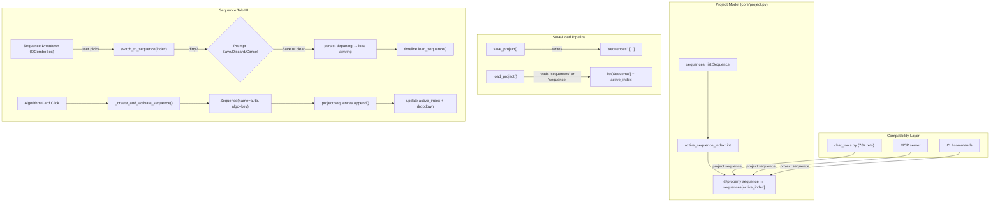

# feat: Multi-sequence project support

## Overview

Evolve Scene Ripper's project model from a single sequence to a list of named sequences with an active-sequence index. Every algorithm run auto-creates a new sequence; the user switches between sequences via a dropdown and can rename or delete them. The goal is to turn the Sequence tab from a destructive single-result workspace into an exploration log where 20 different sequencer experiments coexist.

## Problem Frame

With 20 sequencer algorithms, every run currently overwrites the previous sequence. Users must export before experimenting or lose their work. Multi-sequence support lets users accumulate results, compare by switching, and never lose a previous experiment. (see origin: `docs/brainstorms/2026-04-13-multi-sequence-projects-requirements.md`)

## Requirements Trace

- R1. Project holds any number of sequences, all persisted. At-least-one invariant enforced at model level.
- R2. New projects start with one empty sequence.
- R3. Clicking an algorithm card auto-creates a new sequence (monotonic naming: "Chromatics", "Chromatics #2").
- R3a. Parameter tweaks (direction change, re-run same algo) prompt "Replace current or create new?"
- R4. "New Sequence" button replaces "Clear Sequence" — creates blank sequence, switches to it per R6.
- R5. Dropdown shows sequence names; user switches between them.
- R6. Switching auto-persists departing sequence (with Save/Discard/Cancel prompt if manually edited), then swaps timeline + all related UI state.
- R7. Delete: no confirm for empty (0 clips), confirm for populated.
- R8. Deleting active → switch to index 0. Last sequence → auto-create empty (R2 holds).
- R9. Names are editable. Duplicates permitted.
- Agent/MCP compatibility: `project.sequence` property proxies to active sequence (see origin).

## Scope Boundaries

- No comparison/diff view, duplication, drag-drop reorder, per-sequence render settings, or batch delete
- No full agent/MCP migration — compatibility property is sufficient

### Deferred to Separate Tasks

- Full multi-sequence agent awareness (list sequences, switch active via chat): follow-up after this feature stabilizes
- Batch-delete / "clean up empty sequences": add later if sprawl is observed

## Context & Research

### Relevant Code and Patterns

- `core/project.py` — `Project.sequence` (line 553), `Project.save()` calls `save_project(self.sequence)` (line 1092), 6 methods operate on `self.sequence` (add_to/remove/clear/reorder/recalculate + add_frames)
- `core/project.py` — `save_project()` (line 152) takes `sequence: Optional[Sequence]`, serializes as `project_data["sequence"]`; `load_project()` (line 360) returns 6-tuple with single Optional[Sequence]; `_validate_project_structure()` checks `data["sequence"]` is dict-or-null; `_prepare_prerendered_clips()` handles single sequence; `SCHEMA_VERSION = "1.3"` (line 22)
- `ui/tabs/sequence_tab.py` — 16+ entry points that create/populate sequences (see research), all starting with `self.timeline.clear_timeline()`; `_regenerate_sequence` fires on direction/algorithm dropdown changes
- `ui/timeline/timeline_widget.py` — `self.sequence` is a property delegating to `self.scene.sequence`; `load_sequence(seq, sources, clips)` calls `self.scene.set_sequence(sequence)` — **swap mechanism already exists**
- `ui/main_window.py` — `_save_project_to_file` (line 8930) syncs `self.project.sequence = timeline.get_sequence()` before save; `_refresh_timeline_from_project` (line 2302) loads `project.sequence` into timeline
- `ui/tabs/sequence_tab.py` header layout (line 215): algorithm label → algorithm_dropdown → direction_label → direction_dropdown → stretch → chromatic_bar_checkbox → clear_btn
- `core/project.py` observer: `_notify_observers("sequence_changed", ...)` used by 5 methods
- `core/gui_state.py` — `sequence_ids` (line 70) tracks clip IDs in current sequence for agent context

### Institutional Learnings

- **Sequence state mismatch** (`docs/solutions/ui-bugs/timeline-widget-sequence-mismatch-20260124.md`): Never let parent and child widgets maintain separate Sequence copies. Use property delegation. Already fixed — `TimelineWidget.sequence` delegates to `scene.sequence`.
- **QThread duplicate signal delivery** (`docs/solutions/runtime-errors/qthread-destroyed-duplicate-signal-delivery-20260124.md`): Guard flags + `Qt.UniqueConnection` on signal handlers that create resources. Relevant for any worker that runs during sequence switching.
- **QGraphicsScene track initialization** (`docs/solutions/runtime-errors/qgraphicsscene-missing-items-20260124.md`): After setting a new Sequence on the scene, must call rebuild to create visual items. Critical for the `set_sequence()` swap path.
- **Worker ID mismatch** (`docs/solutions/ui-bugs/pyside6-thumbnail-source-id-mismatch.md`): Worker-created objects have different UUIDs from UI state. Reconcile on handoff.

## Key Technical Decisions

- **`project.sequence` remains as a property**: Getter returns `self.sequences[self.active_sequence_index]`, setter replaces that entry. This shields 78+ call sites (agent tools, MCP, CLI, tests) from the multi-sequence change. Only Project internals and the Sequence tab know about the list.
- **Schema version 1.3 → 1.4**: New format writes `"sequences": [...]` + `"active_sequence_index"`. Old format (`"sequence": dict`) is loaded by wrapping in a single-element list. `_validate_project_structure` accepts both.
- **`save_project` / `load_project` signatures STAY UNCHANGED**: These standalone functions are called by 37+ MCP/CLI callers that destructure the 6-tuple return. Changing the signature would break them all. Instead, `Project.save()` passes `extra_data={"sequences": [...], "active_sequence_index": N}` which `save_project()` merges into the project JSON. `Project.load()` reads the raw JSON to extract `"sequences"` before calling `load_project()` for the standard single-sequence path. The file always writes BOTH `"sequence"` (active, for legacy/MCP readers) AND `"sequences"` (full list, for the GUI). MCP tools that do load-mutate-save only see the active sequence and write it back via the unchanged `"sequence"` key — on write, `save_project()` reads any existing `"sequences"` from the file and replaces only the active entry, preserving other sequences.
- **Shared `_create_and_activate_sequence` method**: All 16+ apply handlers converge on a single method that creates a `Sequence(name=auto_name, algorithm=key)`, appends it to `project.sequences`, sets the active index, updates the dropdown, and returns the new sequence. Existing clip-population code continues as before — only the setup step changes.
- **Dirty tracking via `_sequence_dirty` flag**: Set on manual user actions (drag-reorder, clip removal). Cleared on persist (switch-away, save). Algorithm-generated sequences start clean. The Save/Discard/Cancel prompt only fires when the flag is True and the user switches away.
- **Sequence dropdown position**: Leftmost in the header row, before the algorithm dropdown. Establishes higher-level context (which sequence) before lower-level controls (which algorithm, direction).
- **Rename via context menu**: Right-click on the dropdown opens a context menu with "Rename..." and "Delete" actions. "Rename..." opens an inline QLineEdit or a simple QInputDialog. Avoids conflict with the dropdown's click-to-open behavior.

## Open Questions

### Resolved During Planning

- **Dropdown position**: Leftmost in header row, before algorithm dropdown (user-confirmed).
- **Timeline swap mechanism**: `TimelineWidget.load_sequence()` already calls `scene.set_sequence()` — no new swap method needed. Just need to ensure waveforms and export button state are refreshed.
- **Auto-naming counter**: Scan-based per algorithm key. Scan existing sequence names for max N matching `"{Algo} #{N}"`, use N+1. First run omits suffix. Renames don't affect the counter. If ALL sequences with that algorithm name are deleted, the counter naturally resets (next run produces the unsuffixed name again). This is simpler than a persistent counter and acceptable in practice.
- **Enumerate apply handlers**: 16+ entry points identified in research. All funnel through two patterns: (a) `_on_sequence_ready` for non-dialog algorithms, (b) `_apply_dialog_sequence` + algorithm-specific overrides for dialog algorithms. Plus 3 inline agent-tool handlers and `_on_clear_clicked`/`clear`.
- **What constitutes unsaved edits**: `_sequence_dirty` flag set on manual UI actions (drag-reorder, clip removal via UI). Algorithm runs auto-create clean sequences (flag starts False). Project save clears the flag.

### Deferred to Implementation

- **Exact dirty-tracking trigger list**: Which specific signal connections set `_sequence_dirty`? The timeline widget already emits `sequence_changed` on clip moves — likely tap that signal, but only when the change originated from a user action (not an algorithm run). Determine during implementation.
- **Dropdown styling**: Whether to use a standard `QComboBox` or a custom dropdown widget with richer items (clip count badge, delete icon inline). Start with QComboBox, upgrade later if needed.
- **`_prepare_prerendered_clips` iteration**: Must iterate all sequences during save, building a combined prerender_map. The exact loop shape depends on how prerendered paths are stored and whether sequences share pre-rendered clips. Resolve when touching the code.

## High-Level Technical Design

> *This illustrates the intended approach and is directional guidance for review, not implementation specification. The implementing agent should treat it as context, not code to reproduce.*

## Phased Delivery

### Phase 1 — Data Layer (foundation, must ship together)

Units 1-2: Project model + save/load pipeline. After this phase, multi-sequence data exists and persists but the UI still shows one sequence. All existing tests pass via the compatibility property.

### Phase 2 — Sequence Tab Core (must ship together)

Units 3-5: Dropdown + switching, refactored apply handlers, New Sequence button + delete. After this phase, the full multi-sequence workflow is functional.

### Phase 3 — Polish (can ship independently)

Units 6-7: Rename, parameter-tweak prompt, main_window sync, gui_state updates.

## Implementation Units

### Phase 1: Data Layer

- [x] **Unit 1: Project model — sequences list + compatibility property**

  **Goal:** Change `Project.sequence: Optional[Sequence]` to `Project.sequences: list[Sequence]` with `active_sequence_index: int`. Add a compatibility `sequence` property. Enforce the R2 invariant.

  **Requirements:** R1, R2, Agent/MCP compatibility

  **Dependencies:** None

  **Files:**
  - Modify: `core/project.py` — `Project` class (sequences field, active_sequence_index, property, __init__, new, clear, add_to_sequence, add_frames_to_sequence, remove_from_sequence, clear_sequence, reorder_sequence, _recalculate_sequence_positions, save method)
  - Test: `tests/test_project.py` (extend existing), `tests/test_multi_sequence_project.py` (new)

  **Approach:**
  - Replace `self.sequence = sequence` in `__init__` with `self.sequences: list[Sequence]` and `self.active_sequence_index: int = 0`. If no sequences are provided, create one empty Sequence (R2).
  - Add `@property sequence` that returns `self.sequences[self.active_sequence_index]`. Add `@sequence.setter` that replaces `self.sequences[self.active_sequence_index]`. **Handle None assignment gracefully**: when `project.sequence = None` is assigned (11+ existing call sites in chat_tools.py + `clear()`), the setter substitutes a fresh empty `Sequence()` instead of storing None — this preserves the R2 invariant even when legacy code assigns None.
  - Update `Project.new()` to create with one empty Sequence.
  - Update `Project.clear()` to reset to one empty Sequence (not None).
  - All 6 existing methods that reference `self.sequence` (`add_to_sequence`, etc.) continue to work via the property — no changes needed to their bodies.
  - Add `add_sequence(seq)`, `remove_sequence(index)`, `set_active_sequence(index)` methods that notify `"sequences_changed"` and `"active_sequence_changed"` events.
  - Update `Project.save()` to pass `self.sequences` (full list) + `self.active_sequence_index` to `save_project()`.

  **Execution note:** Start with characterization tests for the existing single-sequence behavior to verify the property shim doesn't break anything before adding multi-sequence behavior.

  **Patterns to follow:**
  - Existing `Project.add_source()` / `Project.add_clips()` methods for the notify-observers pattern
  - Existing `@property` delegation in `TimelineWidget.sequence` for the compatibility property

  **Test scenarios:**
  - Happy path: New Project has exactly 1 empty Sequence at `sequences[0]`, `active_sequence_index == 0`
  - Happy path: `project.sequence` property returns the active sequence (same object identity as `project.sequences[0]`)
  - Happy path: `project.sequence = new_seq` replaces `sequences[active_index]`, not the whole list
  - Happy path: `project.add_to_sequence(clips)` adds to the active sequence (verifying the property shim works for existing methods)
  - Happy path: `project.add_sequence(seq)` appends to list and notifies observers
  - Happy path: `project.remove_sequence(index)` removes and auto-creates empty if last (R2)
  - Happy path: `project.set_active_sequence(1)` changes the active index and notifies observers
  - Edge case: `Project.clear()` resets to exactly 1 empty Sequence, `active_sequence_index == 0`
  - Edge case: `project.remove_sequence(0)` on a 1-sequence project creates a fresh empty sequence (R2 invariant)
  - Edge case: Removing a sequence before the active index decrements `active_sequence_index`
  - Edge case: Removing the active sequence sets `active_sequence_index = 0` (R8)
  - Edge case: `project.sequence = None` substitutes a fresh empty Sequence (R2 invariant preserved, legacy code compatibility)
  - Integration: Existing `test_project.py` tests still pass (characterization — proves the property shim is transparent)

  **Verification:**
  - All existing project tests pass unmodified (the compatibility property is transparent)
  - New multi-sequence operations work correctly with observer notifications

- [x] **Unit 2: Save/load pipeline — schema 1.4 + backward compatibility**

  **Goal:** Update `save_project()` / `load_project()` / `_validate_project_structure()` / `_prepare_prerendered_clips()` to handle `sequences: list[Sequence]` and backward-compatible loading of old single-sequence files.

  **Requirements:** R1 (persistence)

  **Dependencies:** Unit 1

  **Files:**
  - Modify: `core/project.py` — `SCHEMA_VERSION`, `save_project()`, `load_project()`, `_validate_project_structure()`, `_prepare_prerendered_clips()`, `Project.save()`, `Project.load()`
  - Test: `tests/test_multi_sequence_project.py` (extend), `tests/test_project.py` (verify backward compat)

  **Approach:**
  - Bump `SCHEMA_VERSION` to `"1.4"`.
  - **Critical architecture constraint**: `save_project()` and `load_project()` signatures STAY UNCHANGED. They are called by 37+ MCP/CLI callers that destructure the 6-tuple return. Only `Project.save()` and `Project.load()` know about the sequences list. The file always writes BOTH `"sequence"` (active, legacy) AND `"sequences"` (full list, new).
  - **save_project()**: Add `extra_data: Optional[dict] = None` keyword parameter (backward-compatible — existing callers don't pass it). If provided, merge into `project_data` before writing. Additionally: before writing, if the file already exists and contains a `"sequences"` key, read it, replace the entry at `"active_sequence_index"` with the provided `sequence`, and write back the updated list. This preserves non-active sequences when MCP tools do their load-mutate-save cycle. If no existing file or no `"sequences"` key, just write `"sequence"` as before.
  - **_prepare_prerendered_clips()**: Extend to accept an optional `additional_sequences: list[Sequence]` parameter. When present, iterate ALL sequences (not just the one passed to `save_project`) to build a combined prerender_map. `Project.save()` passes the non-active sequences via this parameter or via `extra_data` pre-processing.
  - **load_project()**: Signature and return type UNCHANGED (6-tuple, single Optional[Sequence]). Internally, when `"sequences"` key exists, it uses `active_sequence_index` to pick which one to return as the single sequence. When only `"sequence"` exists (old format), behaves exactly as before.
  - **_validate_project_structure()**: Accept either `"sequences"` (list of dicts) or `"sequence"` (dict-or-null). Both valid.
  - **Project.save()**: Builds `extra_data = {"sequences": [s.to_dict(base_path) for s in self.sequences], "active_sequence_index": self.active_sequence_index}`. Passes it to `save_project()` which merges it into the file.
  - **Project.load()**: First reads the raw JSON file. If `"sequences"` key exists, deserializes the full list into `self.sequences` and sets `self.active_sequence_index`. Then calls `load_project()` normally to get sources, clips, metadata, ui_state, frames. The active sequence from `load_project()` is discarded in favor of the already-deserialized list entry (they're the same data — the file contains both keys).
  - **Forward compatibility**: Old app versions see the `"sequence"` key (active sequence only) and ignore the unknown `"sequences"` key. They lose non-active sequences on save, but don't crash and don't corrupt the active sequence. This is acceptable degradation.
  - **`core/project_export.py`**: Its `save_project(sequence=project.sequence)` call works as-is via the compatibility property — exports only the active sequence, which matches the scope boundary (no per-sequence render settings).

  **Patterns to follow:**
  - Existing `Sequence.to_dict()` / `Sequence.from_dict()` for per-sequence serialization
  - Existing `_prepare_prerendered_clips` for the prerender pattern (just needs to iterate a list)

  **Test scenarios:**
  - Happy path: Save a project with 3 sequences (active index 1) → load back → 3 sequences, active index 1, all clip data preserved
  - Happy path: Sequence names and algorithm labels survive round-trip
  - Edge case: Load an old v1.3 single-sequence project file → wraps into 1-element list, active_index 0, all existing data intact
  - Edge case: Load a v1.3 project with `"sequence": null` → creates 1 empty sequence (R2 invariant)
  - Edge case: Pre-rendered clips across multiple sequences all get their paths relativized correctly on save
  - Integration: Full project round-trip — save with pre-rendered clips across 2 sequences, load back, verify all paths resolve
  - Happy path: `_validate_project_structure` passes for both old and new formats
  - Happy path: `save_project()` called WITHOUT `extra_data` (MCP path) on a file that has `"sequences"` → reads existing sequences, replaces active entry with the provided sequence, preserves others
  - Edge case: `save_project()` called WITHOUT `extra_data` on a file with NO `"sequences"` key (first save, or old file) → writes only `"sequence"`, no `"sequences"` key
  - Edge case: `load_project()` signature and return type unchanged — returns 6-tuple with single Optional[Sequence] regardless of whether file is v1.3 or v1.4

  **Verification:**
  - Old project files load correctly (backward compatibility is the critical gate)
  - New multi-sequence projects round-trip through save/load with all data intact
  - MCP/CLI callers that use `save_project()` directly do NOT destroy non-active sequences (the read-modify-write mechanism preserves them)

### Phase 2: Sequence Tab Core

- [x] **Unit 3: Sequence dropdown + switching with dirty tracking**

  **Goal:** Add a QComboBox to the Sequence tab header (leftmost position) that shows all sequence names and lets the user switch. Implement edit-persistence on switch with dirty tracking.

  **Requirements:** R5, R6

  **Dependencies:** Unit 1

  **Files:**
  - Modify: `ui/tabs/sequence_tab.py` — `_create_header()`, new `_on_sequence_switched()`, new `_sync_sequence_dropdown()`, new `_persist_current_sequence()`, add `_sequence_dirty` flag
  - Modify: `ui/main_window.py` — `_refresh_timeline_from_project` (load active sequence from list), `_save_project_to_file` (sync active sequence back to project)
  - Test: `tests/test_multi_sequence_tab.py` (new)

  **Approach:**
  - **Dropdown**: Add `self.sequence_dropdown = QComboBox()` to `_create_header()`, leftmost position (before algorithm dropdown). Populate with sequence names from `project.sequences`. Connect `currentIndexChanged` to `_on_sequence_switched()`. Block signals when programmatically updating to avoid recursive switches.
  - **Switching (`_on_sequence_switched`)**: (1) If `_sequence_dirty`, show Save/Discard/Cancel prompt. On Cancel, revert the dropdown (block signals, set back) and return. On Discard, clear dirty flag — do NOT persist (the user explicitly chose to throw away edits). On Save, call `_persist_current_sequence()`. (2) **Only if Save was chosen or the sequence was clean**: call `_persist_current_sequence()` to sync timeline state back to the departing sequence. Skip this step after Discard. (3) Set `project.set_active_sequence(new_index)`. (4) Call `timeline.load_sequence(project.sequence, ...)` to load the arriving sequence. (5) Update algorithm dropdown, direction dropdown, chromatic bar checkbox to match the arriving sequence's metadata. (6) Clear `_sequence_dirty`.
  - **Dirty tracking**: Set `_sequence_dirty = True` when the user manually edits the timeline (connect to timeline's `sequence_changed` signal, but only when the change didn't originate from an algorithm run — use a guard flag `_algorithm_running`). Algorithm runs set `_algorithm_running = True` before starting, clear it after the apply handler completes.
  - **`_persist_current_sequence`**: Syncs `timeline.get_sequence()` back to `project.sequences[project.active_sequence_index]`. This is the same pattern as `_save_project_to_file`'s line 8930 but operates on the sequences list instead of replacing `project.sequence`.
  - **`_sync_sequence_dropdown`**: Rebuilds the dropdown items from `project.sequences` names. Called after create/delete/rename. Blocks signals during rebuild.
  - **main_window updates**: `_save_project_to_file` changes to call `_persist_current_sequence()` on the sequence tab, then `project.save()`. `_refresh_timeline_from_project` loads `project.sequence` (which is the active sequence via the property) — existing code works as-is.

  **Patterns to follow:**
  - Existing `algorithm_dropdown` for QComboBox wiring (blockSignals pattern, currentIndexChanged)
  - Existing `timeline.load_sequence()` for the swap path

  **Test scenarios:**
  - Happy path: Dropdown shows 3 sequence names; switching to index 1 loads that sequence's clips in the timeline
  - Happy path: Algorithm label and chromatic bar update to match the selected sequence's metadata
  - Happy path: Editing timeline, switching away without dirty flag doesn't prompt (clean sequence)
  - Happy path: Manually drag-reordering clips, then switching → Save/Discard/Cancel prompt appears
  - Happy path: Choosing "Save" persists edits; switching back shows the saved state
  - Happy path: Choosing "Discard" reverts; switching back shows the pre-edit state
  - Happy path: Choosing "Cancel" reverts the dropdown to the previous selection
  - Edge case: Dropdown programmatically updated (add/remove sequence) doesn't trigger switch handler (blockSignals)
  - Edge case: Project with 1 sequence → dropdown has 1 item, switching is a no-op

  **Verification:**
  - User can switch between sequences without data loss
  - The dirty-prompt only fires when the user has manually edited the timeline

- [x] **Unit 4: Refactor apply handlers to create-and-activate pattern**

  **Goal:** Extract a shared `_create_and_activate_sequence(algorithm_key, display_label)` method and wire all 16+ apply handlers through it. Includes monotonic auto-naming.

  **Requirements:** R3

  **Dependencies:** Unit 1, Unit 3

  **Files:**
  - Modify: `ui/tabs/sequence_tab.py` — new `_create_and_activate_sequence()`, new `_generate_sequence_name()`, refactor `_on_sequence_ready`, `_apply_dialog_sequence`, `_apply_signature_style_sequence`, `_apply_staccato_sequence`, `_apply_dice_roll_sequence`, `_apply_free_association_sequence`, plus 3 inline agent-tool handlers
  - Test: `tests/test_multi_sequence_tab.py` (extend)

  **Approach:**
  - **`_generate_sequence_name(algorithm_key)`**: Reads `project.sequences` names. Scans for the highest N matching `"{Display Label} #{N}"`. First run returns the display label alone (e.g., "Chromatics"). Subsequent runs return `"{Label} #{max_N + 1}"` (e.g., "Chromatics #2").
  - **`_create_and_activate_sequence(algorithm_key, display_label)`**: (1) Silently persist the current timeline back to the departing sequence (no dirty prompt — callers that need the prompt handle it before calling this method). (2) Create `Sequence(name=auto_name, algorithm=algorithm_key)`. (3) `project.add_sequence(new_seq)` — use the model method, NOT `project.sequences.append()`, so observer notifications fire and the invariant enforcement is centralized. (4) `project.set_active_sequence(len(project.sequences) - 1)`. (5) Update the dropdown via `_sync_sequence_dropdown()`. (6) Set `_algorithm_running = True` (so the timeline.load_sequence doesn't set dirty). (7) Clear the timeline via `timeline.load_sequence(new_seq, ...)`. (8) Return the new Sequence for the handler to populate with clips.
  - **Refactor each handler**: Replace `self.timeline.clear_timeline()` with `self._create_and_activate_sequence(algo_key, label)`. The rest of each handler (adding clips to the timeline) stays the same. After population, clear `_algorithm_running = False` in a `try/finally` block (or connect the clear to both worker `finished` AND `error` signals for async handlers) — if a worker crashes, the flag must still be cleared or dirty tracking is permanently disabled for the session.
  - **Dialog handlers** (`_apply_dialog_sequence` and overrides): Same pattern. The dialog already built the clip list; the handler creates a new sequence and populates it.
  - **Inline agent-tool handlers**: Same pattern, using the tool's algorithm key.

  **Patterns to follow:**
  - The existing `_apply_dialog_sequence` flow (clear → add clips → set algorithm) — just replace "clear" with "create new"

  **Test scenarios:**
  - Happy path: Running "Chromatics" algorithm creates a new sequence named "Chromatics" at the end of the list, dropdown updates, timeline shows the new sequence's clips
  - Happy path: Running "Chromatics" again creates "Chromatics #2"
  - Happy path: After running 3 different algorithms, project has 4 sequences (1 initial empty + 3 from runs)
  - Happy path: Previous sequence is preserved — switching back shows its clips intact
  - Edge case: Auto-naming after deletion — "Chromatics" and "Chromatics #2" exist, #1 deleted; next run creates "Chromatics #3" (scans max existing N). If ALL Chromatics sequences are deleted, the counter resets and the next run produces "Chromatics" (no suffix) — the scan-based counter naturally resets when no matching names exist.
  - Edge case: Auto-naming after rename — "Chromatics" renamed to "Final Cut"; next Chromatics run creates "Chromatics #2"
  - Happy path: Dialog-based algorithm (Storyteller) creates a new sequence named "Storyteller"
  - Integration: Full cycle — run Chromatics, run Storyteller, switch back to Chromatics, verify both sequences are intact

  **Verification:**
  - Every algorithm run creates a new sequence (never overwrites)
  - The naming counter is monotonic and predictable
  - All 16+ handlers use the shared create-and-activate path

- [x] **Unit 5: New Sequence button + Delete sequence**

  **Goal:** Replace the "Clear Sequence" button with "New Sequence" (R4) and add delete functionality (R7, R8) via the dropdown's context menu.

  **Requirements:** R4, R7, R8

  **Dependencies:** Unit 3

  **Files:**
  - Modify: `ui/tabs/sequence_tab.py` — replace `clear_btn` with `new_seq_btn`, add `_on_new_sequence_clicked()`, add context menu to dropdown with "Delete" action, add `_on_delete_sequence()`
  - Test: `tests/test_multi_sequence_tab.py` (extend)

  **Approach:**
  - **New Sequence button**: Replace `self.clear_btn` (text "Clear Sequence") with `self.new_seq_btn` (text "New Sequence"). Connect to `_on_new_sequence_clicked()` which calls `_create_and_activate_sequence("manual", "Untitled Sequence")` — creating a blank sequence with no algorithm.
  - **Delete via context menu**: `self.sequence_dropdown.setContextMenuPolicy(Qt.CustomContextMenu)`. Connect `customContextMenuRequested` to a handler that shows a QMenu with "Delete [name]" action. The delete action calls `_on_delete_sequence()`.
  - **`_on_delete_sequence()`**: (1) If the sequence has 0 clips, delete without confirm. If 1+ clips, show `QMessageBox.question("Delete '[name]'? This cannot be undone.")`. (2) On confirm, call `project.remove_sequence(index)`. (3) `_sync_sequence_dropdown()`. (4) If deleted sequence was active, `timeline.load_sequence(project.sequence, ...)`. The Project model (Unit 1) handles the R2 invariant and R8 fallback-to-index-0.
  - **`_on_clear_clicked` removal**: Remove the old clear handler. The "clear" action is replaced by "New Sequence" which creates a fresh sequence rather than erasing the current one.

  **Patterns to follow:**
  - Existing `_on_clear_clicked` for the button position in the header layout
  - `QMessageBox.question` for the confirmation dialog (same pattern as Free Association's stop confirmation)

  **Test scenarios:**
  - Happy path: Clicking "New Sequence" creates a new empty sequence, dropdown updates, timeline is empty
  - Happy path: Delete an empty sequence (0 clips) → no confirmation, removed from list
  - Happy path: Delete a populated sequence → confirmation dialog → on accept, removed; on reject, unchanged
  - Happy path: Delete the active sequence → switches to index 0 of remaining
  - Edge case: Delete the only sequence → project auto-creates a fresh empty one (R2), dropdown shows "Untitled Sequence"
  - Edge case: Delete a non-active sequence → active view unchanged, dropdown updates
  - Happy path: Context menu on dropdown shows "Delete [name]" option

  **Verification:**
  - "Clear Sequence" is gone; "New Sequence" creates without erasing
  - Delete respects the R2 invariant in all cases

### Phase 3: Polish

- [x] **Unit 6: Rename sequence**

  **Goal:** Let users rename sequences via the dropdown's context menu.

  **Requirements:** R9

  **Dependencies:** Unit 5 (context menu already exists)

  **Files:**
  - Modify: `ui/tabs/sequence_tab.py` — add "Rename..." to context menu, add `_on_rename_sequence()`
  - Test: `tests/test_multi_sequence_tab.py` (extend)

  **Approach:**
  - Add "Rename..." to the context menu (above "Delete"). Opens a `QInputDialog.getText()` pre-filled with the current name. On OK, sets `project.sequences[index].name = new_name` and calls `_sync_sequence_dropdown()`.
  - Duplicate names are permitted (no validation beyond non-empty).

  **Patterns to follow:**
  - `QInputDialog.getText()` for simple inline input

  **Test scenarios:**
  - Happy path: Rename "Chromatics" to "Final Cut" → dropdown shows "Final Cut", sequence data unchanged
  - Edge case: Empty name submitted → rename rejected (keep original)
  - Edge case: Duplicate name → accepted (no uniqueness constraint per R9)

  **Verification:**
  - Renamed sequence persists through save/load

- [x] **Unit 7: Parameter-tweak prompt + main_window sync + gui_state**

  **Goal:** Implement R3a (prompt on parameter tweaks) and update peripheral systems that reference the active sequence.

  **Requirements:** R3a

  **Dependencies:** Unit 3, Unit 4

  **Files:**
  - Modify: `ui/tabs/sequence_tab.py` — `_regenerate_sequence()` to show prompt
  - Modify: `core/gui_state.py` — update `sequence_ids` tracking for active sequence
  - Modify: `ui/main_window.py` — ensure `_refresh_timeline_from_project` handles multi-sequence correctly
  - Test: `tests/test_multi_sequence_tab.py` (extend)

  **Approach:**
  - **`_regenerate_sequence()` prompt**: Before re-running the algorithm, show `QMessageBox.question("Replace current sequence or create new?", buttons: Replace | Create New | Cancel)`. On Replace, proceed as before (overwrite active). On Create New, call `_create_and_activate_sequence()` and then run the algorithm into it. On Cancel, no-op.
  - **gui_state.py**: Update `sequence_ids` whenever the active sequence changes. Connect to the Project's `"active_sequence_changed"` observer event. The `to_context_string()` method already reports sequence clip IDs — it just needs to re-read from the new active sequence on change.
  - **main_window.py**: `_refresh_timeline_from_project` already uses `project.sequence` (which is now the property) — should work as-is. Verify during implementation and fix if any edge cases surface.

  **Patterns to follow:**
  - Existing `QMessageBox.question` usage in the codebase
  - Existing `gui_state.update_from_sequence()` if it exists, otherwise mirror how `sequence_ids` is currently populated

  **Test scenarios:**
  - Happy path: Change direction dropdown → prompt appears → "Replace" overwrites active, no new sequence created
  - Happy path: Change direction dropdown → prompt appears → "Create New" creates new sequence, populates with new direction
  - Happy path: Change direction dropdown → prompt appears → "Cancel" does nothing
  - Integration: gui_state.sequence_ids updates correctly when active sequence changes

  **Verification:**
  - Parameter tweaks never silently create unwanted sequences
  - Agent context (`gui_state`) always reflects the active sequence's clips

## System-Wide Impact

- **Interaction graph:** Project's new observer events (`"sequences_changed"`, `"active_sequence_changed"`) connect to: sequence_tab (dropdown sync), gui_state (agent context), main_window (title bar update if applicable). No new cross-component callbacks beyond the established observer pattern.
- **Error propagation:** Save failures already show `QMessageBox.critical` — no change. The Save/Discard/Cancel prompt on switch is the new error-adjacent path; Cancel must cleanly revert the dropdown without side effects.
- **State lifecycle risks:** The critical invariant is R2 (at least one sequence). Enforced at the model level so no UI path can violate it. The `_sequence_dirty` flag must be cleared on every persist path (switch, save, algorithm run) — a missed path means phantom prompts.
- **API surface parity:** Two layers of compatibility: (1) `project.sequence` property shields 78+ `Project`-based callers (agent tools via chat_tools.py, gui_state, main_window). (2) `save_project()`/`load_project()` signatures stay unchanged, shielding 37+ MCP/CLI callers that use the standalone functions directly. MCP tools do load-mutate-save on the active sequence; `save_project()`'s read-modify-write mechanism preserves non-active sequences in the file. **Known limitation**: old app versions that save a v1.4 file will only write the `"sequence"` key, losing non-active sequences — this is acceptable degradation documented in the changelog.
- **Integration coverage:** A full round-trip test (create project → run 3 algorithms → switch between sequences → save → close → reopen → verify all 3 sequences intact) is the critical integration scenario for Phase 2.
- **Unchanged invariants:** `Sequence` model itself is unchanged. `SequenceClip`, `Track`, timeline widget rendering, export pipeline, agent tool behavior — all unchanged. The only moving pieces are Project storage, sequence_tab UI, and save/load.

## Risks & Dependencies

| Risk | Mitigation |
|------|------------|
| Compatibility property misses an edge case (e.g., `project.sequence = None` from `clear()`) | Unit 1 characterization tests cover all existing single-sequence paths before adding multi-sequence. `clear()` now resets to 1 empty sequence, never None. |
| Old project files fail to load | Unit 2 explicitly handles both `"sequence"` (old) and `"sequences"` (new) keys. `_validate_project_structure` accepts both. Test with real old project files. |
| Pre-rendered clip paths break with multiple sequences | `_prepare_prerendered_clips` iterates all sequences. Combined prerender_map prevents duplicate file copies. Tested in Unit 2. |
| Dirty-tracking fires false positives (prompts when user didn't edit) | `_algorithm_running` guard prevents algorithm-generated changes from setting the flag. Only manual UI actions set dirty. |
| Sequence sprawl from power users running many algorithms | R3a prompt on parameter tweaks prevents the worst case. Scope boundary explicitly defers batch-delete if sprawl is observed. |
| MCP server race condition (two concurrent tool calls) | Pre-existing risk with single sequence — not worsened by multi-sequence since MCP callers use the compatibility property. Defer concurrent-safety to separate work. |
| MCP load-mutate-save destroys non-active sequences | `save_project()` reads existing `"sequences"` from the file before writing, replaces only the active entry, preserves the rest. If the file doesn't have `"sequences"` (old format), only `"sequence"` is written. Tested in Unit 2. |
| Old app version saves v1.4 file, losing non-active sequences | File always writes both `"sequence"` (legacy) and `"sequences"` (new). Old apps read `"sequence"` and ignore `"sequences"`. They lose non-active sequences on save but don't corrupt the active one. Documented in changelog as known degradation. |
| `project.sequence = None` from legacy code breaks R2 invariant | Setter substitutes a fresh empty Sequence when assigned None. Tested in Unit 1. |
| `_algorithm_running` flag stuck True after worker crash | Flag cleared in try/finally blocks and connected to worker finished+error signals. If both miss, the worst case is phantom dirty prompts (not data loss). |

## Documentation / Operational Notes

- Update user-guide docs to describe the multi-sequence workflow: dropdown, New Sequence, delete, rename.
- Note in changelog that project file format changed to v1.4 — old app versions cannot open new project files (one-way migration).
- No CI/CD changes needed.

## Sources & References

- **Origin document:** [docs/brainstorms/2026-04-13-multi-sequence-projects-requirements.md](docs/brainstorms/2026-04-13-multi-sequence-projects-requirements.md)
- Related code: `core/project.py`, `ui/tabs/sequence_tab.py`, `ui/timeline/timeline_widget.py`, `ui/main_window.py`, `core/gui_state.py`
- Related PRs: #87 (Free Association), #88 (Embeddings), #89 (Free Association requires embeddings)
- Institutional learnings: `docs/solutions/ui-bugs/timeline-widget-sequence-mismatch-20260124.md`, `docs/solutions/runtime-errors/qthread-destroyed-duplicate-signal-delivery-20260124.md`, `docs/solutions/runtime-errors/qgraphicsscene-missing-items-20260124.md`
