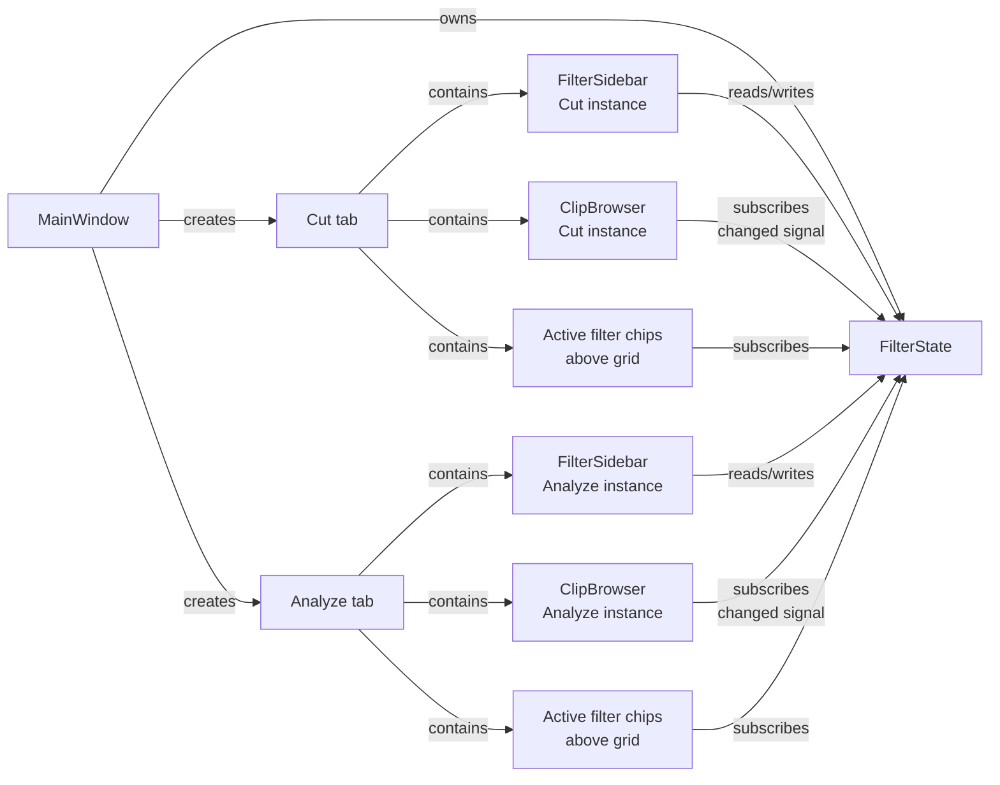

# feat: Comprehensive clip filter system for Cut and Analyze tabs

## Overview

Replace the split filter surface in `ui/clip_browser.py` (a partial
always-visible row plus a collapsing panel) with a toggleable **filter
sidebar** that exposes every relevant analysis dimension in one place.
Expand 13 existing filters and add 15 new ones across 9 categories.
Lift filter state out of per-tab `ClipBrowser` instances into a shared
`FilterState` object so the Cut and Analyze tabs operate on the same
filter values, with per-tab reset (see origin: `docs/brainstorms/2026-04-21-comprehensive-clip-filter-system-requirements.md`).

## Problem Frame

Shot hunting is the driving use case: finding clips matching multiple
precise criteria (e.g., "close-ups of exactly one person looking at
camera, no on-screen text, 2–5 seconds"). The current filter surface
fails this workflow in three ways:

1. **Partial coverage.** Several analysis dimensions have no filter
   (ImageNet labels, YOLO object count, cinematography, OCR, audio
   volume, transcript presence, per-type analysis completion).
2. **Split visibility.** Richer filters live behind a "Filters" button
   and are easy to miss; discoverability for gaze/object/brightness is
   poor.
3. **Single-select everywhere.** Shot type, aspect ratio, color
   palette, gaze are single-select, so "close-up OR extreme close-up"
   is impossible.

## Requirements Trace

Full requirements in the origin document. The plan carries all 31
requirements forward. Short reference by Unit:

- **Layout (R1–R4)** — Units 3, 4, 7
- **Shot properties (R5–R7)** — Units 4, 5
- **Visual/cinematography (R8–R11)** — Units 4, 5
- **People & gaze (R12–R13)** — Units 4, 5
- **ImageNet (R14–R15)** — Unit 6
- **YOLO objects (R16–R18)** — Unit 6
- **Text/OCR/speech (R19–R22)** — Unit 5
- **Audio (R23)** — Unit 5
- **Custom queries (R24)** — Unit 4 (no behavior change)
- **Meta/housekeeping (R25–R27)** — Unit 5
- **Interaction behavior (R28–R31)** — Units 1, 7

## Scope Boundaries

- **No saved filter presets** (explicit non-goal in origin).
- **No per-chip or per-filter NOT** (implicit Yes/No on booleans only).
- **No Sequencer-tab filter changes** (explicit non-goal).
- **No new analysis operations** — only new exposure of existing
  analysis output.
- **No cross-project filter persistence** — sidebar visibility
  persists, filter values reset on project switch.
- **No ImageNet confidence thresholding** — `Clip.object_labels` stores
  a flat `list[str]` (confidences dropped at `ui/main_window.py:7333`).
  Label-only filtering is sufficient for R14/R15.

### Deferred to Separate Tasks

- **Confidence-aware ImageNet filtering**: would require storing
  confidences on `Clip.object_labels` and migrating CLI/UI emission
  sites. Not in current requirements; revisit if shot-hunting demands
  it.
- **Dock state full persistence** (`QMainWindow.saveState/restoreState`
  for width + dock-area): only sidebar *visibility* is persisted in v1.

## Context & Research

### Relevant Code and Patterns

**Files this plan touches or mirrors:**

- `ui/clip_browser.py` — Current filter state (lines 711–751), filter
  composition `_matches_filter` (1632–1720), public
  `apply_filters` (2034–2167) / `get_active_filters` (2177–2201) /
  `has_active_filters` (2203) / `clear_all_filters` (1975–2032)
  contracts. Header filter row (762–856). Collapsible filter panel
  `_create_filter_panel` (1722–1823).
- `ui/tabs/cut_tab.py:114` and `ui/tabs/analyze_tab.py:162` — two
  separate `ClipBrowser` instances today; sibling pattern for R4.
- `ui/main_window.py:1607–1619` — tab-level `filters_changed` wiring.
- `ui/clip_details_sidebar.py:56–100` — `QDockWidget` pattern to
  mirror for `FilterSidebar` (object name, allowed areas, min/max
  width, `toggleViewAction()`).
- `ui/widgets/range_slider.py:10` — existing `RangeSlider` for all
  continuous numeric filters (duration, brightness, volume).
- `ui/widgets/category_pill_bar.py:10` — pill/chip styling template.
  Currently exclusive; new `ChipGroup` will be non-exclusive variant.
- `ui/theme.py:185–208` — `UISizes` constants (see
  `.claude/rules/ui-consistency.md`). Use `background_tertiary`,
  `accent_blue`, `badge_analyzed` (see
  `.claude/skills/scene-ripper-theme-colors/SKILL.md`).
- `models/clip.py:215–518` — all requirement fields confirmed present
  (`object_labels`, `detected_objects`, `person_count`,
  `extracted_texts`, `rms_volume`, `cinematography`, `description`,
  `transcript`, `average_brightness`, `gaze_category`, `shot_type`,
  `dominant_colors`, `custom_queries`, `tags`, `notes`).
- `models/cinematography.py:181–487` — 23 enum-valued fields; value
  constants at module level (`SHOT_SIZES`, `CAMERA_MOVEMENTS`, etc.)
  feed R11 multi-select chips.
- `core/analysis/classification.py:107–132` — cached
  `imagenet_classes.txt` (1000 labels) for R14 typeahead vocabulary;
  readable at app startup regardless of analysis completion.
- `core/analysis/detection.py:17–32, 295–349, 378, 408` — YOLO
  `detected_objects` schema; `get_object_counts()` helper for R18
  per-label rule.
- `core/analysis_availability.py:8–36` —
  `operation_is_complete_for_clip(op_key, clip)` is the exact filter
  primitive for R25. Reuse, don't re-derive.
- `core/analysis_operations.py:23–87` — canonical analysis operation
  list (`OPERATIONS_BY_KEY`) for R25.
- `core/settings.py:374–521` — `Settings` JSON store for sidebar
  visibility persistence (not QSettings).
- `tests/test_clip_browser_filters.py` (502 lines), `tests/test_custom_query_ui.py`,
  `tests/test_clip_browser_similarity.py`,
  `tests/test_clip_browser_selection.py`, `tests/test_shot_type_filter.py`,
  `tests/test_filter_clips_expanded.py` — current coverage; every
  test using the `apply_filters` / `get_active_filters` dict contract
  must keep passing.

### Institutional Learnings

High-relevance skills (apply during implementation):

- `.claude/skills/pyside6-signal-handler-stale-state/SKILL.md` —
  `filters_changed` rebuild handlers must look up clips by ID every
  time, never cache `self.current_X`. Filter state is shared across
  tabs in this plan; cross-tab contamination risk is real.
- `.claude/skills/pyside6-duplicate-signal-guard/SKILL.md` and
  `docs/solutions/runtime-errors/qthread-destroyed-duplicate-signal-delivery-20260124.md`
  — high-traffic `filters_changed` signal needs `Qt.UniqueConnection`
  + guard flags + `@Slot()`.
- `.claude/skills/pyside6-unique-connection-lambda-failure/SKILL.md` —
  `UniqueConnection` + lambda silently fails. All chip click handlers
  use named `@Slot` methods or `functools.partial` (no `UniqueConnection`).
- `.claude/skills/pyside6-checkbox-state-enum/SKILL.md` — use
  `checkbox.isChecked()`, never `state == Qt.Checked`.
- `.claude/skills/pyside6-sidebar-stale-data-refresh/SKILL.md` —
  when analysis workers mutate clip metadata (new YOLO labels, new
  cinematography fields), filter vocabulary lists must refresh via
  explicit `refresh_if_showing` hooks, with signals blocked during
  refresh.
- `.claude/skills/pyside6-tab-refactor-state-isolation/SKILL.md` —
  direct precedent for R4. Tabs should expose public methods
  (`get_filter_state()`, `set_filter_state()`), not poke widgets.
- `.claude/skills/scene-ripper-theme-colors/SKILL.md` — use
  `background_tertiary`, `accent_blue`, `badge_analyzed`. Do not
  reach for `input_background` (doesn't exist).
- `.claude/skills/pyside6-app-wide-theming/SKILL.md` — custom-styled
  chips must connect to `theme().changed`.

Known gaps (no prior learnings; call out in Risks):

- No precedent for `QCompleter` typeahead over 1000+ items in this
  codebase.
- No precedent for multi-section collapsible sidebar or `QSplitter`
  state persistence.

## Key Technical Decisions

- **Shared `FilterState` at MainWindow level with two `FilterSidebar`
  widgets (one per tab)** — honors R4 "shared by default" while
  respecting R1 "hidden state preserved per-tab." Both sidebars bind
  to the same `FilterState` instance; visibility is toggled
  independently per tab. Rejected alternatives: (a) single MainWindow
  sidebar (can't satisfy per-tab visibility cleanly), (b) sync on
  tab-switch (fragile and hard to reason about).
- **`ClipBrowser` remains the grid renderer, not the filter owner.**
  It no longer owns filter state attributes; it subscribes to
  `FilterState.changed` and re-runs `_matches_filter()` using injected
  state. This is a refactor with no behavior change for Unit 1.
- **Public `apply_filters` / `get_active_filters` dict contract stays
  stable.** Existing tests and any agent tools depending on it keep
  working. `ClipBrowser.apply_filters(d)` delegates to
  `self._filter_state.apply_dict(d)`.
- **Multi-select becomes the default for enum filters.** Shot type,
  aspect ratio, color palette, gaze, cinematography — all go from
  single-value to `set[str]`. The existing dict contract's string
  values (e.g., `shot_type: "Close-up"`) expand to accept `list[str]`
  and `set[str]`; a single string remains valid (single-item set).
- **Typeahead is a new reusable widget** (`ui/widgets/typeahead_input.py`)
  built on `QCompleter` + `QStringListModel`. Source vocabulary:
  - ImageNet: read once from `<model_cache_dir>/imagenet_classes.txt`
    (1000 labels, stable vocabulary).
  - YOLO: dynamic — union of labels present across loaded clips;
    refresh on clip-add/clip-update.
- **Reuse `operation_is_complete_for_clip()` for R25.** Don't
  re-derive the completion check; wire the existing primitive.
- **Sidebar sections are collapsible; collapse state persists via
  `Settings` JSON**, not QSettings (Settings JSON is the migration
  target per the existing `_migrate_qsettings_to_json` helper).
- **Active filter chips render above the grid** (not inside the
  sidebar), so hidden-sidebar mode still shows what's applied (R3).
  Each tab renders its own chip bar since each tab has its own
  `ClipBrowser`, but both consult the same `FilterState`.
- **Per-tab reset button lives in the tab (not in the sidebar)** and
  clears the shared `FilterState`. Resetting on one tab visibly
  affects both — this is expected given shared state.

## Open Questions

### Resolved During Planning

- **How does R4's "shared by default" coexist with R1's "hidden state
  preserved per-tab"?** Resolution: shared `FilterState` (values
  shared), independent `FilterSidebar` visibility per tab. Reset
  button per tab clears shared state for both.
- **ImageNet typeahead vocabulary source?** Cached
  `imagenet_classes.txt` (1000 labels) — loaded at sidebar init, not
  deferred behind first analysis.
- **YOLO label vocabulary source?** Union of labels actually present
  in `detected_objects` across loaded clips, not the static COCO 80.
  Covers `detection_mode: open_vocab` with user-defined classes.
- **Per-label count rule UI (R18)?** Stackable rule rows: `[label
  dropdown] [> / = / <] [int input] [× remove]`. Multiple rules ANDed.
- **Sidebar persistence storage?** `core/settings.py:Settings` JSON
  (`cut_filter_sidebar_visible: bool`, `analyze_filter_sidebar_visible: bool`,
  `filter_sidebar_section_expanded: dict[str, bool]`).

### Deferred to Implementation

- **Sidebar location (left vs right rail) and resizability** — decide
  during Unit 3 based on how it composes with the existing
  `ClipDetailsSidebar` (which is left-allowed + right-allowed). Likely
  right rail when left is taken by details. Width: match
  `ClipDetailsSidebar`'s 400–550 min/max.
- **Active-filter chip bar overflow behavior** — wrap to second line
  vs horizontal scroll. Decide during Unit 7 after seeing realistic
  state densities.
- **Typeahead performance at 1000 items** — `QCompleter` with
  `QStringListModel` handles this size comfortably per Qt docs; verify
  empirically during Unit 6 and add prefix-only filtering if popup
  feels slow.
- **Exact label strings for chip display** vs internal keys
  (e.g., `at_camera` → "At Camera") — use `models/cinematography.py`
  helpers (`get_display_badges_formatted`) and existing key→display
  mappings in `ui/clip_browser.py` where present.

## High-Level Technical Design

> *This illustrates the intended approach and is directional guidance for review, not implementation specification. The implementing agent should treat it as context, not code to reproduce.*

Component relationships after the refactor:

The `FilterState.changed` signal fires once per mutation. `ClipBrowser`
re-runs `_matches_filter` for its visible thumbnails (same loop shape
as today; only the data source changes). Both tabs' sidebars show the
same values because they read from the same `FilterState`. Per-tab
visibility is independent because each tab owns its own sidebar
widget.

## Implementation Units

- [ ] **Unit 1: Extract `FilterState` data object and refactor `ClipBrowser` to use it**

  **Goal:** Introduce a `FilterState` dataclass as the single owner of
  filter values. `ClipBrowser` loses its filter state attributes; it
  holds a reference and subscribes to change signals. Public
  `apply_filters` / `get_active_filters` dict contract is preserved
  byte-for-byte so existing tests pass without modification.

  **Requirements:** R28 (AND/OR combination semantics carried forward)

  **Dependencies:** None

  **Files:**
  - Create: `core/filter_state.py`
  - Modify: `ui/clip_browser.py` (remove `_current_filter` etc.
    attributes; route handlers to `self._filter_state`)
  - Modify: `ui/tabs/cut_tab.py`, `ui/tabs/analyze_tab.py`,
    `ui/main_window.py` (construct a single `FilterState`, inject into
    both `ClipBrowser` instances)
  - Test: `tests/test_filter_state.py` (new)
  - Touch: `tests/test_clip_browser_filters.py`,
    `tests/test_custom_query_ui.py`,
    `tests/test_clip_browser_similarity.py`,
    `tests/test_clip_browser_selection.py`,
    `tests/test_shot_type_filter.py`,
    `tests/test_filter_clips_expanded.py` — should require no change
    if contract is preserved

  **Approach:**
  - `FilterState` is a `QObject` with a single `changed` signal
    (payload: changed field names, or void if all-changes).
  - Fields mirror the existing 13 filter attributes exactly
    (`min_duration`, `aspect_ratio`, `shot_type`, `color_palette`,
    `search_query`, `selected_custom_queries`, `gaze_filter`,
    `object_search`, `description_search`, `min_brightness`,
    `max_brightness`, `similarity_anchor_id`, `similarity_scores`).
  - Enum fields that will become multi-select in Unit 4 (shot_type,
    aspect_ratio, color_palette, gaze) stay single-value here to keep
    this unit a pure refactor.
  - `FilterState.apply_dict(d: dict)` mirrors today's
    `ClipBrowser.apply_filters` signature.
  - `FilterState.to_dict()` mirrors today's `get_active_filters`.
  - `ClipBrowser._matches_filter` reads from `self._filter_state`
    instead of `self._...` attributes.
  - `ClipBrowser.apply_filters` / `get_active_filters` /
    `clear_all_filters` / `has_active_filters` delegate to
    `FilterState`.
  - `ClipBrowser.filters_changed` signal remains — forwarded from
    `FilterState.changed`.

  **Execution note:** Characterization-first. Run full filter test
  suite before and after; any behavior change is a regression.

  **Patterns to follow:**
  - `QObject` subclass pattern from `ui/clip_browser.py:686`
    (`ClipBrowser` itself).
  - Signal forwarding: see how `ClipBrowser.filters_changed` is
    consumed at `ui/main_window.py:1607–1619`.

  **Test scenarios:**
  - **Happy path:** `FilterState.apply_dict({"shot_type": "Close-up"})`
    sets `state.shot_type == "Close-up"` and emits `changed` once.
  - **Happy path:** `FilterState.to_dict()` round-trips to an input
    matching `ClipBrowser.get_active_filters()` pre-refactor (parity
    snapshot).
  - **Edge case:** `apply_dict({})` is a no-op; `changed` does not
    emit.
  - **Edge case:** Setting the same value twice only emits `changed`
    once (implicit dirty-check).
  - **Integration:** `ClipBrowser` with an injected `FilterState`
    produces identical `_matches_filter` outputs for a fixture set of
    clips vs. the pre-refactor implementation (parity harness).

  **Verification:**
  - Every existing test in `test_clip_browser_filters.py`,
    `test_custom_query_ui.py`, `test_clip_browser_similarity.py`,
    `test_clip_browser_selection.py`, `test_shot_type_filter.py`,
    `test_filter_clips_expanded.py` passes unchanged.
  - `ClipBrowser` no longer holds filter state attributes (grep
    `self._current_filter`, `self._gaze_filter`, etc. returns empty
    in ui/clip_browser.py).

- [ ] **Unit 2: Reusable sidebar UI primitives**

  **Goal:** Build the small widgets the sidebar and its sections need.
  Each is isolated and testable without a live `FilterSidebar`.

  **Requirements:** R1 (sidebar), R2 (collapsible sections),
  R6/R8/R9/R11/R13 (multi-select chips), R12/R17 (count operators),
  R14 (typeahead)

  **Dependencies:** None

  **Files:**
  - Create: `ui/widgets/collapsible_section.py`
  - Create: `ui/widgets/chip_group.py`
  - Create: `ui/widgets/typeahead_input.py`
  - Create: `ui/widgets/count_operator.py`
  - Test: `tests/test_collapsible_section.py`,
    `tests/test_chip_group.py`,
    `tests/test_typeahead_input.py`,
    `tests/test_count_operator.py`

  **Approach:**
  - `CollapsibleSection`: `QWidget` with a header `QToolButton`
    (`Qt.ToolButtonTextBesideIcon`, chevron rotates on toggle) and a
    content `QFrame`. Exposes `setContentWidget(w)`,
    `set_expanded(bool)`, `expanded` property. Emits
    `expanded_changed(bool)`.
  - `ChipGroup`: non-exclusive `QButtonGroup` wrapping checkable pill
    buttons. Accepts `(value, label)` tuples. Exposes
    `selected_values() -> set[str]`, `set_selected(set[str])`,
    `clear_selection()`. Emits `selection_changed(set[str])`. Styling
    mirrors `ui/widgets/category_pill_bar.py` (use `Radii.FULL`,
    `theme().badge_analyzed` for selected, `background_tertiary` for
    unselected).
  - `TypeaheadInput`: `QLineEdit` + `QCompleter(popupCompletion,
    caseInsensitive)` backed by `QStringListModel`. Exposes
    `set_vocabulary(list[str])`, `selected_value` (emitted on
    completion selection). Intended for single-term entry; caller
    (sidebar) handles chip accumulation.
  - `CountOperator`: `QComboBox` (`>`, `=`, `<`) + `QSpinBox`.
    Exposes `value() -> tuple[str, int] | None`, `set_value(op, n)`,
    `clear()`. Emits `value_changed(op, n)`.
  - All four widgets must connect to `theme().changed` and re-apply
    styling on theme switch (per app-wide theming skill).

  **Patterns to follow:**
  - Chip styling: `ui/widgets/category_pill_bar.py:95–114` pills with
    `Radii.FULL`.
  - Theme signal wiring:
    `ui/clip_browser.py:265–266, 595–608` (ClipThumbnail) and
    `ui/widgets/category_pill_bar.py:34–35`.
  - Range sliders are NOT built here — reuse `ui/widgets/range_slider.py`.

  **Test scenarios:**
  - **Happy path** (all four): construct with fixture inputs, verify
    initial state, simulate interaction, assert signal emission and
    accessor output.
  - **Edge case (ChipGroup):** `set_selected({})` clears all chips;
    `set_selected({"nonexistent"})` does nothing (silent skip).
  - **Edge case (TypeaheadInput):** Empty vocabulary — popup does not
    show; committing empty text emits no signal.
  - **Edge case (CollapsibleSection):** Toggle expands/collapses in
    place without emitting stray signals on initial `set_expanded`
    that matches current state.
  - **Edge case (CountOperator):** Clearing resets both operator and
    int input; `value()` returns `None`.
  - **Integration:** All four widgets render correctly under both
    dark and light themes (theme-switch test).

  **Verification:**
  - Each widget can be instantiated, used, and torn down in isolation
    under `QT_QPA_PLATFORM=offscreen`.
  - No widget references `theme().input_background` or similar
    non-existent attributes (project-standards-reviewer will catch;
    test runs a smoke `apply_to_app` before widget creation).

- [ ] **Unit 3: `FilterSidebar` widget scaffold**

  **Goal:** Build the sidebar as a `QDockWidget` wrapping a scrollable
  column of 9 `CollapsibleSection` instances with empty bodies. Two
  instances (one per tab) bind to the shared `FilterState`.
  Visibility toggles per-tab; collapse state persists via Settings.

  **Requirements:** R1, R2, R4 (shared state wiring), R30 (per-filter
  clear)

  **Dependencies:** Unit 1 (FilterState), Unit 2 (primitives)

  **Files:**
  - Create: `ui/widgets/filter_sidebar.py`
  - Modify: `ui/tabs/cut_tab.py`, `ui/tabs/analyze_tab.py` (add
    sidebar instance, toggle action)
  - Modify: `ui/main_window.py` (instantiate shared `FilterState`;
    pass to both tabs)
  - Modify: `core/settings.py` — add `cut_filter_sidebar_visible: bool
    = True`, `analyze_filter_sidebar_visible: bool = True`,
    `filter_sidebar_section_expanded: dict[str, bool]` fields
  - Test: `tests/test_filter_sidebar.py`

  **Approach:**
  - `FilterSidebar(QDockWidget)` — set `objectName`
    ("CutFilterSidebar" / "AnalyzeFilterSidebar" — unique per tab for
    any future `saveState` support); `setAllowedAreas(LeftDockWidgetArea
    | RightDockWidgetArea)`; default min/max width 360/480.
  - Constructor takes `filter_state: FilterState` and binds to
    `filter_state.changed`.
  - Scroll area wraps a `QVBoxLayout` of 9 `CollapsibleSection`
    instances keyed by section name (Shot / Visual / People / ImageNet
    / YOLO / Text / Audio / Custom Queries / Meta). Bodies are empty
    in this unit; Units 4–6 populate them.
  - Each section has a small "clear section" button in its header
    (activates when anything in that section has a non-default
    value). Implements R30.
  - Tab owns its own sidebar; tab exposes
    `toggleViewAction()`-backed Show/Hide in a tab menu or toolbar.
  - Visibility change persists to
    `settings.cut_filter_sidebar_visible` / `analyze_filter_sidebar_visible`.
  - Section collapse change persists to
    `settings.filter_sidebar_section_expanded`.

  **Patterns to follow:**
  - `ui/clip_details_sidebar.py:56–100` as QDockWidget template.
  - MainWindow dock registration at
    `ui/main_window.py:1680–1723` (chat_dock, clip_details_sidebar).
  - Settings migration at `ui/main_window.py:732–734`.

  **Test scenarios:**
  - **Happy path:** Construct sidebar with empty `FilterState`;
    assert 9 sections present in a defined order.
  - **Happy path:** Toggle visibility; setting persists to
    `settings.cut_filter_sidebar_visible`.
  - **Happy path:** Toggle a section's collapse; setting persists to
    `settings.filter_sidebar_section_expanded[<section>]`.
  - **Integration:** Two sidebars bound to same `FilterState`: mutating
    state from one sidebar emits `changed` that the other receives
    (cross-instance sync via shared state).
  - **Edge case:** Construct sidebar with no Settings entry for
    collapse state; falls back to sensible default (all expanded).

  **Verification:**
  - `QT_QPA_PLATFORM=offscreen` construction succeeds.
  - Cut tab and Analyze tab each render a sidebar that can be shown
    / hidden independently.
  - `MainWindow` holds one `FilterState` shared between both tabs.

- [ ] **Unit 4: Migrate existing filters into the sidebar**

  **Goal:** Move the 13 existing filters from `ClipBrowser`'s header
  row and collapsing panel into the appropriate `FilterSidebar`
  sections. Promote shot type, aspect ratio, color palette, and gaze
  from single-select to multi-select. Remove the now-obsolete header
  row and collapsing panel from `ClipBrowser`. Public
  `apply_filters` / `get_active_filters` contract extends to accept
  `list`/`set` for promoted fields while still accepting a string for
  backward compat.

  **Requirements:** R5, R6, R8, R9, R10, R13, R24 (layout preserved),
  R28 (within-chip OR, across-filter AND), R30

  **Dependencies:** Unit 3

  **Files:**
  - Modify: `ui/clip_browser.py` (remove header filter row and
    `_create_filter_panel`; simplify `_setup_ui`)
  - Modify: `ui/widgets/filter_sidebar.py` (populate Shot / Visual /
    People / Custom Queries sections)
  - Modify: `core/filter_state.py` (expand enum fields to `set[str]`;
    extend `apply_dict` coercion for backward-compat string input)
  - Modify: `tests/test_clip_browser_filters.py`,
    `tests/test_shot_type_filter.py`,
    `tests/test_filter_clips_expanded.py`,
    `tests/test_custom_query_ui.py` (update assertions for
    multi-select semantics)

  **Approach:**
  - **Shot (section):** duration `RangeSlider` (R5), aspect ratio
    `ChipGroup` (R6).
  - **Visual (section):** shot type `ChipGroup` (R8), color palette
    `ChipGroup` (R9), brightness `RangeSlider` (R10).
  - **People (section):** gaze direction `ChipGroup` (R13). Person
    count (R12) deferred to Unit 5.
  - **Custom Queries (section):** existing custom-query menu
    (R24) — rendered as `ChipGroup` consistent with other multi-select
    visuals. No behavior change; same AND-across-selected semantics.
  - **Promotion to multi-select:** `FilterState.shot_type` becomes
    `set[str]`. `_matches_filter` now: `if state.shot_type and thumb.shot_type not in state.shot_type: False`.
    `apply_dict` accepts either string or `list`/`set`/`tuple`.
    `to_dict()` returns the set for programmatic callers but includes
    a single-string representation when exactly one value is set (for
    MCP backward compat if any).
  - **Remove old UI:** `filters_btn`, `filter_combo`,
    `color_filter_combo`, `search_input`, `custom_query_filter_btn`,
    and the entire `_create_filter_panel` output are deleted from
    `ClipBrowser._setup_ui`. `filter_panel` teardown logic gone.
    `ClipBrowser` header shrinks to only the sort order combo and
    selection count label.

  **Execution note:** Characterization-first on multi-select
  promotion. Before changing `_matches_filter`, add failing tests
  for multi-select semantics (e.g., "shot_type=['close-up', 'extreme_cu']
  matches both"); then change the code; the pre-existing single-value
  tests stay green via backward compat.

  **Patterns to follow:**
  - Custom query multi-select chip pattern: current
    `_sync_custom_query_filter_options` at
    `ui/clip_browser.py:1346–1377` and chip UI at `:835–842`.
  - `_matches_filter` structure at
    `ui/clip_browser.py:1632–1720` — mirror the same short-circuit
    AND chain, just reading from `FilterState` and handling `set`
    inputs.

  **Test scenarios:**
  - **Happy path:** `set_selected` on shot-type chips to `{"close-up"}`
    matches only close-up clips.
  - **Happy path:** `set_selected` to `{"close-up", "extreme_cu"}`
    matches clips with either shot type (OR-within-field).
  - **Integration:** Filter values simultaneously set on shot type,
    color palette, and gaze apply as AND — only clips matching all
    three appear.
  - **Edge case (backward compat):** `apply_filters({"shot_type":
    "Close-up"})` (string) produces the same result as
    `apply_filters({"shot_type": ["Close-up"]})`.
  - **Edge case:** `apply_filters({"shot_type": None})` clears the
    filter; `apply_filters({"shot_type": []})` does the same; both
    are equivalent to "no shot_type constraint."
  - **Edge case:** Clearing a section's values via the per-section
    clear button emits `changed` once and leaves other sections
    untouched.

  **Verification:**
  - Header row in `ClipBrowser` is gone (only sort order and
    selection count remain).
  - All existing filter tests pass (may have minor assertion updates
    for multi-select where explicit single-value was asserted).
  - Visual parity: every filter that existed pre-refactor is reachable
    from the sidebar.

- [ ] **Unit 5: Add new non-object filter dimensions**

  **Goal:** Wire up the 9 new filters that don't touch
  `object_labels` / `detected_objects`: person count (R12), has audio
  (R7), cinematography (R11), on-screen text (R19–R20), transcript
  (R21–R22), RMS volume (R23), has-analysis-of-type (R25), enabled /
  disabled (R26), tag/note search (R27).

  **Requirements:** R7, R11, R12, R19, R20, R21, R22, R23, R25, R26,
  R27

  **Dependencies:** Unit 4

  **Files:**
  - Modify: `ui/widgets/filter_sidebar.py` (populate People / Visual /
    Text / Audio / Meta sections with new controls)
  - Modify: `core/filter_state.py` (add fields:
    `person_count: tuple[str, int] | None`,
    `has_audio: bool | None`, `cinematography_filters: dict[str, set[str]]`,
    `has_on_screen_text: bool | None`, `on_screen_text_search: str`,
    `has_transcript: bool | None`, `min_volume`/`max_volume`,
    `has_analysis_ops: set[str]`, `enabled_filter: bool | None`,
    `tag_note_search: str`)
  - Modify: `ui/clip_browser.py` (extend `_matches_filter` with new
    predicates)
  - Test: `tests/test_filter_state.py` (extend), `tests/test_clip_browser_filters.py`
    (add per-filter predicate tests)

  **Approach:**
  - Each new filter: add state field, add UI control in sidebar,
    extend `_matches_filter`, extend `apply_dict` / `to_dict`.
  - **Person count:** `CountOperator` (from Unit 2); predicate:
    `op(clip.person_count, n)` with `None` treated as 0.
  - **Has audio:** boolean chip pair (Yes / No / Any). Derived from
    existing `Source.has_audio` attribute or `Clip` metadata; if
    neither exists, gate by whether clip has transcript OR rms_volume
    set.
  - **Cinematography:** one `ChipGroup` per meaningful enum field
    (`camera_angle`, `camera_movement`, `dutch_tilt`,
    `focus_type`, etc.), or a single "Cinematography" section that
    groups them as nested collapsibles. Implementer's call based on
    visual density. Vocabularies come from `models/cinematography.py`
    module-level constants (`CAMERA_ANGLES`, `CAMERA_MOVEMENTS`,
    etc.). Predicate: AND across selected fields, OR within each.
  - **On-screen text:** boolean for presence
    (`bool(clip.extracted_texts)`); `QLineEdit` text search over
    `ExtractedText.text` concatenation (case-insensitive substring).
  - **Transcript:** boolean for presence
    (`bool(clip.transcript)`); text search folded into existing
    description search at R22 (rename control to "Description /
    transcript").
  - **RMS volume:** `RangeSlider` over `clip.rms_volume`, dB units.
  - **Has analysis of type X:** `ChipGroup` with
    `OPERATIONS_BY_KEY.keys()` as values. Predicate uses
    `operation_is_complete_for_clip(op_key, clip)`. Semantics: AND
    across selected ops ("must have all these analyses done").
  - **Enabled / disabled:** boolean. Predicate on `clip.disabled`.
  - **Tag/note search:** text search over
    `" ".join(clip.tags) + " " + clip.notes`.

  **Patterns to follow:**
  - Predicate layout: mirror `_matches_filter` short-circuit AND
    chain at `ui/clip_browser.py:1632–1720`.
  - Analysis completion check: reuse
    `core/analysis_availability.py:operation_is_complete_for_clip`.

  **Test scenarios:**
  - **Happy path (person count):** `state.person_count = (">", 1)`
    filters to clips with `person_count > 1`.
  - **Happy path (cinematography):** set camera_angle to
    `{"low_angle", "high_angle"}`, matches clips with either.
  - **Happy path (has-analysis):** select `{"describe", "colors"}` —
    only clips where both are complete appear.
  - **Edge case:** `clip.person_count is None` treated as 0 across
    all operators.
  - **Edge case:** `clip.rms_volume is None` excluded from matches
    when the volume range is active.
  - **Edge case:** `has_audio` boolean does not over-filter clips
    from sources with no audio analysis run yet (tolerate None).
  - **Edge case:** `operation_is_complete_for_clip` returns False
    for `custom_query` by design — ensure R25 filter doesn't
    erroneously reject all clips when custom_query is selected.
  - **Integration:** Combining person-count, cinematography, and
    has-analysis filters produces the AND intersection; visible
    count in grid equals the expected fixture count.

  **Verification:**
  - `get_active_filters()` dict gains new keys mirroring the new
    fields; `apply_filters` round-trips them.
  - All new filters reachable from the sidebar.
  - `_matches_filter` stays O(N_clips) per rebuild — no new O(N²)
    work.

- [ ] **Unit 6: ImageNet and YOLO object filters**

  **Goal:** The two object filter categories with novel UI
  requirements: ImageNet typeahead over 1000 classes, YOLO
  label chips, total object count, and per-label count rules.

  **Requirements:** R14, R15, R16, R17, R18

  **Dependencies:** Unit 4 (sidebar populated), Unit 5 (pattern for
  state/predicate extension)

  **Files:**
  - Modify: `ui/widgets/filter_sidebar.py` (populate ImageNet and
    YOLO sections)
  - Create: `ui/widgets/per_label_count_rule.py` — compound row
    widget: `[label dropdown] [> / = / <] [int] [× remove]`
  - Modify: `core/filter_state.py` — add fields:
    `imagenet_labels: set[str]`, `imagenet_mode: str` ("any"/"all"),
    `yolo_labels: set[str]`, `yolo_total_count: tuple[str, int] | None`,
    `yolo_per_label_rules: list[tuple[str, str, int]]`
  - Modify: `ui/clip_browser.py` (predicates for the 5 new fields)
  - Modify: `core/analysis/classification.py` — expose a helper
    `load_imagenet_class_list() -> list[str]` reading the cached
    `imagenet_classes.txt` (if not already publicly accessible)
  - Test: `tests/test_clip_browser_filters.py` (add object-filter
    scenarios), `tests/test_per_label_count_rule.py` (new widget
    test)

  **Approach:**
  - **ImageNet typeahead (R14):** `TypeaheadInput` populated from
    `load_imagenet_class_list()` (1000 labels). User selects →
    chip added to `imagenet_labels` set. Removed via chip × button.
    Sort-by-frequency display *nice-to-have*: show counts like
    `"dog (42)"` only when the sidebar has access to clip data; if
    too expensive, defer. (Implementer's call — deferred.)
  - **ImageNet Any/All toggle (R15):** two radio buttons above the
    chip list. Predicate:
    `any()` for "Any", `all()` for "All" across selected labels vs
    `clip.object_labels`.
  - **YOLO label chips (R16):** `ChipGroup` populated from the union
    of `{d["label"] for clip in clips for d in (clip.detected_objects or [])}`.
    Refresh the vocabulary when clips are added/updated (hook via
    `FilterSidebar.refresh_yolo_vocab()` called from
    `ClipBrowser.add_clip` / `update_clip`). Semantics: OR within
    selected.
  - **Total object count (R17):** `CountOperator`. Predicate:
    `op(len(clip.detected_objects or []), n)`.
  - **Per-label count rules (R18):** stacked `PerLabelCountRule`
    widgets. Each produces a `(label, op, int)` tuple. Predicate per
    rule: `op(Counter(d["label"] for d in clip.detected_objects)[label], n)`.
    Rules combine as AND. "Add rule" button appends a new empty
    row; "×" removes.

  **Patterns to follow:**
  - Helper: `core/analysis/detection.py:get_object_counts()` (378)
    for per-image label counting — inline equivalent is fine too.
  - Vocabulary refresh pattern:
    `_update_filter_availability` at
    `ui/clip_browser.py:2248–2291` for disabling controls when no
    data present; mirror for YOLO vocabulary refresh.

  **Test scenarios:**
  - **Happy path (ImageNet Any):** select `{"dog"}` → matches clips
    whose `object_labels` contains "dog".
  - **Happy path (ImageNet All):** select `{"dog", "golden retriever"}`
    with mode="all" → matches only clips containing both labels.
  - **Happy path (YOLO labels):** `yolo_labels = {"person", "car"}` →
    matches clips with either "person" or "car" in `detected_objects`.
  - **Happy path (YOLO total count):** `yolo_total_count = (">", 3)`
    → matches clips where `len(detected_objects) > 3`.
  - **Happy path (per-label rule):** rule `("person", "=", 1)` →
    matches clips with exactly one person detection.
  - **Happy path (stacked rules):**
    `[("person", "=", 1), ("car", ">", 0)]` → matches clips with 1
    person AND at least 1 car.
  - **Edge case (empty detections):** `clip.detected_objects is None`
    is treated as empty list across all predicates.
  - **Edge case (open-vocab label):** YOLO vocabulary includes user
    custom class ("frisbee"), filter still works when selected.
  - **Edge case (ImageNet vocabulary):** typeahead never crashes
    when imagenet_classes.txt is missing (fall back to empty list,
    disable the section with a nudge tooltip).
  - **Integration:** Combined "ImageNet has dog" AND "YOLO has-label
    person" AND "total count ≥ 2" returns the AND intersection.

  **Verification:**
  - ImageNet typeahead responds to input within a reasonable
    interactive budget (subjective: feels immediate on `main_window`
    startup with 1000 labels loaded).
  - YOLO vocabulary updates when new YOLO analysis completes and
    adds novel labels to a clip.
  - Per-label count rules can be added, configured, and removed
    multiple times without leaking widgets.

- [ ] **Unit 7: Active filter chips, per-tab reset, empty state, polish**

  **Goal:** Surface applied filter state as chips above the grid,
  add per-tab reset buttons, provide an explicit empty-results state,
  persist sidebar visibility across app restarts, and wire shared
  filter state between Cut and Analyze tabs.

  **Requirements:** R3, R4, R29 (boolean Yes/No), R31

  **Dependencies:** Units 1, 3, 4, 5, 6

  **Files:**
  - Create: `ui/widgets/active_filter_chips.py` — compact read-only
    chip bar that mirrors the current `FilterState` values, each
    with a small × that clears just that filter.
  - Modify: `ui/tabs/cut_tab.py`, `ui/tabs/analyze_tab.py` (add
    `ActiveFilterChips` above grid, add "Reset filters" button)
  - Modify: `ui/clip_browser.py` (empty-state message when no clips
    match active filters)
  - Modify: `core/settings.py` (already added fields in Unit 3 —
    ensure load/save/migration are wired)
  - Test: `tests/test_active_filter_chips.py`,
    `tests/test_clip_browser_empty_state.py`

  **Approach:**
  - `ActiveFilterChips` subscribes to `FilterState.changed` and
    renders one chip per non-default field. Chip label format:
    `<section>: <value summary>` (e.g., `"Shot: Close-up, Extreme CU"`,
    `"People: >1"`, `"Objects: person, car"`).
  - Each chip has a × that clears that specific field on
    `FilterState`.
  - Reset button calls `filter_state.clear_all()` — visible effect
    on both tabs because of shared state.
  - Empty state: `ClipBrowser` detects
    `has_active_filters() and visible_count == 0` and shows a
    centered message with a "Clear filters" action. Existing empty
    state for "no clips at all" stays as the fallback.
  - Persistence: on close/save, write sidebar visibility and
    section-expand state to `settings`. On app startup, read these
    into the two `FilterSidebar` instances.
  - Wire the two tabs' sidebars and `ClipBrowser` instances through
    `MainWindow` so both tabs see changes immediately (already done
    in Unit 3; verify here).

  **Patterns to follow:**
  - Active-filter chip pattern: reuse `ChipGroup` visuals, but
    read-only.
  - Empty state: see existing empty-state handling in
    `ClipBrowser` (grep for current "no clips" display); stack or
    adjacent to grid as appropriate.
  - Settings load/save sequencing:
    `core/settings.py:load_settings` / `save_settings`; new fields
    follow the dataclass-field pattern.

  **Test scenarios:**
  - **Happy path:** Apply several filters; chip bar shows one chip
    per active filter.
  - **Happy path:** Click × on a chip; that field clears; chip
    disappears; grid refreshes.
  - **Happy path:** Reset button clears all filters; both tabs
    reflect empty state instantly.
  - **Edge case:** No active filters — chip bar collapses/hides
    (no empty row).
  - **Edge case (chip label):** A multi-value filter with 5+ values
    renders as `"Cinematography: 5 selected"` rather than listing
    all.
  - **Integration (persistence):** Toggle sidebar visibility, quit
    app, relaunch — visibility matches.
  - **Integration (shared state):** Set a filter on Cut tab, switch
    to Analyze tab — same filter value is active and reflected in
    Analyze's sidebar.
  - **Integration (per-tab reset):** Click reset on Cut tab while
    filters are active — Analyze tab also shows cleared state
    (shared).
  - **Edge case (empty results):** Apply a filter combination with no
    matches; grid shows the empty state with Clear Filters CTA.

  **Verification:**
  - Chip bar visible at the top of both Cut and Analyze tab grids.
  - Closing with sidebar hidden on Cut tab and visible on Analyze tab
    then reopening — same state.
  - Cross-tab filter sync works end-to-end through the shared
    `FilterState`.

## System-Wide Impact

- **Interaction graph:** `FilterState.changed` will fire very
  frequently. Both tabs' `ClipBrowser._rebuild_grid`, both tabs'
  `ActiveFilterChips`, and both `FilterSidebar` instances subscribe.
  Use `Qt.UniqueConnection` + `@Slot()` + guard flags per
  `pyside6-duplicate-signal-guard` skill. Do not use lambdas with
  `UniqueConnection` (silent failure per
  `pyside6-unique-connection-lambda-failure`).
- **Error propagation:** Filter predicates that touch potentially
  `None` fields (e.g., `clip.person_count is None`) must gracefully
  treat None as the non-match side rather than raising. Add a
  defensive path in each new predicate.
- **State lifecycle risks:** When background analysis workers mutate
  clip metadata (e.g., YOLO labels added), the filter sidebar's
  vocabulary lists (YOLO label chips) must refresh. Use explicit
  `refresh_*` methods called from clip-update handlers, per
  `pyside6-sidebar-stale-data-refresh`. Block state signals during
  refresh to prevent edit loops.
- **API surface parity:** The `apply_filters` / `get_active_filters`
  dict contract is part of the external surface — MCP tools and any
  persisted state may depend on it. Preserve all existing keys;
  accept both string and list/set for promoted multi-select fields;
  add new keys without breaking old ones.
- **Integration coverage:** Unit tests with mocks won't prove the
  shared-state wiring is correct; at least one integration test per
  R4 scenario must exercise real `MainWindow` + both tabs with a real
  `FilterState`.
- **Unchanged invariants:** `Clip` schema and analysis data shapes
  (`object_labels`, `detected_objects`, etc.) are not modified.
  `ClipBrowser._matches_filter` retains its short-circuit AND chain
  structure; only its data source changes. Sequencer tab filtering
  is untouched.

## Risks & Dependencies

| Risk | Mitigation |
|------|------------|
| Typeahead over 1000 ImageNet classes feels laggy | `QCompleter` + `QStringListModel` handles this size per Qt docs. Verify empirically in Unit 6; add prefix-only filtering or max-suggestion limit if popup feels slow. |
| Cross-tab state sync causes infinite signal loops | Use `Qt.UniqueConnection` + guard flags (`self._updating_from_state`) on all `FilterState.changed` handlers. Named `@Slot` methods, no lambdas with UniqueConnection. |
| Multi-select promotion breaks API consumers expecting strings | `apply_dict` coerces string → single-item set; `to_dict` emits string when exactly one value. Existing tests stay green. Document the extension in code. |
| Collapsible sections + sidebar splitter persistence is a new pattern | Keep v1 persistence minimal: visibility + section-collapse only. Full dock geometry (width, position) deferred. |
| Filter vocabulary drift (YOLO labels change as analysis runs) | Explicit `refresh_yolo_vocab()` hook called from clip add/update. Snapshot tested. |
| Large number of units may ship incrementally with broken intermediate states | Unit 1 is a pure refactor (tests stay green). Units 2–3 add infrastructure without removing old UI. Unit 4 removes the old UI in the same unit that lands the new sidebar-backed migration — ship as one change. |
| User has open session with current filter UI on upgrade | The public `apply_filters` dict contract keeps working; worst case is a brief visual disruption on first launch with v0.3.x persisted state. Settings migration is defensive (unknown keys tolerated). |

## Documentation / Operational Notes

- Update `docs/user-guide/analysis.md` and
  `docs/user-guide/cut.md` (if present) to describe the sidebar and
  the new filter dimensions after Units 6 and 7 land.
- Consider a demo GIF for the PR description
  (`/compound-engineering:ce-demo-reel`) showing the shot-hunt
  workflow: open sidebar → add multiple filters → reset → switch tab.
- No migration logic required for persisted project state — filter
  values are runtime-only, not serialized to project file in v1.

## Sources & References

- **Origin document:** [docs/brainstorms/2026-04-21-comprehensive-clip-filter-system-requirements.md](../brainstorms/2026-04-21-comprehensive-clip-filter-system-requirements.md)
- Related code: `ui/clip_browser.py`, `ui/clip_details_sidebar.py`,
  `ui/widgets/range_slider.py`, `ui/widgets/category_pill_bar.py`,
  `models/clip.py`, `models/cinematography.py`,
  `core/analysis/classification.py`, `core/analysis/detection.py`,
  `core/analysis_availability.py`, `core/analysis_operations.py`,
  `core/settings.py`
- Institutional skills that apply: `pyside6-signal-handler-stale-state`,
  `pyside6-duplicate-signal-guard`,
  `pyside6-unique-connection-lambda-failure`,
  `pyside6-checkbox-state-enum`,
  `pyside6-sidebar-stale-data-refresh`,
  `pyside6-tab-refactor-state-isolation`,
  `scene-ripper-theme-colors`, `pyside6-app-wide-theming`
