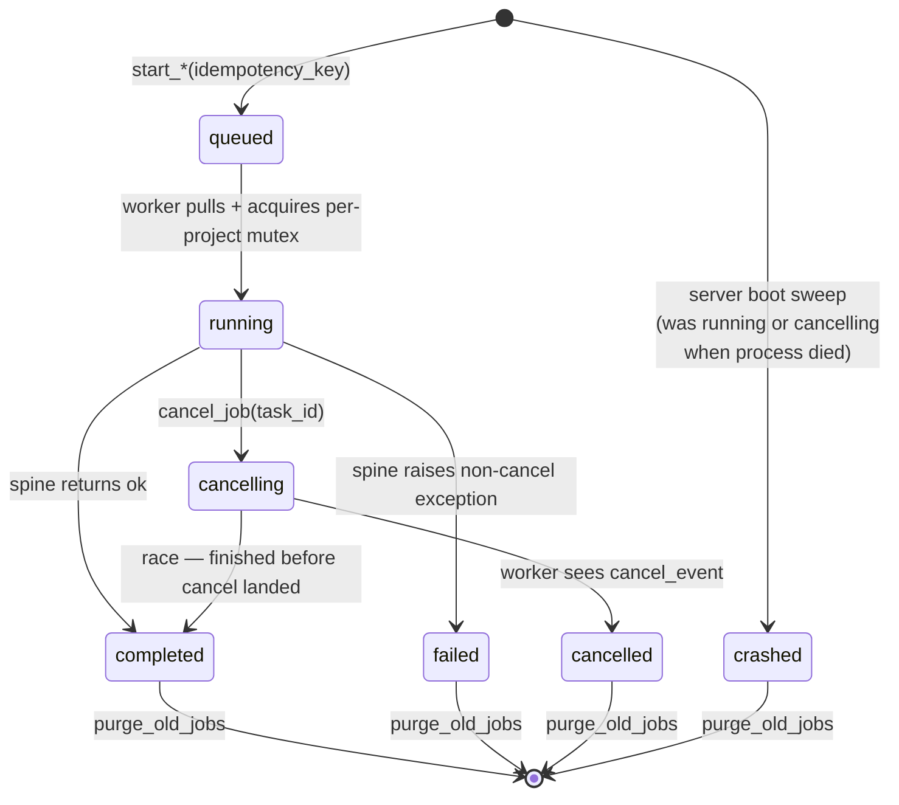

# feat: Headless agent-callable MCP with shared tool spine

## Summary

Extract a GUI-agnostic tool spine at `core/spine/` that both `core/chat_tools.py` (GUI agent) and `scene_ripper_mcp/` (MCP server) consume, refactor MCP onto `Project` instances with per-project locking, then add a SQLite-backed polling-jobs framework so Claude Code (and similar MCP-capable harnesses) can drive long-running multi-film work without sitting blocked. Nine units across four phases; the desktop GUI for students is unchanged.

---

## Problem Frame

The project owner now operates almost exclusively from Claude Code, where the natural workflow is "kick off a multi-step process, look at the result, run the next step." Today's `scene-ripper-mcp` exposes only synchronous tools, can't host hours-long multi-film batch work, and re-implements the GUI agent's catalog in parallel — every new SR feature has to be built twice or only one surface gets it. The spine refactor unifies the two catalogs; the jobs framework unblocks long-running ops; together they make Claude Code a first-class driver of Scene Ripper. (See origin: `docs/brainstorms/2026-05-05-headless-agent-mcp-requirements.md`.)

---

## Requirements

R-IDs trace 1:1 to origin requirements. Origin provides full prose; this plan adds plan-level requirements (R15+) for plumbing the brainstorm did not name.

**MCP surface and async jobs**
- R1. Start/status/result/cancel tools for long-running ops; start returns a job handle promptly. (origin R1)
- R2. Multiple concurrent jobs; status and results addressable per job handle. (origin R2)
- R3. Job state persisted to disk; coherent status after MCP server restart. (origin R3)
- R4. Cancellable jobs; cancellation does not corrupt the project file. (origin R4)
- R5. Existing synchronous MCP tools remain backward-compatible. (origin R5)
- R6. Pollable progress (percent + current-step description) while running, not only at completion. (origin R6)

**Headless project workflow**
- R7. Lightweight project handles, not full state per call. (origin R7)
- R8. MCP surface covers the F1 multi-film flow end-to-end. (origin R8)
- R9. MCP-produced project files are byte-equivalent to GUI-produced ones; round-trip cleanly. (origin R9)
- R10. No GUI process required to run any of this. (origin R10)

**Shared tool spine**
- R11. GUI-agnostic spine; functions take `Project` (and op args), no PySide6 dependency. (origin R11)
- R12. `core/chat_tools.py` consumes the spine for non-GUI ops; GUI-specific tools remain as wrappers. (origin R12)
- R13. MCP consumes the same spine; new spine ops reachable from both surfaces without separate registration. (origin R13)
- R14. Tool-by-tool refactor with regression coverage at each step. (origin R14)

**Plan-level (added during planning to make execution unambiguous)**
- R15. Spine functions are sync `def`; long-running ops accept an optional `progress_callback: Callable[[float, str], None]` and an optional `cancel_event: threading.Event`. MCP wrappers run them via `asyncio.to_thread()`; GUI agent calls them directly from the chat-worker QThread.
- R16. Path validation lives once in `core/spine/security.py`. The duplicated logic in `core/chat_tools.py` and `scene_ripper_mcp/security.py` is removed. URL validation lives once in `core/spine/url_security.py`; the existing `core/downloader.py:VideoDownloader.is_valid_url` is migrated to import from there. Both validators use the MCP-version signature (`must_exist`, `must_be_file`, `must_be_dir`); chat-tools call sites are rewritten in U1.
- R17. Concurrent jobs targeting the same project serialize through a per-project mutex keyed on `Path(project_path).expanduser().resolve()` — never the raw caller-supplied string. Jobs queue when their target project is held by a mutating job; queued status surfaces `queue_position` and `blocking_job_id` so callers can reason about the wait (R6).
- R18. Crashed jobs (process died mid-run) are marked `crashed` on the next MCP server boot via an unconditional sweep: `UPDATE jobs SET status='crashed', error='server restarted while in flight', finished_at=now() WHERE status IN ('running', 'cancelling')`. Per-item results already persisted to the project file are preserved. The caller decides whether to retry. No per-op auto-resume in v1.
- R19. Project-file collision defense: MCP captures project-file mtime at load; save aborts with a `ProjectModifiedExternally` exception if mtime drifted between load and save (with a 1s tolerance for filesystem cache jitter). This is **best-effort, not a guarantee** — `core/project.py:303-318`'s read-modify-write mid-save is still a TOCTOU window. The per-project mutex (R17) protects against intra-process races; the mtime guard catches most external collisions; an undetected race leaves last-writer-wins semantics. The v1 scope assumes the GUI is closed when MCP drives the project.
- R20. Long-running jobs reach a single terminal state with a per-item result list (`succeeded: [...], failed: [{item, error, ...}]`) — never silent skips.
- R21. `start_*` tools accept an optional `idempotency_key` (max 255 chars, validated at the MCP boundary). The composite UNIQUE constraint is `(kind, project_path, idempotency_key)` — a key is scoped to a specific op kind and project, so `'batch-1'` against project A does not collide with `'batch-1'` against project B. A row in a terminal state (`completed`) returns the existing `job_id`; rows in terminal-error states (`failed`, `cancelled`, `crashed`) allow re-submit with the same key, replacing the row. Cleanup of stale terminal rows is via the explicit `purge_old_jobs` tool (R22), not TTL on every call.
- R22. A `purge_old_jobs(days: int = 30)` MCP tool is exposed for explicit history pruning. No automatic TTL on terminal rows in v1.
- R23. The MCP server's catalog filters tools by their existing `modifies_gui_state` flag — tools with `modifies_gui_state=True` are hidden from the MCP `list_tools` response. No new `surface` field is introduced. The audit during U9 verifies the existing flag accurately reflects MCP-incompatibility (anything taking `main_window` should already be `modifies_gui_state=True`); audit fixes any miscategorized entries in `core/chat_tools.py` registrations.
- R24. The spine module passes an import-boundary test asserting `import core.spine.<module>` does not pull `PySide6`, `mpv`, or `av` into `sys.modules`.
- R25. MCP tool bodies wrap exceptions to `mcp.types.ToolError`; `asyncio.CancelledError` is caught and translated rather than propagating (defends FastMCP SDK #1152, #953). Tracebacks stored in `jobs.db:error` are sanitized — exception type + message + last 10 frames, capped at 4KB, with absolute source paths stripped.
- R26. Job table API field names use `snake_case` consistent with the codebase (`task_id`, `status_message`, `poll_interval`, `ttl_seconds`). If/when SEP-1686 Tasks stabilizes, a mechanical rename to spec-mandated names is a follow-up.
- R27. Job framework lives in `scene_ripper_mcp/jobs/` only; the GUI continues to use `ui/workers/CancellableWorker` for its own long-running work and does not consume the job framework. Spine ops are sync long-running functions; the job framework is the MCP wrapper around them.
- R28. `list_jobs` projects to safe columns only: `task_id, kind, status, progress, status_message, project_path, created_at, updated_at, finished_at, queue_position, blocking_job_id`. Sensitive payload (`args_json`, `result_json`, `error` with traceback) is confined to `get_job_result`.
- R29. The `jobs.db` SQLite file is created with mode `0o600` so other local users cannot read job history.

**Origin actors:** A1 (power user / project owner — primary), A2 (student / GUI user — must not regress), A3 (calling agent — Claude Code, Hermes, Openclaw), A4 (Scene Ripper MCP server)
**Origin flows:** F1 (multi-film analysis end-to-end, headless), F2 (job resume after restart), F3 (shared spine reachable from both surfaces)
**Origin acceptance examples:** AE1 (start returns promptly + progress polling), AE2 (job survives MCP restart), AE3 (cancel stops cleanly), AE4 (MCP-produced files round-trip through GUI), AE5 (new spine op reachable from both surfaces)

---

## Scope Boundaries

- No SR-side LLM agent loop; no agent-as-tool delegation. (origin)
- No drive-the-running-GUI bidirectional mode. (origin)
- No campaign / declarative-spec orchestration in v1. (origin — Approach C deferred)
- No standalone `scene-ripper chat` CLI agent entry point. (origin)
- No streaming MCP responses. (origin — polling chosen)
- No new GUI features for students. (origin)
- No auto-resume of jobs from per-op checkpoints (planning decision).
- No `install_feature` MCP tool in v1. MCP refuses with `feature_unavailable` error when a feature isn't ready; install remains a UI/CLI/manual concern.
- No removal of PySide6 from `requirements-core.txt`. The spine is import-boundary-isolated regardless; splitting requirements files is orthogonal and out of scope.
- No refactor of `core/chat_tools.py`'s GUI-coupled flows beyond auditing the existing `modifies_gui_state` flag and wrapping spine consumers. Plan controller's interactive surface, dialog-bound generators, tab-navigation tools, playback tools stay where they are.
- No authentication, rate-limiting, or remote-network exposure of the MCP server. Local-only as today.

### Deferred to Follow-Up Work

- `install_feature` MCP tool with progress reporting — add after v1 if `feature_unavailable` errors prove too frictionful.
- Campaign / declarative-spec orchestration layer — revisit once 2-3 multi-film campaigns have been run by hand from Claude Code and the right primitive is visible.
- Native MCP Tasks adoption — migrate from manual split-tool pattern to SEP-1686 Tasks once Python SDK support stabilizes.

---

## Context & Research

### Relevant Code and Patterns

- `scene_ripper_mcp/server.py` — FastMCP server, lifespan, transport selection (stdio/HTTP). `MCP_TOOL_TIMEOUT` env var read but not enforced today.
- `scene_ripper_mcp/tools/{project,clips,sequence,analyze,export,youtube}.py` — current MCP tools. **All bypass `Project` instance**: load via 7-tuple, mutate raw lists, save. Violates AGENTS.md "use model methods" guidance.
- `scene_ripper_mcp/schemas/inputs.py` — Pydantic models exist but are not actually wired to the tools (the tools use `Annotated[T, "..."]` directly). Spine refactor consolidates schemas.
- `scene_ripper_mcp/security.py` — path validation (`SAFE_ROOTS`, `validate_path`, `validate_video_path`, `validate_project_path`). Duplicated in `core/chat_tools.py:_validate_path` (lines 49-126).
- `core/chat_tools.py` — 7953 lines, 117 registered tools. `ToolDefinition` (line 268), `ToolRegistry` (line 324), capability flags (`requires_project`, `modifies_gui_state`, etc.). Codebase grep: **83 tools `modifies_gui_state=True`** (worker-spawning + tab/dialog/playback flows — keep as GUI wrappers per R23) and **32 tools `modifies_gui_state=False`** (project-only, spine-eligible). The chat-worker dispatches GUI-state tools to the main thread via `gui_tool_requested` (`ui/chat_worker.py:295-301`); spine ops bypass that path entirely.
- `core/tool_executor.py` — sync executor; only injects `project`. The spine fits here cleanly.
- `core/project.py` — Qt-clean (`grep` confirmed). `Project.load()` / `project.save()` / `mutation_generation` / `_notify_observers` are the API the spine should use everywhere. Atomic save via `tmp + os.replace`.
- `ui/chat_worker.py` (lines 295-320) — the chat agent's main-thread dispatch via `gui_tool_requested.emit` + `threading.Event`. Spine ops (no `modifies_gui_state`) bypass this entirely; GUI ops keep using it.
- `ui/workers/base.py` — `CancellableWorker` (`threading.Event`-based cancellation, `progress` signal). Pattern for spine-level worker wrappers transposes cleanly to non-Qt.
- `core/feature_registry.py` — `check_feature_ready`, `install_for_feature`. Already accepts `progress_callback`; no Qt deps.
- `core/plan_controller.py`, `core/gui_state.py` — Qt-free (only the bridge in `ui/main_window.py:_on_gui_tool_requested` uses Qt).
- `ui/algorithm_config.py` — structural template for the spine (zero-dep module both consumers import without importing each other).
- `tests/test_chat_tools.py` (2023 lines) — already builds real `Project` instances and calls tool functions directly. The pattern the spine refactor extends.
- `scene_ripper_mcp/tests/test_integration.py` — `pytest.mark.asyncio` with `AsyncMock()` ctx and tempfile project files.
- `tests/test_transcription_runtime_imports.py` — import-boundary test precedent for R24.

### Institutional Learnings

- `docs/solutions/runtime-errors/qthread-destroyed-duplicate-signal-delivery-20260124.md` — Qt `finished` signal can fire twice; spine progress/cancel must NOT be Qt signals — plain callables/protocols. Qt adapter wraps with `Qt.UniqueConnection` + guard flags + `@Slot()`.
- `docs/solutions/runtime-errors/macos-libmpv-pyav-ffmpeg-dylib-collision-20260504.md` — Spine must not pull `av`/`mpv`/`PyAV`/`QtGui` at top level; use lazy `__getattr__` and `find_spec`. Add boundary test.
- `docs/solutions/ui-bugs/pyside6-thumbnail-source-id-mismatch.md` — Workers must reconcile UUIDs against existing `Project` IDs before insertion; spine ops accept caller-provided IDs when extending entities.
- `docs/solutions/ui-bugs/cut-tab-clips-hidden-after-thumbnail-failure.md` — Long jobs commit primary state before enrichment; treat enrichments as updates that may fail per-item.
- `docs/solutions/security-issues/ffmpeg-path-escaping-20260124.md` — Centralize path/name sanitization in spine; coerce all `fps`/timestamps to plain `float`/decimal seconds before subprocess calls.
- `docs/solutions/security-issues/url-scheme-validation-bypass.md` — URL validators (used by YouTube/IA download) must check scheme first, then host whitelist.
- `docs/solutions/logic-errors/circular-import-config-consolidation.md` — Spine layering pattern: zero-dep module below both consumers; never reach back into the consumers' helpers.
- `docs/solutions/reliability-issues/subprocess-cleanup-on-exception.md` — Wrap subprocess iteration in `try/finally` with `proc.terminate()` then `proc.wait()`; cancellable jobs must not orphan workers.

### External References

- [MCP Tasks specification (2025-11-25)](https://modelcontextprotocol.io/specification/2025-11-25/basic/utilities/tasks) — field-name convention to mirror.
- [Async HandleId Pattern (AWS / dev.to)](https://dev.to/aws/fix-mcp-timeouts-async-handleid-pattern-8ek) — production-tested split-tool pattern.
- [MCPJam — How to work with MCP Tasks](https://www.mcpjam.com/blog/mcp-tasks) — manual-pattern walk-through.
- [python-sdk #1152](https://github.com/modelcontextprotocol/python-sdk/issues/1152) — `CancelledError` cascade can crash the server; wrap and translate.
- [python-sdk #953](https://github.com/modelcontextprotocol/python-sdk/issues/953) — `report_progress` broken under `stateless_http`; treat as best-effort UX.
- [SQLite WAL documentation](https://www.sqlite.org/wal.html) — pragmas and concurrency model.
- [SkyPilot — Abusing SQLite to Handle Concurrency](https://blog.skypilot.co/abusing-sqlite-to-handle-concurrency/) — single-process server pattern.

---

## Key Technical Decisions

- **Spine signature: sync `def` with optional `progress_callback` and `cancel_event`**. Matches `core/feature_registry.py:55` precedent. MCP wrappers run them via `asyncio.to_thread()`; GUI calls directly from chat-worker QThread. Avoids forcing async into the GUI's sync `ToolExecutor` path.
- **Spine layering: new `core/spine/` package**. Zero PySide6/mpv/av imports at module top level. Both `core/chat_tools.py` and `scene_ripper_mcp/tools/` import from it; neither imports the other. (origin: layering precedent from `ui/algorithm_config.py`.)
- **Standardize on `Project` instances, not 7-tuples**. Both surfaces `Project.load(path)` at session entry and `project.save()` after mutation. Per AGENTS.md line 62; unblocks observer-driven downstream features. Today's MCP tools are migrated tool-by-tool.
- **Job storage: SQLite + WAL** at `<settings.cache_dir>/jobs.db` (requires adding `cache_dir: Path = field(default_factory=_get_cache_dir)` to `Settings` in `core/settings.py` — currently exposed only as the private `_get_cache_dir()` helper). File created with mode `0o600`. Pragmas: `journal_mode=WAL`, `synchronous=NORMAL`, `busy_timeout=5000`, `foreign_keys=ON`. One row per job. JSON-per-job and single-registry-JSON rejected (no atomic multi-row updates, fragile under concurrent writers).
- **Crash detection: unconditional boot sweep**, not a `server_run_id` token. On lifespan startup: `UPDATE jobs SET status='crashed', error='server restarted while in flight', finished_at=now() WHERE status IN ('running', 'cancelling')`. The mark is unconditional because the MCP server is single-process by design — a row in `running` after we boot was running under a dead process.
- **Concurrent same-project jobs: per-project mutex**. Mutex keyed on `Path(project_path).expanduser().resolve()` (canonical absolute path), not the raw caller string. Jobs targeting the same project serialize; different-project jobs run in parallel. `queued` status surfaces `queue_position` and `blocking_job_id` so a calling agent polling a queued job sees something useful (R6).
- **Cancellation: hybrid `threading.Event` + DB flag**. `cancel_job` tool sets DB `status='cancelling'` then signals the in-memory event; worker checks at safe yield points. Subprocess work uses `proc.terminate()` then `wait()` in `try/finally`. Per-clip cancellation in analysis ops requires plumbing `cancel_event` into the iteration loops in `core/analysis/color.py`, `core/analysis/audio.py`, etc. — these functions are pure today but have no cancel hooks; adding them is part of U7's scope, not free.
- **GUI-vs-MCP same-project hazard: mtime guard as best-effort defense**, not a guarantee. Spine captures mtime at `Project.load()` and aborts save with `ProjectModifiedExternally` if mtime drifted (1s tolerance). The existing read-modify-write at `core/project.py:303-318` and the gap between mtime-check and `os.replace` leave a TOCTOU window — last-writer-wins under undetected races. Acceptable for the v1 "GUI closed" scope; could harden to `fcntl.flock` if collisions surface.
- **Mark-crashed semantics for restart**: locked in over auto-resume. Per-item progress already on disk in the project file is preserved; caller decides retry. Auto-resume from per-op checkpoints is deferred.
- **Partial-batch terminal state**: jobs reach `completed` with a `per_item: {succeeded: [...], failed: [{item, error}]}` payload. Generalizes today's `analyzed_count`/`skipped_count` pattern from `tools/analyze.py`.
- **Idempotency on `start_*`**: optional `idempotency_key` (max 255 chars), composite UNIQUE on `(kind, project_path, idempotency_key)`. A key matching a `completed` row returns the existing `job_id`; matching a terminal-error row (`failed`, `cancelled`, `crashed`) replaces it. Pruning stale rows is via the explicit `purge_old_jobs(days=30)` tool, not opportunistic TTL.
- **Field names: `snake_case`** consistent with codebase: `task_id`, `status_message`, `poll_interval`, `ttl_seconds`. Departs from SEP-1686 Tasks' camelCase to match the surrounding Python convention; rename is a mechanical search-replace if the spec stabilizes.
- **MCP catalog visibility**: filter on existing `modifies_gui_state` flag (no new `surface` field). MCP `list_tools` excludes `modifies_gui_state=True` entries. The audit during U9 verifies the existing flag accurately reflects MCP-incompatibility and corrects any miscategorized registrations.
- **Defensive error wrapping**: every MCP tool body wraps to `mcp.types.ToolError`; MCP tool wrappers also catch `asyncio.CancelledError` and translate. Tracebacks in `jobs.db:error` are sanitized: exception type + message + last 10 frames, ≤4KB, absolute source paths stripped. `list_jobs` projects to safe columns only — `args_json`, `result_json`, full `error` are confined to `get_job_result`. Defends FastMCP bugs and avoids leaking internal paths to LLM context.
- **`ctx.report_progress` is best-effort UX only**. Source of truth is the DB row's `progress` and `status_message` columns; agents poll those.
- **Path security**: single `core/spine/security.py` consolidates today's two implementations using the MCP-version signature (`must_exist`, `must_be_file`, `must_be_dir`). Existing `core/chat_tools.py:_validate_path` callers (which use a follow-up `if not video.is_file()`) are rewritten to pass `must_be_file=True`. URL validation similarly consolidates to `core/spine/url_security.py`; `core/downloader.py:VideoDownloader.is_valid_url` migrates to import from there. Whitelist match uses the leading-dot anchor: `host == 'youtube.com' or host.endswith('.youtube.com')`.

---

## Open Questions

### Resolved During Planning

- **Sync vs async spine signature**: Sync, with `progress_callback` and `cancel_event` (R15).
- **Job framework lives where**: MCP-only (`scene_ripper_mcp/jobs/`); spine ops are sync long-running functions. The GUI continues to use `ui/workers/CancellableWorker` for its own work and does not consume the job framework (R27).
- **Project handle shape**: Path is canonical and required on every MCP call. The MCP server keeps a per-call `Project` instance with mtime guard; no long-lived session token in v1. Reconsider after v1 if the cost of repeated `load_project` is felt.
- **Job persistence shape**: SQLite single file at `<settings.cache_dir>/jobs.db` (with mode `0o600`). Requires adding `Settings.cache_dir: Path = field(default_factory=_get_cache_dir)` since the attribute is referenced in CLAUDE.md but not currently exposed on the dataclass.
- **Cancellation granularity**: Per-op. Analysis ops cancel per-clip — but per-clip cancellation requires plumbing `cancel_event` into iteration loops in `core/analysis/color.py`, `core/analysis/audio.py`, etc. (those modules are pure but have no cancel hooks today). Detection cancels per-source. Downloads cancel per-URL with `proc.terminate()`. Plumbing the cancel hooks is part of the relevant op's scope (U7 for analysis).
- **Feature install from MCP**: Refuse with `feature_unavailable` error. Auto-install during a job is a footgun; out of scope for v1.
- **MCP catalog visibility**: filter on existing `modifies_gui_state` flag — `modifies_gui_state=True` entries are hidden from the MCP `list_tools` response (R23). No new `surface` field; the existing flag is sufficient and the audit verifies it.
- **AE5 "consistent"**: identical LLM-visible schema, identical `{success, result}` return shape, identically-structured errors; transport-level differences allowed.
- **SAFE_ROOTS enforcement layer**: spine, not surface adapters. Spine validators use `Path(...).expanduser().resolve()` and are also the source of the per-project mutex key (canonical resolved path).
- **Partial-batch terminal state**: `completed` with per-item success/failure list (R20).
- **Crashed job re-submit**: a key matching a `crashed`/`failed`/`cancelled` row allows resubmission with the same idempotency key (replaces the row); only `completed` is sticky (returns the same `task_id`). This explicitly resolves the "terminal-error state" ambiguity (R21).
- **Same-project queued status**: `get_job_status` returns `queue_position` and `blocking_job_id` for `queued` rows so polling agents see useful state, not just `progress=0` (R17, AE1).
- **Missing source files on `Project.load()` from MCP**: tool wrappers catch `MissingSourceError` from `Project.load()` and return a structured `source_files_missing` error listing the unresolved source IDs. No silent skip; no propagation as raw exception.
- **Existing async MCP tools during the migration**: U2 wraps the bodies of today's `scene_ripper_mcp/tools/analyze.py` async tools with `asyncio.to_thread(...)` so concurrent polling works during Phase 1+2 — the synchronous CPU work no longer blocks the FastMCP event loop.

### Deferred to Implementation

- [Affects U6][Technical] Optimal progress granularity for `detect_scenes` across multi-source: per-source vs per-clip vs hybrid. Resolve by writing the implementation against per-source first; if calling-agent feedback suggests insufficient resolution, add per-clip ticks.
- [Affects U7][Technical] How to deduplicate "skip-existing" semantics for analysis ops post-restart. Today each `analyze_*` tool re-runs everything; planning's R18 "preserve on-disk progress" is most useful when the calling agent re-issues with skip-existing. May or may not need a new `skip_existing: bool` param at U7.
- [Affects U4][Technical] Whether `cancel_event.set()` should be coupled with `loop.call_soon_threadsafe` to preempt awaiting workers, or whether checking-on-yield is enough. Implementation discovery.
- [Affects U2][Needs research] Whether `Project.save()` should grow an mtime-check parameter (R19) or whether wrapping at the call site is cleaner. Audit existing `save_project` callers when implementing.
- [Affects U9][Technical] Exact list of tool registrations whose `modifies_gui_state` flag drifted from reality. Codebase grep shows 83 True / 32 False; the audit verifies each `main_window`-taking tool is True and each project-only tool is False. Expect a handful of corrections.
- [Affects U5][Technical] Whether the MCP `list_jobs` tool should support filter params (`status`, `kind`, `project`) or return everything and let the agent filter. Default to "everything + agent-side filter"; revisit if the table grows.

---

## High-Level Technical Design

> *This illustrates the intended approach and is directional guidance for review, not implementation specification. The implementing agent should treat it as context, not code to reproduce.*

### Spine function signature contract

```
# core/spine/<module>.py

def detect_scenes_for_source(
    project: Project,
    source_id: str,
    sensitivity: float = 5.0,
    *,
    progress_callback: Optional[Callable[[float, str], None]] = None,
    cancel_event: Optional[threading.Event] = None,
) -> dict:
    """Detect scenes on a single existing source. Mutates project in place via
    project.replace_source_clips(). Returns
    {"success": bool, "result": {"clips": [...], "skipped_reasons": [...]}}."""
    ...
```

- Sync. Takes `Project` (already loaded by the caller) plus op args. Optional `progress_callback` and `cancel_event`. No Qt.
- GUI agent calls `executor.execute(tool_call)` from the chat-worker QThread; the executor invokes the spine function directly.
- MCP wrapper at `start_*` time: (1) loads `Project` via `core.spine.project_io.load_with_mtime(project_path)`, (2) builds a closure `def _run(): return spine.detect_scenes_for_source(project, source_id, sensitivity, progress_callback=..., cancel_event=...)`, (3) inserts a job row, (4) submits the closure to the pool, (5) returns `{task_id}`. The pool worker invokes the closure; the spine fn never reloads the project. Final result lands in `result_json`.
- `detect_scenes` has TWO entry points by necessity: `detect_scenes_for_source(project, source_id, ...)` (matches today's GUI shape — operate on an existing project source) and a thin `detect_scenes_new_project(video_path, output_project_path, ...)` (matches today's MCP shape — create-then-detect, internally composes `Project.new() + add_source() + detect_scenes_for_source`). The MCP `start_detect_scenes_bulk` job iterates per-source via the first entry point.

### Polling-jobs flow (sequence diagram)

```mermaid
sequenceDiagram
    participant CA as Calling agent (Claude Code)
    participant MCP as scene-ripper-mcp
    participant DB as jobs.db (SQLite WAL)
    participant Pool as ThreadPoolExecutor
    participant Spine as core/spine.<op>
    participant Proj as .sceneripper file

    CA->>MCP: start_analyze_colors(project_path, idempotency_key="abc")
    MCP->>Proj: load_project (Project instance + mtime captured)
    MCP->>DB: INSERT job (id=j1, kind, project_path, status=queued)
    MCP->>Pool: submit(closure binding spine.analyze_colors with project + args)
    MCP-->>CA: {task_id: "j1", status: "queued", poll_interval: 5}
    Pool->>Spine: analyze_colors(project, progress_callback, cancel_event)
    Spine->>DB: UPDATE jobs SET status=running, progress=0.0
    loop Per clip
        Spine->>Spine: extract_dominant_colors(...)
        Spine->>Spine: cancel_event.is_set() check
        Spine->>DB: UPDATE jobs SET progress=N/total, status_message="clip K"
    end
    Spine->>Proj: save (mtime check; abort with ProjectModifiedExternally if drifted)
    Spine->>DB: UPDATE jobs SET status=completed, result_json={succeeded, failed}, finished_at=...
    CA->>MCP: get_job_status("j1")
    MCP->>DB: SELECT projected_columns FROM jobs WHERE id="j1"
    MCP-->>CA: {status: "completed", progress: 1.0, status_message: "..."}
    CA->>MCP: get_job_result("j1")
    MCP->>DB: SELECT result_json FROM jobs WHERE id="j1"
    MCP-->>CA: {result: {succeeded: [...], failed: [...]}}
```

The `Project` is loaded by the MCP wrapper (not by the spine fn) so the mtime is captured at the call boundary. The closure submitted to the pool binds the loaded `Project` plus the op's named args; the spine fn receives them unpacked through the closure rather than via a generic `args` dict.

### Job lifecycle (state diagram)



### Surface partitioning

```
                ┌──────────────────────┐
                │  core/spine/*        │  sync funcs taking Project + op args
                │  (no Qt, no MCP SDK) │  + optional progress_callback + cancel_event
                └──────────┬───────────┘
                           │ imported by both
            ┌──────────────┴───────────────┐
            │                              │
  ┌─────────▼───────────┐       ┌──────────▼──────────────┐
  │ core/chat_tools.py  │       │ scene_ripper_mcp/tools/ │
  │ - GUI agent registry│       │ - sync wrappers (no job)│
  │ - injects main_window│      │ - start_*/get_*/cancel  │
  │ - dispatches GUI ops│       │   (jobs framework)      │
  │   to main thread    │       │ - hides modifies_gui... │
  └─────────────────────┘       └─────────────────────────┘
```

---

## Implementation Units

Grouped into four phases. Phase 1 lands incrementally and ships value (the GUI agent benefits from the consolidated path security and Project-instance discipline). Phase 2 adds the jobs framework. Phase 3 moves the multi-film flows onto jobs (the user-visible payoff). Phase 4 is hygiene.

### Phase 1 — Spine foundation

- U1. **Spine package + path-security consolidation + import-boundary test**

**Goal:** Establish the `core/spine/` package, move path-security and URL-validation helpers into it, and lock in the import-boundary discipline with a test.

**Requirements:** R11, R16, R24

**Dependencies:** None — this is the foundation.

**Files:**
- Create: `core/spine/__init__.py`, `core/spine/security.py`, `core/spine/url_security.py`
- Create: `tests/test_spine_imports.py`
- Modify: `core/chat_tools.py` (replace `_validate_path` etc. with imports from `core.spine.security`)
- Modify: `scene_ripper_mcp/security.py` (re-export from `core.spine.security` during the migration; deprecation path)

**Approach:**
- Move path validators into `core/spine/security.py` using the **MCP-version signature**: `validate_path(path_str, must_exist=False, must_be_file=False, must_be_dir=False) -> tuple[bool, str, Path | None]`. Existing `core/chat_tools.py` callers using `_validate_path(p, must_exist=True)` followed by `if not video.is_file()` are rewritten to pass `must_be_file=True`. The `allow_relative` parameter on `chat_tools` callers is dropped (MCP behavior is stricter and the chat agent shouldn't traffic in relative paths).
- Add `validate_url(url) -> tuple[bool, str]` to `core/spine/url_security.py`: scheme-first (only `http`/`https`), strip credentials and non-default ports, then host whitelist match using leading-dot anchor: `host == 'youtube.com' or host.endswith('.youtube.com')` (and similarly for `archive.org`). The full whitelist is enumerated in one place: `youtube.com`, `youtu.be`, `vimeo.com`, `archive.org`.
- Migrate `core/downloader.py:VideoDownloader.is_valid_url` to import from `core.spine.url_security`. There is then exactly one URL validator in the codebase.
- `scene_ripper_mcp/security.py` becomes a thin re-export so MCP tests keep passing without touching every import.
- `tests/test_spine_imports.py` asserts that importing every `core.spine.*` module does NOT add `PySide6`, `mpv`, `av`, `faster_whisper`, `paddleocr`, `mlx_vlm` to `sys.modules`. Mirror pattern from `tests/test_transcription_runtime_imports.py`.

**Patterns to follow:**
- `tests/test_transcription_runtime_imports.py` for the boundary test.
- `ui/algorithm_config.py` for the zero-dep-module layering.

**Test scenarios:**
- Happy path: importing `core.spine.security` and calling `validate_path("/Users/foo/proj.sceneripper", must_exist=False, must_be_file=True)` returns `(True, "", Path(...))`.
- Edge case: `validate_path("../../etc/passwd", must_exist=False)` rejected because `..` in raw string.
- Edge case: `validate_path("/etc/passwd", must_exist=False)` rejected — outside `SAFE_ROOTS`.
- Error path: empty string and `None` both rejected.
- Edge case (URL): `validate_url("javascript://example.com/x")` rejected on scheme; `validate_url("http://example.com:9999/")` rejected on non-default port; `validate_url("https://www.youtube.com/watch?v=abc")` accepted; `validate_url("https://evil.notyoutube.com/x")` rejected (leading-dot anchor); `validate_url("https://youtube.com/x")` accepted (bare domain).
- Integration: import-boundary test — `python -c "import core.spine.security; import sys; assert 'PySide6' not in sys.modules"` passes; same for `mpv`, `av`, `faster_whisper`.
- Backward compat: existing `scene_ripper_mcp/tests/test_integration.py` continues to pass (the re-export keeps `scene_ripper_mcp.security.validate_path` callable).

**Verification:**
- `pytest tests/test_spine_imports.py` passes.
- `pytest scene_ripper_mcp/tests/` passes unchanged.
- `grep -n "_validate_path\|SAFE_ROOTS\|validate_video_path" core/chat_tools.py scene_ripper_mcp/security.py` shows no duplicate logic, only imports.

---

- U2. **MCP `Project`-instance refactor + project-file mtime guard + async-tool wrapping**

**Goal:** Migrate every existing `scene_ripper_mcp/tools/*.py` tool from raw 7-tuple manipulation to `Project.load()` / `project.save()`. Add the mtime guard so MCP saves abort if the file changed externally. Wrap existing async tool bodies with `asyncio.to_thread()` so concurrent polling works during the migration window before jobs land.

**Requirements:** R7, R9, R19, plus pre-jobs concurrency hygiene

**Dependencies:** U1 (spine.security used in load path)

**Files:**
- Modify: `scene_ripper_mcp/tools/project.py`
- Modify: `scene_ripper_mcp/tools/clips.py`
- Modify: `scene_ripper_mcp/tools/sequence.py`
- Modify: `scene_ripper_mcp/tools/analyze.py`
- Modify: `scene_ripper_mcp/tools/export.py`
- Modify: `scene_ripper_mcp/tools/youtube.py`
- Create: `core/spine/project_io.py` (helpers: `load_with_mtime`, `save_with_mtime_check`)
- Modify: `core/settings.py` (add `cache_dir: Path = field(default_factory=_get_cache_dir)` so downstream U4 can use it)
- Modify: `scene_ripper_mcp/tests/test_integration.py` (existing tests adjust to round-trip via `Project`)

**Approach:**
- Introduce `core.spine.project_io.load_with_mtime(path) -> tuple[Project, float]` and `save_with_mtime_check(project, path, expected_mtime) -> None`. The save helper raises `ProjectModifiedExternally(path, expected_mtime, current_mtime)` (a new exception in `core.spine.project_io`) when current mtime drifted by >1s from expected; otherwise returns normally. Keeps the existing module-level `load_project`/`save_project` alive for callers who don't need the guard (the GUI uses its own save path).
- Each MCP tool body: `project, mtime = load_with_mtime(path); ... project.add_clips(...); save_with_mtime_check(project, path, mtime)`. The blanket `except Exception` in each tool catches `ProjectModifiedExternally` and returns a structured `{"success": False, "error": {"code": "project_modified_externally", "path": str(path), "since": float}}`.
- `MissingSourceError` from `Project.load()` is caught by tool wrappers and surfaced as `{"success": False, "error": {"code": "source_files_missing", "missing": [{"id": ..., "path": ...}, ...]}}`. No silent skip; callers can decide to re-acquire the source files and retry.
- Replace raw `clips.extend(...)`, `sources.append(...)`, `track.clips = [...]` with `project.add_clips()`, `project.add_source()`, `project.replace_source_clips()`, etc.
- Wrap CPU-heavy bodies of existing async tools (`tools/analyze.py:analyze_colors`, `analyze_brightness`, `analyze_audio`; `tools/youtube.py:download_video`; `tools/project.py:detect_scenes`) with `await asyncio.to_thread(_inner_sync_fn, ...)` so the FastMCP event loop stays responsive to concurrent polls while these synchronous CPU/subprocess ops run. ~1hr of work; unblocks concurrent MCP usability during Phase 1+2 before jobs framework lands.
- `Project` class itself does not gain new state — the mtime is owned by the spine helper.

**Note on `Settings.cache_dir`**: `core/settings.py` currently exposes `_get_cache_dir()` as a private helper used by `thumbnail_cache_dir`/`model_cache_dir`/`stems_cache_dir` defaults. CLAUDE.md already documents `settings.cache_dir` as the cache root, so the public field is overdue. Adding it here unblocks U4's `<settings.cache_dir>/jobs.db` path.

**Patterns to follow:**
- `core/project.py` existing `save_project()` atomic-write pattern (`tmp + os.replace`).
- AGENTS.md line 62: "use model methods such as `add_source()` and `add_clips()`."

**Test scenarios:**
- Covers AE4. Happy path: MCP `add_clip_tags(path, clip_id, ["x"])` round-trips through `Project` and produces a file the GUI loader opens identically.
- Edge case: `add_clip_tags` on a clip that doesn't exist returns structured error (not `KeyError` propagation).
- Error path: `save_with_mtime_check` rejects when an external process touched the file between load and save (simulate by `os.utime` mid-test).
- Integration: existing `scene_ripper_mcp/tests/test_integration.py` happy-path tests still pass after migration.
- Edge case: empty project (`Project.new`) round-trips through every modified tool without losing structure.

**Verification:**
- `pytest scene_ripper_mcp/tests/` passes; the integration tests now exercise `Project` rather than raw JSON.
- `grep -n "load_project\|save_project" scene_ripper_mcp/tools/*.py` shows the new helper used uniformly.

---

- U3. **Project-only chat tools migrated to spine**

**Goal:** Move the ~32 project-only chat tools (those with `modifies_gui_state=False`) from `core/chat_tools.py` into `core/spine/<topic>.py` modules; keep `core/chat_tools.py` re-exports thin during the migration so the GUI agent's behavior is unchanged. The remaining ~85 tools with `modifies_gui_state=True` continue to live in `core/chat_tools.py` as GUI-bound; they are NOT in scope for U3.

**Requirements:** R11, R12, R14

**Dependencies:** U1

**Files:**
- Create: `core/spine/clips.py`, `core/spine/sequence.py`, `core/spine/sources.py`, `core/spine/audio_sources.py`, `core/spine/queries.py` (filter/search/transcripts), `core/spine/tags.py`
- Modify: `core/chat_tools.py` (each migrated tool becomes `from core.spine.X import _impl; @tools.register(...) def my_tool(project, ...): return _impl(project, ...)`)
- Create: `tests/test_spine_clips.py`, `tests/test_spine_sequence.py`, etc.
- Modify: existing `tests/test_chat_tools*.py` (no behavioral change expected; tests verify the wrapper still produces same output)

**Approach:**
- Tool-by-tool migration. Suggested order (low-risk first): `list_clips`, `filter_clips`, `get_clip_cinematography`, `list_sources`, `list_audio_sources`, `get_audio_source`, `import_audio_source`, `search_transcripts`, `find_similar_clips`, `group_clips_by`, `add_to_sequence`, `remove_from_sequence`, `clear_sequence`, `reorder_sequence`, `sort_sequence`, `update_sequence`, `add_tags`, `remove_tags`, `add_note`, `update_clip`, `delete_clips`, `delete_frames`, `import_frames`, `update_source`, `clear_custom_queries`.
- Each spine impl: pure function `(project, *args, progress_callback=None) -> dict`. No `main_window`. No `gui_state`. No Qt imports.
- The chat-tools wrapper retains `@tools.register(...)` so the LLM sees an unchanged catalog.
- Preserve return shapes exactly so `core/tool_executor.py:114` `_format_result_for_agent` keeps working.

**Execution note:** Test-first per migration. For each tool: copy its existing test-cases under `tests/test_spine_<topic>.py` calling the spine impl directly; confirm passes; then refactor the chat-tools registration to delegate.

**Patterns to follow:**
- Existing `tests/test_chat_tools.py` setup (real `Project`, `make_test_clip`).
- AGENTS.md "use model methods" — every spine mutation goes through `project.<method>()`, never the underscore-private collections.

**Test scenarios:**
- Per migrated tool: at minimum, parity with its existing chat-tools test, called directly against the spine impl. Examples: `list_clips` returns the right count; `filter_clips({"shot_type": "close-up"})` filters correctly; `add_to_sequence([clip_id])` appends to `project.sequence` and sets `mark_dirty()`.
- Integration: a randomly-picked migrated tool, called via `core.chat_tools` (registered wrapper), produces byte-identical output to the spine impl directly.
- Edge case: each mutating spine fn correctly invalidates `Project` caches (assert `project.clips_by_source` reflects the change after `add_to_sequence`).
- Error path: each spine fn returns a structured error (not raises) on missing IDs.

**Verification:**
- `pytest tests/` passes (current test count baseline captured at U3 start; no regressions).
- `pytest tests/test_spine_*.py -v` passes.
- `pytest tests/test_chat_tools*.py -v` passes (regression guard for R14).
- `grep -c "def " core/spine/*.py` shows the migrated count matches the number of `@tools.register` wrappers that became thin delegations.

---

### Phase 2 — Jobs framework

- U4. **Jobs framework (persistence + runtime + cancellation)**

**Goal:** Build the SQLite-backed job store, the in-memory `ThreadPoolExecutor` runtime, the unconditional boot sweep, and the cancellation event/flag protocol.

**Requirements:** R1, R2, R3, R4, R6, R17, R18, R20, R21, R22, R25, R26, R27, R28, R29

**Dependencies:** U1 (spine.security for arg validation), U2 (Settings.cache_dir attribute, project_io helpers)

**Files:**
- Create: `scene_ripper_mcp/jobs/__init__.py`, `scene_ripper_mcp/jobs/store.py` (SQLite layer), `scene_ripper_mcp/jobs/runtime.py` (executor, cancellation), `scene_ripper_mcp/jobs/lock.py` (per-project mutex registry)
- Create: `scene_ripper_mcp/jobs/migrations/0001_init.sql`
- Modify: `scene_ripper_mcp/server.py` (lifespan creates the store, runs the boot sweep, owns the executor)
- Create: `scene_ripper_mcp/tests/test_jobs_store.py`, `scene_ripper_mcp/tests/test_jobs_runtime.py`

**Approach:**
- `store.py` opens `<settings.cache_dir>/jobs.db` with mode `0o600` (`os.open(..., os.O_CREAT | os.O_RDWR, 0o600)` then `sqlite3.connect`). WAL pragmas: `journal_mode=WAL`, `synchronous=NORMAL`, `busy_timeout=5000`, `foreign_keys=ON`. Schema: `jobs(id TEXT PRIMARY KEY, kind TEXT NOT NULL, status TEXT NOT NULL, idempotency_key TEXT, args_json TEXT NOT NULL, project_path TEXT, project_mtime_at_start REAL, progress REAL DEFAULT 0.0, status_message TEXT, result_json TEXT, error TEXT, queue_position INTEGER, blocking_job_id TEXT, created_at REAL NOT NULL, updated_at REAL NOT NULL, finished_at REAL)`. Composite uniqueness: `CREATE UNIQUE INDEX idx_jobs_idempotency ON jobs(kind, project_path, idempotency_key) WHERE idempotency_key IS NOT NULL`. Other indices on `status`.
- `runtime.py` exposes `submit(kind, project_path, idempotency_key, run_callable) -> task_id` returning fast: validate idempotency_key length (<=255), check existing row by `(kind, project_path, idempotency_key)` — if found in `completed` state, return its `task_id` without spawning; if found in a terminal-error state (`failed`/`cancelled`/`crashed`), DELETE the old row and proceed. Insert new row → register `Future` + `cancel_event` in an in-memory dict → submit `run_callable` (a closure prepared by the start_* tool that already binds the loaded `Project` and op args) to `ThreadPoolExecutor(max_workers=10)` → return.
- The submitted closure: acquire the per-project mutex (`lock.py`), update `status=running`, invoke the spine fn with `progress_callback` (debounced ~2s writes to `progress`/`status_message`) and `cancel_event`. On completion: write `result_json` and `status=completed`. On `cancel_event.is_set()`: `status=cancelled`. On exception: `status=failed` with sanitized traceback (≤4KB, last 10 frames, absolute paths stripped via the relative-path normalizer; full traceback never persisted).
- `lock.py`: a `defaultdict(threading.RLock)` keyed by `Path(project_path).expanduser().resolve()` — never the raw caller string. Submitting a job acquires the lock at the start of the worker fn; if already held, status reflects `queued` with `queue_position` = position behind blocking job, `blocking_job_id` = task_id of the holder. Released on completion. Same-project jobs queue serially; different-project jobs run concurrently.
- Boot sweep in `server.py:lifespan`, unconditional: `UPDATE jobs SET status='crashed', error='server restarted while in flight', finished_at=now WHERE status IN ('running','cancelling')`. No `server_run_id` indirection — the MCP server is single-process by design, so any row in `running` after boot was running under a dead process. Log how many jobs were swept (count only, not error payloads).
- Pruning: explicit `purge_old_jobs(days=30)` MCP tool. No automatic TTL on `start_*` calls.

**Execution note:** Test-first. The store and runtime should be testable without the MCP SDK (no FastMCP, no transport). The MCP wrapper in U5 uses these.

**Patterns to follow:**
- `ui/workers/base.py:CancellableWorker` for the cancellation protocol shape.
- `core/feature_registry.py:55` for the `progress_callback(progress: float, message: str)` signature.

**Test scenarios:**
- Covers AE2. Happy path: `submit("test", {}, lambda p, args, pc, ce: time.sleep(0.1))` returns a `job_id`; status transitions `queued -> running -> completed`; final `progress == 1.0`.
- Edge case: `submit` with the same `idempotency_key + kind + project_path` matching a `completed` row returns the same `task_id`; the second call doesn't spawn a worker.
- Edge case: `submit` with the same key matching a `crashed` (or `failed`/`cancelled`) row replaces the row and spawns a fresh job — the terminal-error state is not sticky.
- Edge case: same `idempotency_key` against a different `project_path` spawns a fresh job — composite scope, not global.
- Error path: `idempotency_key` longer than 255 chars rejected at submit with structured `invalid_idempotency_key` error.
- Error path: `submit` with a closure that raises `ValueError("boom")` results in `status=failed`, sanitized traceback in `error` (no absolute paths, ≤4KB).
- Cancellation: submit a long-running closure; call `cancel(task_id)`; `cancel_event` fires; closure detects it and returns; final row `status=cancelled`.
- Restart: insert a row with `status='running'`; instantiate a new store (simulating boot); row is updated to `status=crashed` with the canned error message.
- Concurrency: submit 5 same-project jobs simultaneously (different idempotency keys or none); verify they execute serially (only one `running` at a time per project) and complete in submission order. Verify queued rows surface non-zero `queue_position` and matching `blocking_job_id`.
- Concurrency: submit jobs for two different projects; verify they execute in parallel.
- Concurrency: submit two jobs with the same project under DIFFERENT path strings (one tilde-prefixed, one fully resolved); verify the mutex serializes them — the resolved canonical path is the lock key, not the raw string.
- File perms: confirm `jobs.db` is created with mode `0o600` on POSIX systems.
- Edge case: SQLite busy-wait — open two connections, one starts a write txn, the second waits up to `busy_timeout=5000` and succeeds.

**Verification:**
- `pytest scene_ripper_mcp/tests/test_jobs_*.py` passes.
- Manual: kick off a long sleep job, kill the MCP process (`kill -9 $(pgrep -f scene-ripper-mcp)`), restart, observe the row was marked `crashed`.

---

- U5. **MCP job tools (start/status/result/cancel/list/purge)**

**Goal:** Expose the jobs framework over MCP with the split-tool pattern. Field names use `snake_case` consistent with the codebase; rename to SEP-1686 spec names is a mechanical follow-up if/when that spec stabilizes.

**Requirements:** R1, R2, R3, R4, R5, R6, R22, R26, R28

**Dependencies:** U1 (spine.security for arg validation), U4 (jobs runtime)

**Files:**
- Create: `scene_ripper_mcp/tools/jobs.py`
- Modify: `scene_ripper_mcp/server.py` (import side-effect for the new tools module)
- Create: `scene_ripper_mcp/tests/test_jobs_tools.py`

**Approach:**
- New tools at the catalog level: `get_job_status(task_id) -> {status, status_message, progress, poll_interval, queue_position, blocking_job_id}` (projects safe columns only — never `args_json`/`result_json`/full `error`), `get_job_result(task_id) -> {result | error}` (only valid in terminal status; this is where sensitive payload surfaces), `cancel_job(task_id) -> {ok}`, `list_jobs(status_filter=None) -> [<safe-projection-row>]` (uses the same projection as `get_job_status`), `purge_old_jobs(days=30) -> {deleted_count}`. These are general-purpose; one set serves all op kinds.
- `start_*` tools (per op) live in U6/U7/U8. They're thin: validate args via `core.spine.security`, load `Project` via `core.spine.project_io.load_with_mtime`, build a closure binding the loaded `Project` and op args, register the job via `runtime.submit`, return `{task_id, status: "queued", poll_interval: 5}`.
- Every tool body wraps to `try/except` and converts to `mcp.types.ToolError`. `asyncio.CancelledError` is caught and re-raised as `ToolError("client cancelled request")` (defends FastMCP SDK#1152). The import path is `from mcp.types import ToolError` (the canonical FastMCP location).
- `get_job_result` returns `error` if status is `failed`/`cancelled`/`crashed`; the structured `{result}` only when `completed`. For `running`/`queued`, returns a structured `not_terminal` error with current status — never the partial result.

**Patterns to follow:**
- Existing `scene_ripper_mcp/tools/clips.py` registration pattern (`@mcp.tool()` decorator, `Annotated[str, "description"]` args).
- SEP-1686 spec field names for forward compat.

**Test scenarios:**
- Covers AE1. Happy path: `start_*` returns within <2s p99 (assertion via `time.monotonic`), `task_id` is a UUIDv4.
- Covers AE1 (queued semantics). Two same-project starts in quick succession: second returns `task_id` immediately, status `queued`, with `queue_position=1` and `blocking_job_id` set to the first.
- Covers AE2. Restart: create a row with `status='running'`, instantiate a new store (simulating boot), query `get_job_status` — returns `crashed`, never `unknown`.
- Covers AE3. Cancellation: start a long fn; call `cancel_job`; poll status → `cancelling` → `cancelled`. Verify project file unchanged (mtime captured at start preserved).
- Edge case: `get_job_result` on a job in status `running` returns a structured `not_terminal` error, not the partial result.
- Error path: `cancel_job("not-a-real-id")` returns structured error, not raises.
- Idempotency: `start_*` with a duplicate `(kind, project_path, idempotency_key)` matching a `completed` row returns the same `task_id`. Same key against a `crashed` row spawns a new job. Same key against a different `project_path` spawns a new job.
- Error path: `idempotency_key` longer than 255 chars rejected by `start_*` with structured error.
- Info-disclosure check: `get_job_status` and `list_jobs` responses do NOT include `args_json`, `result_json`, or `error` fields. `get_job_result` is the only place the sensitive payload appears, and it's gated on terminal status.
- Edge case: `list_jobs(status_filter="completed")` returns only completed rows; `list_jobs()` returns all.
- `purge_old_jobs(days=30)` deletes rows where `finished_at + 30*86400 < now()`; running/queued rows are never deleted.

**Verification:**
- `pytest scene_ripper_mcp/tests/test_jobs_tools.py` passes.
- Manual smoke (with `scene-ripper-mcp --transport stdio`): use the MCP inspector to call `start_*`, then `get_job_status`, then `get_job_result`.

---

### Phase 3 — Long-running ops as jobs

- U6. **`detect_scenes` through jobs (canonical first integration)**

**Goal:** First end-to-end demonstration of a long-running op routed through the jobs framework. Reconciles the two existing `detect_scenes` implementations — which have **different op semantics** (chat_tools operates on an existing project + adds source; MCP creates a new project) — onto a single spine canonical impl plus a thin compose-then-detect entry point for the new-project case.

**Requirements:** R6, R8, R20

**Dependencies:** U3 (spine package), U5 (MCP job tools)

**Files:**
- Create: `core/spine/detect.py` (defines `detect_scenes_for_source` and `detect_scenes_new_project`)
- Modify: `core/chat_tools.py` (remove inline `detect_scenes`; register a thin wrapper that calls `core.spine.detect.detect_scenes_for_source`)
- Modify: `scene_ripper_mcp/tools/project.py` (remove inline `detect_scenes`; replace with `start_detect_scenes_bulk` (per-source list) and `start_detect_scenes_new_project` (one video → new project) job tools)
- Modify: `scene_ripper_mcp/tools/jobs.py` (or extend) for the `start_*` registrations
- Create: `tests/test_spine_detect.py`

**Approach:**
- `core.spine.detect.detect_scenes_for_source(project, source_id, sensitivity, *, progress_callback, cancel_event) -> dict` is the canonical impl. Per-source. Returns `{success, result: {clips: [...], skipped_reasons: [...]}}`. Mutates project via `project.replace_source_clips(source_id, new_clips)` (preserves the AGENTS.md model-method discipline; respects existing `mutation_generation` invariants).
- `core.spine.detect.detect_scenes_new_project(video_path, output_project_path, sensitivity, *, progress_callback, cancel_event) -> dict` is the compose entry point: creates a fresh `Project.new()`, adds the source via `project.add_source()`, calls `detect_scenes_for_source`, saves to `output_project_path`. Used by MCP callers that don't yet have a project file (today's MCP `detect_scenes` shape).
- A bulk spine fn `core.spine.detect.detect_scenes_bulk(project, source_ids, sensitivity, *, progress_callback, cancel_event)` iterates per source via `detect_scenes_for_source`, reports `progress = i/len(source_ids)` after each. Per-item failure aggregated into `failed: [{source_id, error}]`; never raises mid-batch. Cancel via `cancel_event` between sources (per-source granularity for detection).
- MCP exposes both `start_detect_scenes_bulk(project_path, source_ids, sensitivity, idempotency_key)` (existing project) and `start_detect_scenes_new_project(video_path, output_project_path, sensitivity, idempotency_key)` (greenfield from a single video) — they cover different workflows; one MCP tool per workflow.
- Source ID reconciliation per the thumbnail-id-mismatch learning: if source_ids contains an ID not in `project.sources_by_id`, that source goes into `failed` with reason `unknown_source_id`, the worker continues with the rest.

**Execution note:** Characterization-first. Read the two existing `detect_scenes` implementations carefully, write a test capturing what they do today (especially edge cases: empty videos, codec failures, FrameTimecode handling), then refactor.

**Patterns to follow:**
- Existing `core/scene_detect.py:SceneDetector` (already uses `progress_callback` natively).
- The `analyzed_count`/`skipped_count` shape from `scene_ripper_mcp/tools/analyze.py` for the per-item failure list.

**Test scenarios:**
- Covers F1, AE1, AE5. Happy path: call `core.spine.detect.detect_scenes_for_source(project, source_id, sensitivity=5.0)` — returns clips, mutates `project.clips_by_source[source_id]`, marks dirty.
- Edge case: source with FrameTimecode-style fps (existing learning: `fix(detect): handle FrameTimecode progress callbacks`) round-trips correctly.
- Error path: source file missing on disk — `failed: [{source_id, error: "source_file_missing"}]`, no exception propagates.
- Cancellation: start a `detect_scenes_bulk` over 3 sources; set `cancel_event` after the first; second/third sources are not started; result reports `cancelled` partway with `succeeded: [first_source_id]`.
- Integration: `start_detect_scenes_bulk` job → poll until `completed` → `get_job_result` → call `get_project_state` → confirm new clips present and disabled-state preserved.
- Boundary: import `core.spine.detect` does not pull `PySide6` into `sys.modules` (extends `tests/test_spine_imports.py`).

**Verification:**
- Both `pytest tests/test_spine_detect.py` and `pytest scene_ripper_mcp/tests/` pass.
- `grep -rn "def detect_scenes" core/ scene_ripper_mcp/` shows only the spine canonical impl plus thin wrappers.

---

- U7. **Analysis ops as jobs (the F1 multi-film payoff)**

**Goal:** Extract analysis ops from `scene_ripper_mcp/tools/analyze.py` (which is where they live today — they are NOT in `core/chat_tools.py`; only `analyze_all_live` is, as a GUI worker wrapper) into spine + jobs. This is the user's stated multi-film batch use case. **Plumbing per-clip cancellation into `core/analysis/color.py`/`audio.py` is part of this unit's scope, not a free transposition** — those modules are pure but have no `cancel_event` hooks today.

**Requirements:** R6, R8, R18, R20

**Dependencies:** U6 (template established)

**Files:**
- Create: `core/spine/analyze.py` (analysis spine impls, with cancel-event plumbing)
- Modify: `core/analysis/color.py`, `core/analysis/audio.py`, `core/analysis/brightness.py` (or equivalents) — add optional `cancel_event` parameter to per-clip iteration loops; check between clips/frames at safe yield points
- Modify: `scene_ripper_mcp/tools/analyze.py` (replace synchronous `analyze_colors` with `start_analyze_colors`; ditto brightness, audio; the existing async tool bodies become thin start_* wrappers)
- Modify: `core/chat_tools.py` only for `analyze_all_live` (a GUI worker wrapper that stays); no project-only analysis tools to remove from there
- Create: `tests/test_spine_analyze.py`

**Approach:**
- Analysis spine fns: `analyze_colors(project, clip_ids, *, progress_callback, cancel_event)`, `analyze_brightness(project, clip_ids, ...)`, `analyze_audio(project, clip_ids, ...)`. Each iterates clips and calls the existing pure functions in `core/analysis/*` — but those functions get a new optional `cancel_event` parameter. If passed, the iteration loop inside `extract_dominant_colors` / `analyze_audio_clip` / etc. checks `cancel_event.is_set()` between the unit-of-work boundaries (per-frame for color k-means, per-stem for demucs, per-clip for brightness). The spine fn checks `cancel_event` between clips for coarse-grained cancel.
- A composite `analyze_all(project, clip_ids, ops: list[str], *, progress_callback, cancel_event)` runs the requested ops in sequence. Progress weighted by op estimated cost.
- Feature gating: the spine fn calls `core.feature_registry.check_feature_ready(name)`; if not ready, returns `{success: false, error: {code: "feature_unavailable", feature: name, missing: [...]}}` immediately. No auto-install.
- Skip-existing: each per-clip step checks `if clip.<analysis_field> is not None: skip` so calling agents can re-issue after a `crashed` job and the work resumes from where it left off (R18 — preserve on-disk progress).
- Subprocess calls (FFprobe-based brightness, demucs for stems) keep `proc` handles and call `proc.terminate()` then `wait()` in `try/finally` on cancel.

**Execution note:** Test-first per op. Use existing `tests/test_chat_tools*.py` patterns.

**Patterns to follow:**
- Existing `core/analysis/color.py`, `core/analysis/audio.py` pure functions.
- `ui/workers/color_worker.py` for the iteration shape and error aggregation pattern.
- `cut-tab-clips-hidden-after-thumbnail-failure` learning — commit primary state before enrichment.

**Test scenarios:**
- Covers F1. Happy path: `analyze_colors(project, [c.id for c in project.clips])` runs, populates `clip.dominant_colors`, returns `succeeded: all_clips, failed: []`.
- Edge case: skip-existing — pre-populate `clip.dominant_colors` on half the clips, call `analyze_colors` again, assert only the remaining clips were processed (per `progress` ticks).
- Error path: feature `color_analysis` not ready — returns structured `feature_unavailable` error without attempting work.
- Cancellation: start `analyze_audio` (slow); set `cancel_event` mid-loop; verify subprocess (`ffprobe`) was terminated; final status `cancelled`; partial results saved via the `commit-primary-before-enrichment` discipline.
- Integration via MCP: `start_analyze_colors` → poll status → `get_job_result` → `get_project_state` → confirm `dominant_colors` populated.
- Edge case: 12 sources × ~50 clips each (multi-film batch) completes within the polling window without timing out the calling agent's poll loop. Progress ticks per-clip; agent sees ~600 progress updates over the run.

**Verification:**
- `pytest tests/test_spine_analyze.py` passes.
- Manual: drive F1 from Claude Code (a real ~12-source project). Time-box: must complete with no required GUI interaction.

---

- U8. **Download ops as jobs (search + per-URL + bulk)**

**Goal:** YouTube and Internet Archive download tools become long-running jobs.

**Requirements:** R6, R8, R20

**Dependencies:** U5 (MCP job tools), U7 (multi-item job pattern proven)

**Files:**
- Create: `core/spine/downloads.py`
- Modify: `core/chat_tools.py` (replace `download_video`, `download_videos` with thin wrappers)
- Modify: `scene_ripper_mcp/tools/youtube.py` (replace synchronous downloads with `start_download_videos`)
- Create: `tests/test_spine_downloads.py`

**Approach:**
- `core.spine.downloads.download_videos(project, urls: list[str], target_dir: Path, *, progress_callback, cancel_event)` iterates URLs, calls existing `core.downloader.download(url)` per item.
- Each subprocess (yt-dlp) tracked by the worker for explicit `proc.terminate()` on cancel.
- Per-URL failures (geo-block, DRM, deleted) aggregated to `failed: [{url, error_code, error_message}]`.
- URL validation via `core.spine.url_security.validate_url` (from U1) — scheme-first, host whitelist (`youtube.com`, `youtu.be`, `archive.org`).
- Search ops (`search_youtube`, `search_internet_archive`) stay synchronous — they're <30s and don't need jobs.

**Patterns to follow:**
- Existing `core/downloader.py`.
- `subprocess-cleanup-on-exception` learning for `try/finally`.

**Test scenarios:**
- Happy path: `download_videos(project, [valid_url], tmp_dir)` returns `succeeded: [{url, file_path}]`, file exists on disk.
- Edge case: URL list with one geo-blocked URL among 5 valid — returns `succeeded: [4 urls]`, `failed: [{url, error_code: 'geo_blocked'}]`. Job status `completed` (not `failed`).
- Error path: invalid scheme (`javascript://...`) rejected at validation, never reaches yt-dlp.
- Cancellation: start download of a large file; set `cancel_event`; subprocess receives SIGTERM; partial file is removed; job status `cancelled`.
- Integration: `start_download_videos` → poll → result → `get_project_state` shows new sources present in the project.

**Verification:**
- `pytest tests/test_spine_downloads.py` passes (with mocked `core.downloader.download` to avoid real network).
- Manual: download 3 short YouTube videos via MCP from Claude Code.

---

### Phase 4 — Catalog hygiene & docs

- U9. **MCP catalog filter on `modifies_gui_state` + audit + documentation**

**Goal:** Filter the MCP catalog to exclude tools whose `modifies_gui_state=True` (the existing flag is the right axis — anything that needs `main_window` should already carry it). Audit the existing flag usage to fix any miscategorized registrations. Update docs so the new shape is discoverable.

**Requirements:** R12, R13, R23

**Dependencies:** U3 (spine package established so the GUI-vs-spine line is clear)

**Files:**
- Modify: `scene_ripper_mcp/server.py` (or wherever the MCP catalog is built — add filter excluding `tool.modifies_gui_state=True` from the FastMCP `list_tools` exposure)
- Audit & correct: every `@tools.register(...)` in `core/chat_tools.py` — verify that any tool taking `main_window` is `modifies_gui_state=True` and any project-only tool is `modifies_gui_state=False`. Codebase grep shows 83 currently True / 32 False; the audit may shift a handful at the margins.
- Create: `docs/user-guide/headless-mcp.md` — caller-facing reference (start/status/result/cancel pattern, idempotency contract, project-mtime guard, feature_unavailable errors, calling-agent UX guidance)
- Modify: `AGENTS.md` (mention the spine layering rule and the boundary test under "Architecture & safety patterns")
- Modify: `CLAUDE.md` (mirror the AGENTS.md addition; correct the `Settings.cache_dir` reference if needed)

**Approach:**
- No new `surface` field on `ToolDefinition`. The existing `modifies_gui_state` already encodes the right boundary: `True` means "needs the main thread to dispatch through" — which is exactly the same set of tools that need a `main_window` and therefore can't run from MCP. Adding a parallel `surface` field is unjustified complexity.
- MCP catalog filter: at FastMCP `list_tools` time (or equivalent — confirm with FastMCP API), filter out tools whose `modifies_gui_state=True`. The chat agent (GUI side) continues to see all tools.
- Audit: walk through `core/chat_tools.py` registrations. For any tool that takes `main_window` but is registered with `modifies_gui_state=False`, fix it. For any tool that's `modifies_gui_state=True` but is genuinely project-only (rare; perhaps left over from a refactor), fix it. Document any genuinely surprising entries in the audit notes for future reference.
- The "Calling-agent UX contract" subsection of `docs/user-guide/headless-mcp.md` covers: how to discover in-flight jobs at session start (`list_jobs(status_filter=['queued','running'])`), recommended polling cadence (use the `poll_interval` returned by `start_*` and `get_job_status`), and that `get_job_result` is a separate call required after status indicates `completed`.

**Patterns to follow:**
- Existing `ToolDefinition` dataclass shape (no new fields).
- Existing `to_openai_format()` pattern for the LLM-visible projection — it already reads `modifies_gui_state`; reuse via a `surface_filter` parameter.

**Test scenarios:**
- Happy path: `core.chat_tools.tools.to_openai_format(exclude_gui=True)` returns only tools where `modifies_gui_state=False`. Same call without `exclude_gui` returns the full set.
- Integration: an MCP `list_tools` (FastMCP equivalent) does NOT include `present_plan`, `navigate_to_tab`, `analyze_all_live`.
- Audit verification: every tool whose function signature includes a `main_window` parameter has `modifies_gui_state=True` — assertion via `inspect.signature`.
- Regression: chat-worker tests pass — the GUI agent still sees and dispatches all tools as before.

**Verification:**
- `pytest` passes across `tests/` and `scene_ripper_mcp/tests/`.
- Manual: run the MCP inspector against `scene-ripper-mcp` and confirm GUI-only tools are hidden.
- `docs/user-guide/headless-mcp.md` exists and covers the polling-jobs contract, idempotency, manual-purge semantics, project-handle semantics, and the calling-agent UX contract.

---

## System-Wide Impact

- **Interaction graph:** The chat-worker `gui_tool_requested` bridge (`ui/chat_worker.py:295-320`) continues to serve `modifies_gui_state=True` tools (its existing role). Spine tools (`modifies_gui_state=False`) execute inline via `ToolExecutor` on the chat-worker QThread. The MCP server gains a per-project lock manager; concurrent same-project jobs now serialize.
- **Error propagation:** Spine fns return `{success: false, error: {code, message, ...}}` rather than raise. MCP wrappers catch unexpected exceptions → `ToolError`. `asyncio.CancelledError` translated rather than propagated. The GUI agent's existing `_format_result_for_agent` consumes the same shape.
- **State lifecycle risks:** (a) Project-mtime guard — if multiple processes touch the file the second save aborts with `ProjectModifiedExternally` (best-effort, see R19 caveats). (b) Terminal job rows accumulate until `purge_old_jobs(days=N)` is called explicitly. (c) Cancelled jobs save in-flight work up to the last commit point, then mark cancelled — no rollback.
- **API surface parity:** `core/chat_tools.py` LLM-visible schemas unchanged for migrated tools. MCP tool catalog gets new `start/status/result/cancel/list_jobs/purge_old_jobs` entries plus the existing tools (which keep their synchronous shape per R5).
- **Integration coverage:** New cross-layer tests at the MCP+spine+Project boundary (jobs framework, mtime guard, cancellation through subprocess termination). The chat-worker bridge is unchanged but its scope tightens; existing chat-tool tests retain regression-coverage role.
- **Unchanged invariants:** `Project` API (`add_source`, `add_clips`, observers, `mutation_generation`) is unchanged. `requirements-core.txt` contents unchanged. Existing synchronous MCP tools keep their schemas (R5). The desktop GUI for students sees no behavioral change.

---

## Risks & Dependencies

| Risk | Mitigation |
|------|------------|
| Spine refactor regresses GUI agent during U3 | Tool-by-tool migration with full test parity at each step (R14). Run the existing `tests/test_chat_tools*.py` suite after every tool moved. |
| FastMCP SDK bugs (`CancelledError` cascade, `report_progress` under stateless_http) crash server | Wrap every tool body in try/except → `mcp.types.ToolError`. Treat `report_progress` as best-effort UX; DB is source of truth. Pin `mcp[cli]` version in `pyproject.toml` once a known-good is identified. |
| SQLite WAL contention at higher concurrency than scoped (10+ jobs) | Pragmas chosen for the 3-10 concurrent-job range. If the user's actual load exceeds this, reconsider — but it's not a v1 concern. |
| Project-file mtime guard misses race in `core/project.py:303-318` read-modify-write window | Documented as best-effort defense, not a guarantee (R19). The per-project mutex (R17) prevents intra-process races; the mtime guard catches most external collisions; an undetected race leaves last-writer-wins. Acceptable for v1 "GUI closed" scope; harden to `fcntl.flock` if collisions surface in practice. |
| Project-file mtime guard false-positives (network mounts, disk caching) | 1s tolerance built into the comparison. If false positives surface, switch to content-hash check under the same lock window. |
| Long-running yt-dlp/ffmpeg subprocess doesn't terminate on `proc.terminate()` | After 5s grace, escalate to `proc.kill()`. Already a known pattern from `subprocess-cleanup-on-exception` learning. |
| Spine modules accidentally import Qt via transitive `from core.X import ...` | `tests/test_spine_imports.py` catches this in CI. Audit at U1; re-run after each phase. |
| Per-project mutex starves a queued job behind a stuck job | Job timeouts (default 1h, configurable per kind). Stuck jobs eventually `failed` with `timeout_exceeded`, releasing the lock. `queue_position` and `blocking_job_id` in `get_job_status` make wait state visible to the caller. |
| Calling agent disconnects, jobs continue consuming resources | Acceptable in v1 (stated in deferred questions). Future: add idle-timeout / heartbeat if it bites. |
| `is_cancelled` plumbing in `core/analysis/*` is more invasive than expected | U7 estimate is conservative on this; if the cancel-event integration touches more loops than expected, reduce cancel granularity to per-clip (vs per-frame inside k-means) and document. |
| Audit of `modifies_gui_state` flag (U9) shifts more than a handful of tools | Risk that the codebase has drifted and several tools are mis-flagged. Mitigation: the audit IS the work — assertion test using `inspect.signature` catches `main_window`-taking tools that are currently `modifies_gui_state=False`. |

---

## Phased Delivery

### Phase 1 — Spine foundation (~1 week)
U1, U2, U3. Ships value to the GUI agent immediately (consolidated path security, Project-instance discipline) AND restores concurrent-MCP-usability today via U2's `asyncio.to_thread` wrapping of existing tool bodies — the headless caller can already poll concurrently before jobs land. Low blast radius; reversible.

**Alternative sequencing considered**: jobs-first against today's MCP tools (Phase 2 before Phase 1) would let F1 ship in ~1 week. Rejected because (a) the load-mutate-save races today's MCP tools have are made worse by concurrent jobs without U2's `Project`-instance discipline + per-project mutex, and (b) the spine consolidation in U1 is needed before U4's `Project` lifecycle helpers are well-defined. The chosen ordering pays a one-week tax for migration safety.

### Phase 2 — Jobs framework (~1 week)
U4, U5. The plumbing without yet user-visible payoff. Adds new MCP tools that are unused until Phase 3.

### Phase 3 — Long-running ops on jobs (~1.5 weeks)
U6, U7, U8. The user-visible payoff: F1 multi-film flow becomes drivable from Claude Code. U6 establishes the pattern; U7 delivers the stated motivating use case; U8 rounds out coverage.

### Phase 4 — Hygiene (~3-4 days)
U9. Surface tagging, catalog filter, documentation.

**Total:** ~3-4 weeks of focused work.

---

## Documentation Plan

- `docs/user-guide/headless-mcp.md` (new) — caller-facing: how to drive `scene-ripper-mcp` from Claude Code; the polling-jobs contract (`task_id`, `status`, `progress`, `status_message`, `poll_interval`, `queue_position`, `blocking_job_id`); idempotency keys (composite scope, max 255 chars, terminal-error states allow re-submit); cancellation; project-mtime guard semantics; structured error codes (`feature_unavailable`, `source_files_missing`, `project_modified_externally`, `not_terminal`, `invalid_idempotency_key`); recovery patterns. Includes a "Calling-agent UX contract" subsection: at session start, call `list_jobs(status_filter=['queued','running'])` to discover in-flight work; the `poll_interval` returned by `start_*` and `get_job_status` is the recommended cadence; `get_job_result` is a separate call required after status reaches a terminal state (the result is NOT auto-included in `get_job_status`).
- `AGENTS.md` — add spine layering rule; mention the `tests/test_spine_imports.py` boundary test under "Architecture & safety patterns."
- `CLAUDE.md` — mirror the AGENTS.md addition; note that `core/spine/` is now the place for new tool implementations.
- `docs/solutions/` — capture post-implementation: (a) MCP polling-jobs pattern with FastMCP gotchas; (b) per-project mutex for concurrent MCP writes; (c) the Project-mtime collision defense.

---

## Open Strategic Questions (not blocking — for the user to weigh)

These are judgment calls the document review surfaced; the plan does not silently resolve them either way. They do not block planning or implementation but are worth revisiting once you have running data.

- **Spine compounding-value claim is unevidenced today.** The plan asserts that single-tool-source-of-truth has compounding value across the GUI agent and MCP. With the user operating almost exclusively from Claude Code, the GUI agent may be a fading consumer; the spine still pays back as the MCP-canonical surface either way, but the dual-surface framing in the Problem Frame is partly speculative. Worth re-evaluating after Phase 1: if the GUI agent's catalog turns out to be diverging in practice, lean further into MCP-canonical and let the GUI agent shrink.
- **Bundle vs. ship-jobs-first sequencing.** Phase 1 lands ~1 week of foundation before Phase 3 ships the F1 multi-film payoff. Phased Delivery now names the alternative explicitly and the chosen sequencing's cost — accept and proceed, or revisit if the user feels the wait.
- **Campaign abstraction (Approach C) deferral lacks a learning loop.** Plan calls for revisiting after 2-3 multi-film campaigns. Suggested observation discipline while running them by hand: capture the prompt sequence used, where Claude Code re-prompted itself for context, and which tool calls were repetitive across campaigns. That data informs whether the right primitive is a structured spec, a saved prompt template, or a higher-level tool.

---

## Sources & References

- **Origin document:** [docs/brainstorms/2026-05-05-headless-agent-mcp-requirements.md](docs/brainstorms/2026-05-05-headless-agent-mcp-requirements.md)
- Related code: `scene_ripper_mcp/server.py`, `scene_ripper_mcp/tools/`, `core/chat_tools.py`, `core/tool_executor.py`, `core/project.py`, `ui/chat_worker.py`, `ui/workers/base.py`, `core/feature_registry.py`, `core/plan_controller.py`, `core/gui_state.py`, `ui/algorithm_config.py`, `tests/test_chat_tools.py`, `scene_ripper_mcp/tests/test_integration.py`, `tests/test_transcription_runtime_imports.py`
- Institutional learnings: `docs/solutions/runtime-errors/qthread-destroyed-duplicate-signal-delivery-20260124.md`, `docs/solutions/runtime-errors/macos-libmpv-pyav-ffmpeg-dylib-collision-20260504.md`, `docs/solutions/ui-bugs/pyside6-thumbnail-source-id-mismatch.md`, `docs/solutions/ui-bugs/cut-tab-clips-hidden-after-thumbnail-failure.md`, `docs/solutions/security-issues/ffmpeg-path-escaping-20260124.md`, `docs/solutions/security-issues/url-scheme-validation-bypass.md`, `docs/solutions/logic-errors/circular-import-config-consolidation.md`, `docs/solutions/reliability-issues/subprocess-cleanup-on-exception.md`
- External: [MCP Tasks spec 2025-11-25](https://modelcontextprotocol.io/specification/2025-11-25/basic/utilities/tasks), [Async HandleId Pattern (AWS)](https://dev.to/aws/fix-mcp-timeouts-async-handleid-pattern-8ek), [python-sdk #1152](https://github.com/modelcontextprotocol/python-sdk/issues/1152), [python-sdk #953](https://github.com/modelcontextprotocol/python-sdk/issues/953), [SQLite WAL](https://www.sqlite.org/wal.html), [SkyPilot — Abusing SQLite for Concurrency](https://blog.skypilot.co/abusing-sqlite-to-handle-concurrency/)
