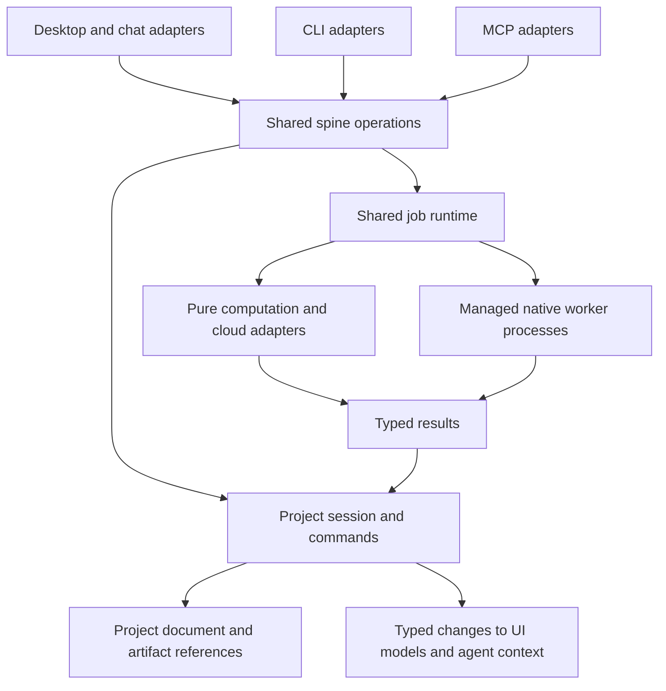
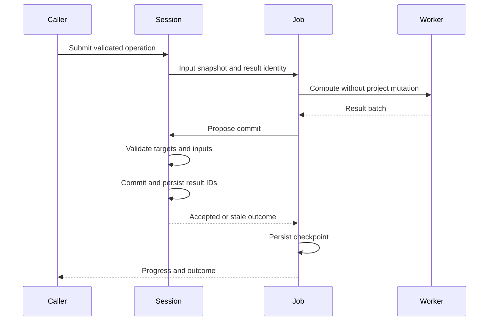
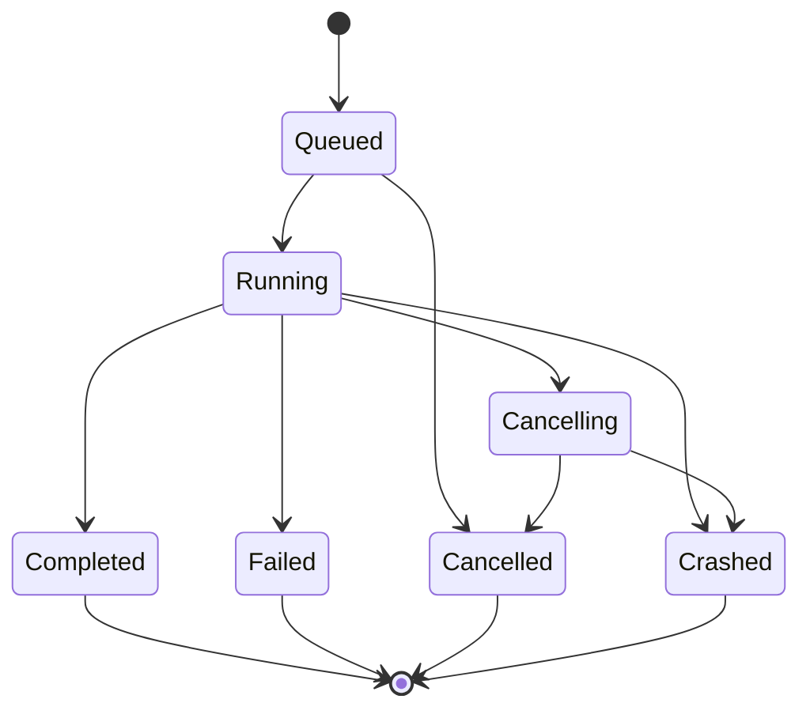

# Shared Editing Engine and Architecture Renewal - Plan

## Goal Capsule

**Objective:** Make Scene Ripper reliable to edit, automate, and extend: the same action has the same result from the desktop, chat, CLI, and MCP; creative experiments remain recoverable and reproducible.

**Means:** Evolve the existing Python/PySide6 application through a shared headless engine, explicit project commands, consistent jobs, precise media time, versioned analysis, saved recipes, and isolated optional runtimes.

**Delivery:** Start with a complete color-analysis workflow across all four surfaces. Deliver the remaining units in dependency order as focused changes that preserve a working application. This is a program of work, not one release or one PR.

**Authority:** Requirements govern behavior. Key technical decisions govern mechanisms. Unit details refine neither without revising this plan. Existing repository safety rules continue to apply until their owning migration unit updates them.

**Stop conditions:** Stop the affected migration if it cannot preserve existing projects, if a runtime cannot operate in its target packaged environment, or if a required public contract would break without a compatibility path. Unrelated ready units may continue.

---

## Product Contract

### Summary

Move workflow ownership from windows and transport wrappers into shared application operations. Preserve the existing creative algorithms and desktop workspaces while making sequence variations, analysis results, and job outcomes durable and accessible to automation.

### Problem Frame

Workflow behavior is distributed across `ui/main_window.py`, `ui/workers/`, `core/chat_tools.py`, CLI commands, and MCP wrappers. Project and sequence objects remain mutable across these callers. Changes therefore require coordinated updates to execution, dirty tracking, notifications, and agent context.

The repository already has useful foundations: `core/spine/`, the `Project` model, MCP job persistence, sequence preview caching, optional dependency management, platform build helpers, and regression coverage. The work extends those foundations and removes replaced implementations.

### Requirements

**Shared behavior and editing**

- R1. Import, scene detection, analysis, sequence generation, editing, and export use the same application operations across desktop, chat, CLI, and MCP where the action is applicable.
- R2. Project mutations have one owner that validates changes, updates the revision, and emits one coherent change notification.
- R3. Editorial changes support undo and redo within the owning live session, including changes initiated by agents; undo does not repeat downloads or paid inference.
- R4. Existing CLI commands, MCP tools, project loading, six workspaces, algorithms, and export formats retain compatibility during migration.

**Execution and media correctness**

- R5. Long-running operations expose consistent progress, per-item outcomes, cancellation, retries, and terminal state through every surface.
- R6. Late, duplicated, or stale worker results cannot overwrite newer editorial state or affect another project session.
- R7. Optional native ML runtimes can fail or restart without terminating the editor, and runtime repair does not replace packages loaded in the GUI process.
- R8. Source ranges and timeline positions have explicit timebases; preview and export resolve the same edit decisions for mixed-rate media, stills, gaps, audio, and transforms.

**Persistence and creative workflow**

- R9. Analysis records identify their inputs, operation/model versions, parameters, and completion state; valid empty results are distinct from failures and missing analysis.
- R10. Generated sequences retain their recipes and realized decisions so users can inspect, duplicate, vary, and reconstruct an edit without repeating model calls.
- R11. Users can create and compare named sequence variations without overwriting previous edits, using existing workspaces for inspection and correction.
- R12. Large derived artifacts have verifiable identities, project references, and safe cleanup; saved projects retain user-authored work when media or caches are offline.

**Delivery**

- R13. Core behavior, cross-surface contracts, project migrations, media outputs, and packaged runtime operation have enforced verification gates.
- R14. Headless installation and import do not require Qt or local ML packages; desktop and optional runtime dependencies are independently defined and reproducible.

### Success Criteria

The pilot is successful when identical color-analysis inputs produce equivalent project changes and per-item outcomes on every surface, with no duplicated processing loop in a UI or transport adapter.

The program is successful when a new sequencing algorithm can be added through its parameter definition and implementation without adding workflow branches to the main window, CLI, or MCP execution code. Custom visual controls may still be needed.

### Actors and Key Flows

- A1. Desktop filmmaker: edits projects, generates variations, previews and exports.
- A2. Automation caller: uses chat, CLI, or MCP to operate on the same project model.
- A3. Maintainer: adds algorithms and distributes supported builds.
- F1. A1 or A2 selects inputs, starts an operation, observes progress, receives per-item results, and sees committed changes. Covers R1, R2, R5, R6.
- F2. A1 or A2 duplicates a recipe, changes a parameter, reviews prerequisites and cost, generates a separate sequence, compares it, and undoes its insertion if needed. Covers R3, R9, R10, R11.
- F3. A job is interrupted; committed results remain usable after restart, and an explicit retry runs only missing or invalid work. Covers R5, R6, R9, R12.

### Scope Boundaries

All eight recommendations from the architecture review are represented in this plan. Initial releases preserve the six tabs and existing algorithm names. The sequence-variation work adds a focused comparison workflow rather than redesigning all navigation.

This plan does not introduce a new programming language, web frontend, distributed task cluster, third-party plugin marketplace, automatic paid-job resumption, or collaborative multi-user editor.

#### Deferred to Follow-Up Work

- Connecting MCP to a live desktop-owned project session through local RPC. This plan first makes concurrent ownership safe through explicit exclusive writer ownership; independent processes do not silently share mutable state.
- New creative algorithms, general multitrack compositing, and advanced transitions beyond existing supported behavior.
- Broad visual redesign, removal of existing workspaces, and a fully general visual recipe graph editor.

---

## Planning Contract

### Assumptions

- The user requested a plan for the preceding review. The implementation details below are proposed technical decisions, not claims that each was individually approved.
- Existing Python, Qt, FFmpeg, mpv, and local/cloud analysis integrations remain the supported stack.
- Exclusive writer ownership is an acceptable first concurrency contract. Read-only inspection of the last saved project remains available while another process owns edits.
- Undo history is session-local initially. Desktop/chat share the desktop session, and MCP retains a headless session across calls while its server lives. A one-shot CLI invocation has no undo history from previous invocations; batch execution may undo within its session. Saved recipes and sequence content remain durable. Cross-invocation CLI undo and replaying historical commands across restarts are outside this plan.
- Exact performance budgets will be calibrated against recorded workloads before each performance-sensitive migration. Correctness and compatibility gates do not depend on those measurements.

### Key Technical Decisions

- KTD1. **Extend the spine instead of adding a second application facade.** Public project operations remain under `core/spine/`. New internal modules in `core/operations/`, `core/jobs/`, and `core/project_session.py` implement behavior behind it. Preserve the import rule and avoid a directory-wide rename. Governs R1, R14.
- KTD2. **Use typed requests, results, and changes.** Operation definitions bind validated parameters, prerequisites, execution, and result types. Public wrappers translate to their existing wire formats. GUI navigation and playback controls remain UI-specific adapters. Governs R1, R4, R5.
- KTD3. **Serialize commits, not expensive computation.** A project session owns mutations. Workers receive immutable input snapshots and return proposed results; commits validate session identity, target identity, and input fingerprint. Unrelated project changes need not invalidate useful results. Governs R2, R6.
- KTD4. **Use reversible commands without event sourcing.** Store inverse editorial changes in a session history. Group an algorithm's sequence insertion into one undo action; analysis commits do not clutter editorial history. Undoing deletion restores model references, and referenced files remain retained while undo can restore them. Governs R3, R12.
- KTD5. **Enforce cross-process writer ownership.** A Qt-free OS-backed project lock is held for the desktop's open editing session and for a headless mutation's load-through-save lifetime. Lock a stable sidecar or managed lock identity, not the project-file inode replaced during atomic save. Canonical paths and file identity checks reject aliases to an already owned project. Unsaved projects acquire ownership before first save; Save As acquires the destination before releasing the old path. Busy callers receive a structured conflict. Retained MCP sessions reload on external saved-revision changes and invalidate their previous undo history before mutation. Mtime checks remain diagnostic rather than the consistency mechanism. Governs R2, R4, R6.
- KTD6. **Generalize existing MCP job concepts.** Move reusable scheduling, storage, cancellation, and item-result handling into `core/jobs/`; leave transport projection in MCP and Qt signal delivery in UI adapters. Keep existing task IDs, history, public status meanings, and idempotency contracts readable. Partial success is an outcome summary; it need not add an incompatible public status. Governs R4, R5.
- KTD7. **Commit item results before marking job progress durable.** Persist accepted result batches atomically with project revision and applied result IDs, then checkpoint job state. Reconciliation handles a crash between these writes without double-applying results. Unsaved-project jobs are marked session-only until saved. Never describe an in-memory result as restart-safe. Governs R5, R6, R12.
- KTD8. **Use a managed executable for native inference.** Launch a versioned worker interpreter/runtime, not the frozen desktop executable masquerading as Python. A bounded versioned JSON message protocol over pipes carries paths, task IDs, progress, cancellation, and result references; logs use a separate stream. No pickled objects, GUI objects, arbitrary callable names, or secrets in persisted job arguments. Validate result paths against the assigned artifact staging directory before ingestion. Runtime installation resolves allowlisted feature/profile IDs through existing verified manifests; callers cannot submit package URLs or executable paths. Preserve keyring/environment credential resolution and private job-store permissions. Start with one warm worker per compatible runtime family and serialize accelerator access. Governs R7, R14.
- KTD9. **Normalize media time at one seam.** Represent source ranges in their source timebase and timeline ranges in rational timeline time, with exclusive range ends. Distinct video and still entries avoid invalid field combinations. A compiler produces validated render segments shared by preview, playback mapping, video export, and EDL adapters. At target frame rate, round shared boundaries once using a documented nearest-frame rule; use timestamps or a verified CFR proxy mapping for VFR input. Governs R8.
- KTD10. **Version migrations and preserve ambiguity.** Keep JSON project documents and introduce ordered migrations before new writes. Preserve originals before schema upgrades. Old trim semantics cannot always be inferred: migrate only when provenance or unambiguous evidence identifies the coordinate convention; otherwise preserve the legacy entry and require resolution before affected rendering. Unknown future schemas open read-only. Governs R4, R8, R12.
- KTD11. **Store typed analysis records and referenced artifacts.** A record key includes source identity, source range, operation/schema version, model identity, normalized parameters, and sampling/prompt identity when relevant. Large arrays and media live in an artifact store; project manifests retain references. A missing artifact makes the derived result unavailable, not the source edit invalid. Legacy values import as provenance-unknown and require explicit reuse or recomputation. Governs R9, R12.
- KTD12. **Separate recipes from realized edits.** Each algorithm has one Qt-free definition and produces a common sequence proposal. Persist a versioned recipe plus realized clip choices, trims, transforms, rationale, and provider outputs needed for reconstruction. Regenerate creates a new variation by default; reconstruct does not call providers. Governs R1, R10, R11.
- KTD13. **Use shared data models with workspace-local selection.** Qt item models project project-session state; filters and selections remain local to each workspace unless an explicit command transfers them. Apply model changes only on their owning UI thread, as required by [Qt's model threading contract](https://doc.qt.io/qtforpython-6/PySide6/QtCore/QAbstractItemModel.html#thread-safety). Governs R2, R6, R11.
- KTD14. **Cut over one capability at a time.** Maintain a checked-in surface compatibility matrix and remove the old implementation when its replacement passes parity checks. Do not execute both old and new operations against live state for comparison. Keep compatibility wrappers narrow and give each a removal condition. Governs R1, R4, R13.

### High-Level Technical Design

Cancellation stops new dispatch and rejects results arriving after the cancellation cutoff. Previously committed items remain committed. An accepted completion wins only if it was serialized before the cancellation request. Recovery never silently restarts a paid operation.

### Phased Delivery

| Milestone | Units | Release evidence |
|---|---|---|
| 1. Prove the shared operation | U1-U3 | Color-analysis parity with one implementation |
| 2. Own edits and persistence | U4-U5 | Reversible edits, safe project ownership, migration fixtures |
| 3. Unify execution | U6-U7 | Durable jobs and shared workflows across surfaces |
| 4. Settle media semantics | U8-U9 | Correct mixed-rate and nonzero-offset media outputs |
| 5. Preserve analysis and recipes | U10-U12 | Validated caches, reproducible variations, all algorithm adapters |
| 6. Isolate native runtimes | U13-U14 | Crash containment and install/repair on supported packages |
| 7. Simplify the desktop | U15-U16 | Shared browser models and sequence comparison |
| 8. Enforce and remove legacy paths | U17 | Required gates, headless installation, migration completion |

U13 can begin after U6 and U10 while recipe work proceeds. U15 can begin after U7 and U10. Keep ownership of shared files explicit; milestones are dependency groupings rather than promises of parallel implementation.

### Relationship to Existing Plans

- `docs/plans/2026-05-05-001-feat-headless-agent-mcp-plan.md` supplies the spine and durable-job foundation. U6 intentionally supersedes its MCP-only job-framework constraint; update `AGENTS.md` with that cutover. Preserve public MCP compatibility and local-only exposure.
- `docs/plans/2026-04-13-002-feat-multi-sequence-projects-plan.md` supplies multiple sequences and the active-sequence compatibility property. U4, U5, and U12 replace widget-owned mutation and legacy dual-key save merging in stages.
- `docs/plans/2026-05-04-clip-browser-model-view-virtualization-plan.md` is an input to U15. Retain working virtualization, selection behavior, and thumbnail loading rather than restarting that work.
- Existing solved-issue documents on duplicate signal delivery, sequence-state mismatch, source IDs, subprocess cleanup, and native-library collisions inform failure tests. Historical plan claims are not evidence that current code meets them.

---

## Implementation Units

New paths below are proposed file ownership, not existing files. Large migrations use the same acceptance contract for each capability and can land in consecutive focused PRs.

### U1. Record compatibility and characterization coverage

**Goal:** Establish the observable behavior that migration must preserve.

**Requirements:** R1, R4, R8, R13. **Dependencies:** None.

**Files:** New `docs/architecture/surface-compatibility.md`, `tests/test_operation_contracts.py`, and `tests/fixtures/projects/`; existing `tests/test_cli_integration.py`, `tests/test_multi_sequence_project.py`, `scene_ripper_mcp/tests/test_integration.py`.

**Approach:** Inventory operations, algorithm routes, defaults, errors, persistence behavior, cancellation, and Qt-only actions. Record observed versus intended media semantics separately; do not freeze known defects as desired behavior. Include every current sequencing algorithm and analysis operation in the matrix.

**Patterns:** Existing spine import tests and MCP integration fixtures.

**Test scenarios:**

1. Equivalent GUI-agent, CLI, and MCP color requests identify the same target clips and persisted metadata.
2. Characterize round-trip behavior for projects with several sequences, stills, audio, transforms, and offline media; record any current data loss for correction and regression coverage in U5 rather than requiring U1 to implement the fix.
3. Capture nonzero source offsets and mixed-rate sequence construction from each current entry point; mark conflicting behavior as a defect to resolve in U8.

**Verification:** The matrix identifies supported and missing routes, and fixtures cover project versions already supported by the loader. Characterization tests distinguish current behavior from planned corrections.

### U2. Define the operation contract through color analysis

**Goal:** Introduce the smallest typed operation module needed for a real workflow.

**Requirements:** R1, R5, R6. **Dependencies:** U1.

**Files:** New `core/operations/contracts.py`, `core/operations/colors.py`, `tests/test_color_operation.py`; existing `core/spine/analyze.py`, `core/analysis/color.py`, `tests/test_spine_analyze.py`, `tests/test_spine_imports.py`.

**Approach:** Apply KTD1-KTD3 to color analysis. Separate input resolution, computation, and result application. Preserve existing spine signatures through a compatibility wrapper. Use a minimal commit adapter until U4 introduces the project session; do not create a general dependency graph scheduler in the pilot.

**Test scenarios:**

1. Successful, empty, missing-source, invalid-ID, and extraction-failed cases each produce an explicit per-item outcome.
2. Cancellation stops dispatch and returns completed and unprocessed items distinctly.
3. Compute does not mutate input clips; duplicated result application is rejected.
4. Importing contracts and the spine does not load GUI or native ML dependencies.

**Verification:** One computation implementation serves the spine, with typed outcomes and meaningful failure tests.

### U3. Route all color entry points through the pilot

**Goal:** Prove shared behavior in the live architecture before expanding it.

**Requirements:** R1, R4, R5, R13. **Dependencies:** U2.

**Files:** `ui/workers/color_worker.py`, `ui/main_window.py`, `core/chat_tools.py`, `cli/commands/analyze.py`, `scene_ripper_mcp/tools/analyze.py`, `scene_ripper_mcp/tools/jobs.py`, `tests/test_analysis_pipeline.py`, `tests/test_operation_contracts.py`, `scene_ripper_mcp/tests/test_jobs_tools.py`.

**Approach:** Migrate toolbar/tab actions, analysis pipeline, intention workflow, chat, CLI, synchronous MCP, and MCP jobs. Adapters may schedule work and format output; they must not own color processing or result semantics. Delete replaced loops and update the compatibility matrix.

**Test scenarios:**

1. Each entry point produces equivalent changes for the same settings, including skip-existing and forced recomputation.
2. Partial failure is visible on each surface without discarding successful results.
3. UI progress updates stay responsive and completion updates Cut and Analyze once through the project notification path.

**Verification:** Milestone 1 is complete only when all color routes converge and legacy loops are removed. Reassess contract complexity here before U4.

### U4. Introduce project sessions and reversible editorial commands

**Goal:** Establish one mutation owner and shared undo behavior.

**Requirements:** R2, R3, R6. **Dependencies:** U3.

**Files:** New `core/project_session.py`, `core/commands/`, `tests/test_project_session.py`, `tests/test_edit_commands.py`; existing `core/project.py`, `ui/project_adapter.py`, `ui/commands/toggle_clip_disabled.py`, `ui/tabs/sequence_tab.py`, `ui/timeline/timeline_scene.py`, `core/chat_tools.py`, `scene_ripper_mcp/tools/sequence.py`.

**Approach:** Implement KTD3-KTD4 for insert/remove/reorder/trim, sequence create/delete/rename, clip enable/disable, source removal, and metadata edits. Preserve existing model methods as delegations during cutover. Replace duplicated dirty flags with session-derived saved revision and command history. Use stable sequence IDs; the active-sequence index remains a compatibility projection.

**Test scenarios:**

1. UI and agent edits generate the same command changes and can be undone without rerunning inference.
2. Undo restores removed sequence/source references and redo reapplies the edit once.
3. A job result for a changed clip is stale; a result for an unchanged clip survives an unrelated rename.
4. Switching projects rejects old-session completions; observer delivery stays on the proper thread.

**Verification:** Migrated editorial paths cannot bypass validation, revision updates, or change publication. Undo/redo state and save dirty state agree.

### U5. Add versioned persistence and exclusive project ownership

**Goal:** Make save, load, and schema transitions safe across processes.

**Requirements:** R2, R4, R6, R12. **Dependencies:** U4.

**Files:** New `core/project_lock.py`, `core/project_migrations.py`, `tests/test_project_lock.py`, `tests/test_project_migrations.py`; existing `core/project.py`, `core/spine/project_io.py`, `core/spine/project_save.py`, `ui/main_window.py`, `tests/test_save_project_worker.py`, `tests/test_multi_sequence_project.py`.

**Approach:** Implement KTD5 and the migration infrastructure of KTD10. Preserve source references when files are offline. Save immutable snapshots atomically; only mark the saved revision clean if no later edit occurred. Replace legacy read-modify-merge writes after all writers use the canonical model. Legacy standalone save/load interfaces remain wrappers until their callers migrate.

**Test scenarios:**

1. Two processes target the same project through canonical and alias paths; only one acquires writer ownership.
2. Lock release after process death permits recovery without deleting another owner's live lock.
3. Save As conflict leaves the current project and its lock intact.
4. An edit during asynchronous save remains dirty after completion.
5. Interrupted migration or disk-full save preserves the last valid file and its backup; newer schemas cannot be overwritten.
6. Atomic replacement does not release writer ownership, and a retained MCP session detects an intervening external edit before offering undo.

**Verification:** Cross-process integration tests demonstrate ownership, atomic save, offline-reference preservation, and rollback to an untouched pre-migration file.

### U6. Extract the shared job lifecycle and durable commits

**Goal:** Let desktop and headless clients use the same execution lifecycle.

**Requirements:** R4, R5, R6, R12. **Dependencies:** U5.

**Files:** New `core/jobs/`, `ui/workers/job_adapter.py`, `tests/test_job_lifecycle.py`, `tests/test_job_recovery.py`; existing `scene_ripper_mcp/jobs/`, `scene_ripper_mcp/tools/jobs.py`, `ui/workers/base.py`, `core/gui_state.py`, `AGENTS.md`, `scene_ripper_mcp/tests/test_jobs_runtime.py`, `scene_ripper_mcp/tests/test_jobs_store.py`.

**Approach:** Apply KTD6-KTD7. Reuse the job store schema and migrations where possible. Introduce operation identity, immutable normalized arguments, result IDs, session/input revisions, and execution capabilities. Preserve MCP's transport-specific status and idempotency mapping. Existing GUI workers become lifecycle adapters as their operations migrate.

**Test scenarios:**

1. Start, queued cancellation, running cancellation, partial success, and exactly one terminal transition behave consistently across adapters.
2. Crash after project commit but before job checkpoint does not double-apply on recovery.
3. Retrying an operation skips only valid committed results and does not repeat a completed charged call whose result was recorded.
4. A job on an unsaved project is visibly session-only; restart does not claim its changes were persisted.
5. Old job history and existing task IDs remain readable after store migration.

**Verification:** Failure-injection tests cover both sides of the project/job persistence seam. Update the MCP-only rule in `AGENTS.md` only when the shared runtime lands.

### U7. Migrate remaining analysis and import workflows

**Goal:** Remove workflow orchestration from the main window and CLI loops.

**Requirements:** R1, R4, R5, R6. **Dependencies:** U6.

**Files:** `core/spine/analyze.py`, `core/spine/detect.py`, `core/spine/downloads.py`, `core/spine/thumbnails.py`, `core/analysis_operations.py`, `core/analysis_dependencies.py`, `core/intention_workflow.py`, `core/operations/`, `ui/workers/`, `ui/main_window.py`, `cli/commands/`, `scene_ripper_mcp/tools/`; tests in `tests/test_operation_contracts.py`, `tests/test_analysis_pipeline.py`, `tests/test_intention_workflow_downloads.py`, and `scene_ripper_mcp/tests/test_jobs_tools.py`.

**Approach:** Migrate in this order: source import/download and detection/thumbnails; transcription/alignment; description/custom queries/cinematography; classification/objects/faces/gaze/embeddings/OCR; remaining audio and frame-analysis routes. Each migration lands independently under KTD14. Replace intention-workflow signal chains with an explicit ordered operation plan and prerequisites. Keep provider-specific computation in its existing analysis module.

**Test scenarios:**

1. Missing dependencies produce the same capability result on each surface; install and cost confirmation precede dispatch.
2. One failed download does not lose successful sources; retry does not duplicate imported sources or detected clips.
3. Both clip and frame targets retain identity through analysis completion.
4. Cancellation between workflow steps prevents later stages from starting.
5. Credential failures and transient retries retain their per-item distinction without leaking secrets.

**Verification:** Every matrix-listed analysis/import operation has one execution implementation. Tests no longer need to impersonate private main-window pipeline state for these workflows.

### U8. Introduce explicit media time and legacy conversion

**Goal:** Resolve source/timeline coordinate ambiguity before changing rendering.

**Requirements:** R4, R8, R12. **Dependencies:** U5; U1 fixtures.

**Files:** New `models/media_time.py`, `tests/test_media_time.py`, `tests/test_legacy_sequence_migration.py`; existing `models/sequence.py`, `models/clip.py`, `core/project_migrations.py`, `core/spine/`, `ui/tabs/sequence_tab.py`, `scene_ripper_mcp/tools/sequence.py`, `tests/test_sequence_playback_mapping.py`.

**Approach:** Apply KTD9-KTD10. Correct all sequence constructors through one conversion operation. Preserve legacy raw data and migration diagnostics. Do not infer offset convention merely because values fit both ranges. Offer a source-range versus clip-relative resolution action for ambiguous entries, accessible through UI and headless commands.

**Test scenarios:**

1. A clip starting at source frame 240 trims and exports from the intended source range.
2. 24, 25, 30, and 30000/1001 sources produce coherent positions in the same timeline.
3. Shared adjacent boundaries round identically, including a long sequence and one-frame clips.
4. Still holds, audio sample ranges, and VFR timestamps do not reuse video-frame assumptions.
5. Ambiguous legacy projects remain inspectable; affected rendering is blocked with a resolution path and originals remain intact.

**Verification:** New entries have one documented coordinate meaning. All legacy fixtures migrate unambiguously or retain explicit unresolved diagnostics without data loss.

### U9. Compile one render plan for playback, preview, and exports

**Goal:** Make rendered output agree with the timeline's edit decisions.

**Requirements:** R1, R8. **Dependencies:** U6, U8.

**Files:** New `core/render_plan.py`, `tests/test_render_plan.py`, `tests/test_media_render_e2e.py`; existing `core/sequence_export.py`, `core/sequence_preview.py`, `core/edl_export.py`, `core/project_export.py`, `ui/main_window.py`, `ui/workers/export_worker.py`, `cli/commands/export.py`, `scene_ripper_mcp/tools/export.py`.

**Approach:** Validate references, time mapping, gaps, transforms, and supported track layouts once. Route live playback mapping, proxy preview, video export, and EDL through the compiler. Unsupported overlaps or compositing fail preflight rather than silently flattening content. Existing FFmpeg helpers remain output adapters.

**Test scenarios:**

1. Synthetic videos with visible frame IDs prove first/last frames and total duration for nonzero trims and mixed frame rates.
2. Reverse, flip, still holds, gaps, and music alignment agree between preview and final export.
3. Missing media and unsupported track overlaps fail before output is published.
4. Cancel or encoder failure leaves no valid-looking final output; successful output is atomically published.
5. EDL reports unsupported transformations explicitly rather than pretending they are represented.

**Verification:** Decode rendered test media and inspect frame identities, durations, and audio alignment; mocked FFmpeg argument tests alone are insufficient.

### U10. Add analysis provenance and managed artifacts

**Goal:** Make reuse and invalidation correct and storage reclaimable.

**Implementation checkpoint:** In progress. Colors, thumbnail and boundary embeddings, object
detection, OCR, ImageNet classification, shot classification, gaze, descriptions, and cinematography now use verified
records across their shared operations and delivery surfaces. Thumbnail and boundary embedding
artifacts have manifest, live-project, undo, save, and bundle retention. Remaining
work includes the other U7 analysis families, explicit legacy-reuse flows,
cross-consumer reuse/projection checks, legacy job ownership and receipt pruning, and
the complete retention/recovery audit. See
[analysis provenance](../architecture/analysis-provenance.md) for the implemented
scope and its limitations. U10 is not complete.

Custom queries now retain independent records through shared operations, direct
headless calls, GUI worker delivery/recovery, and durable headless jobs. GUI reuse
verifies saved records without duplicate history or local weight loading. Durable
query retries recover records with their answers; later explicit requests still
append new history. Cinematography shared operations and direct headless calls now
retain verified records for actual frame/video execution. GUI delivery, recovery,
and combined clip/frame pipelines now carry those records. Durable jobs verify reuse,
retain failed-attempt records, and recover forced refreshes without repeated
inference. Cinematography completion and availability checks now validate current
records and settings without probing VLM runtimes on the UI thread. Transcription
and audio/alignment remain among the next analysis families to migrate. Their
extraction prerequisite now distinguishes FFmpeg failure/empty output from valid
silence, removes failed temporary files, and prevents successful saved receipts
for extraction failures (98 focused regression tests passed).
Transcription providers now report actual backend/model selection, including MLX
fallback/mapping and model-free no-audio results. Groq model selection is pinned
for each provider call and accepts an explicit queued selection. The provider
regression run passed 135 tests, with 15 follow-up execution tests. Queued clip and
audio jobs, GUI workers/journals, and shared batches now freeze the cloud model in
their options and match it during recovery. The subsequent regression run passed
312 tests including MCP coverage. Shared clip transcription and the direct
headless operation now retain verified success/reuse/failure records, including
actual execution metadata and guarded publication. The migration regression run
passed 357 tests, with 74 guard follow-up tests and 26 final record tests. GUI
workers/journals, queued delivery, save checkpoints, and the combined pipeline now
carry verified transcript records. Reuse skips preflight/model loading; failures
preserve the prior display. The GUI regression run passed 392 tests, with 11
follow-up worker/delivery tests and clean scoped typing. Durable jobs now retain
and recover transcript records, verify semantic reuse, and save guarded failure
records. Forced refreshes recover one batch without repeated inference. CLI and
generic analysis routes verify populated transcripts against the requested model.
The durable regression run passed 273 tests including CLI, combined recovery, and
MCP coverage, with clean scoped job typing. Clip transcription completion now
verifies current inputs/settings in availability and MCP status, including silent
clips, without probing media or loading models. Its regression run passed 249
tests, with 34 focused follow-up tests. Standalone audio, alignment, and the
remaining cross-consumer audit remain unfinished.
Standalone audio's shared operation now supports verified whole-file records and
guarded success/reuse/failure publication. Transcript and record publication is
atomic for project observers. Its shared regression run passed 294 tests. GUI
workers now request verified tasks, carry records through queued delivery and
recovery, preserve transcripts on failed refresh, and require matching saved
records before acknowledging receipts. Verified reuse avoids inference, including
empty transcripts. The GUI regression run passed 298 tests with clean scoped
typing. Durable audio jobs now also verify semantic reuse, persist failure records
without replacing displayed text, and recover exact transcript/record pairs after
save or checkpoint failures. Missing old receipts no longer invalidate verified
project records; edited managed transcripts require force. The durable regression
run passed 308 tests, with 31 focused follow-ups and clean scoped typing. Audio
completion surfaces now use current record, input, runtime, and settings checks.
The audio list and agent no longer treat legacy transcript presence as completion;
verified silence remains complete. The GUI keeps verification available and
refreshes audio rows after settings changes. These checks run no probes or
inference. The completion regression run passed 277 tests, with 12 focused
follow-ups and clean scoped typing. Alignment now reports loaded CTC model/revision
and whole-clip/segment execution separately from approximate uniform fallback.
Its provider regression run passed 257 tests. Shared alignment and the direct
spine route now carry verified records binding media, editorial transcript, cached
model revision, and actual execution; failed attempts preserve existing words.
Empty word results reuse, changed inputs invalidate reuse, and late owner delivery
is guarded. The shared regression run passed 271 tests, with 43 final focused tests
and clean scoped typing. Project-backed GUI alignment now carries verified records
through queued delivery and recovery, authenticates transient reuse/failure,
checks saved records before acknowledgement, and skips preparation on reuse.
First model loading updates recovery identity without repeating inference on
restart. The GUI regression run passed 246 tests, with 16 focused follow-ups and
clean scoped typing. Both mounted word-source picker dialogs now pass their
project for guarded record/receipt publication and retain the worker through
native completion, including deferred close/reject after cancellation. Their
regression run passed 252 tests, with 33 dialog and 14 final delivery follow-ups
and clean scoped controller/delivery typing. Durable alignment now carries verified
records, authenticates saved transcript/record pairs, preserves words on failure,
and requires force for edited managed output. First model loading and interrupted
save/checkpoint recovery avoid repeated inference; cancellation retains computed
receipts without publishing cancelled targets. Its regression run passed 280
tests, with clean scoped typing and changed-file Ruff. Word-picker completion now
verifies alignment records or native transcription words, accepts verified silence,
and rejects stale or legacy fields without hashing media or running inference.
MCP audio listing delegates to the shared spine completion check. The combined
alignment, dialog, completion, and MCP regression run passed 300 tests.
Project-free compatibility callers remain to audit or migrate, along with the
broader U10 audit.

The raw alignment application now rejects changed project paths and replaced
records. Transcript replacement clears prior alignment verification before
observers see the new words; transcription failure preserves existing alignment.
The combined regression run passed 362 tests with scoped typing and Ruff clean.
Detached project-free compatibility remains to audit.

Face loading fingerprints staged ONNX weights before opening sessions and rejects
changed files or failed initialization. Shared face operations and direct spine
calls now use version 2 records with full media/model-pack hashes, actual runtime,
sampling inputs, and save-compatible embedding precision. Valid empty results
reuse without model loading. Guarded publication rejects stale or cancelled output
and preserves existing faces on failure. Raw compatibility keeps its existing
precision and task identities; older GUI receipt shapes retain authenticated IDs
and digests. The combined regression run passed 308 tests, with four operation/job
modules passing scoped typing and changed-file Ruff. GUI/durable face delivery,
completion checks, and managed embedding storage remain pending.

New computed-result receipt bodies above 16 KiB now use managed artifacts with
durable retention and transparent recovery reads. Existing inline receipts remain
readable. Safe receipt pruning and abandoned-publication pin reconciliation remain.
New large job arguments, operation specifications, and result bodies are managed
too; history deletion/pruning and result replacement release their owners while
protecting active readers and retaining independent computed receipts.
New jobs and receipts also pin files referenced by their structured and embedded
JSON inputs/results. Session-only jobs retire those pins when their in-memory
history closes. Existing job rows are not eagerly backfilled.
Continuous previews now use verified managed media, staged publication, registered
cache eviction, and consumer leases. Legacy unregistered previews are preserved
without automatic reuse. Transformed-clip production now also uses verified
managed media with content/range/runtime identity and staged publication. Sequence
and undo references, save/export leases, portable restoration, and cache eviction
are wired. Batch leases protect the handoff from rendering to project ownership.
The complete cross-consumer audit, including legacy prerender playback, remains.
Description providers expose actual execution model/backend and input mode,
including local model and cloud video-to-frame fallbacks. The shared operation
and direct headless entry point use verified records and semantic reuse, including
failure publication. GUI workers, clip/frame delivery, combined analysis, and save
checkpoints now carry and verify those records. Durable headless jobs also verify
reuse, recover without old receipt rows, and publish operation-owned failures.
Description completion indicators now verify default settings and current source
bindings without importing inference runtimes on the UI thread.
Custom-query validation distinguishes malformed answers from valid negative
matches and versions its parser in receipt identities. The shared operation and
direct headless entry point now own per-query semantic/failure records while
preserving append history. GUI and durable job delivery now carry and verify those
records as described above; the cross-consumer audit remains unfinished.

**Requirements:** R9, R12. **Dependencies:** U5, U6.

**Files:** New `models/analysis_record.py`, `core/artifacts.py`, `tests/test_analysis_records.py`, `tests/test_artifact_store.py`; existing `models/clip.py`, `models/frame.py`, `core/analysis_availability.py`, `core/analysis_target.py`, `core/paths.py`, `core/project_migrations.py`, `core/sequence_preview.py`, `core/remix/prerender.py`.

**Approach:** Implement KTD11, initially for colors and embeddings, then all analyses migrated in U7. Treat old clip fields as read projections until consumers move. Import legacy values with unknown provenance. Stage artifacts before publishing manifest references. Retain manifests for known projects and pin exports, running jobs, and undo-restorable content during cleanup. Never delete source media; unknown/untracked artifacts require conservative handling.

**Test scenarios:**

1. A valid empty object-detection result is reusable; a failed result is not.
2. Changing source content, trim, sampling, prompt, model, or operation version invalidates the relevant record.
3. Missing embeddings trigger targeted recomputation without losing a sequence or notes.
4. Cleanup preserves artifacts referenced by closed known projects, active jobs, and undo history.
5. Corrupt or partial artifact writes are detected, and project bundle export includes referenced artifacts needed for reconstruction.

**Verification:** Reuse decisions are based on record identity and state, and storage cleanup has cross-project reference tests.

### U11. Define the algorithm registry and recipe model

**Goal:** Make algorithm execution independent of dialogs and preserve generation inputs.

**Requirements:** R1, R9, R10. **Dependencies:** U7, U8, U10.

**Files:** New `core/remix/registry.py`, `models/recipe.py`, `core/spine/sequences.py`, `tests/test_recipe_model.py`, `tests/test_algorithm_registry.py`; existing `core/remix/__init__.py`, `ui/algorithm_config.py`, `core/cost_estimates.py`, `models/sequence.py`.

**Approach:** Apply KTD12 to shuffle and color first. Separate candidate selection and prerequisite computation from pure generation. Use typed sequence proposals for simple ordering, timed/audio edits, and provider-assisted algorithms. Keep UI labels and custom-control hints in adapters; the engine owns algorithm parameters and prerequisite meaning.

**Test scenarios:**

1. Same inputs, algorithm version, and seed reconstruct deterministic output.
2. Seed zero is an explicit seed if the new contract defines it so; legacy random-seed behavior is translated at compatibility adapters.
3. Recipe round-trip retains input selection, analysis identities, parameters, and realized transforms.
4. Registry import is Qt-free and exposes schemas to both agent surfaces without UI imports.

**Verification:** Pilot algorithms execute through the registry from every applicable surface and persist reconstructable recipes.

### U12. Migrate all sequencers and add variation commands

**Goal:** Complete algorithm parity and preserve creative alternatives.

**Requirements:** R1, R3, R4, R10, R11. **Dependencies:** U9, U11.

**Files:** `core/remix/`, `core/spine/sequences.py`, `ui/dialogs/`, `ui/workers/sequence_worker.py`, `ui/tabs/sequence_tab.py`, `core/chat_tools.py`, `scene_ripper_mcp/tools/sequence.py`, new `cli/commands/sequence.py`, `tests/test_recipe_reconstruction.py`, `tests/test_sequence_variations.py`, `scene_ripper_mcp/tests/test_integration.py`.

**Approach:** Migrate registry groups independently: arrange; similarity/reference/gaze/face; audio/word timing; text/LLM/drawing. Custom dialogs collect validated parameters and observe jobs. Provide list, inspect recipe, duplicate, regenerate variation, reconstruct, and activate commands. Drawing/reference inputs become asset references rather than GUI objects. Preserve realized provider decisions for offline reconstruction.

**Test scenarios:**

1. Every algorithm in U1's matrix is discoverable and executable without instantiating its dialog.
2. Reconstructing an LLM-generated edit performs no provider call; regeneration records a new run.
3. Generating a variation does not modify the previous sequence; undo removes the new insertion as one edit.
4. Missing recipe inputs or unavailable algorithm versions produce an actionable result without overwriting existing edits.

**Verification:** All current sequencers use the registry, and cross-surface tests cover each family plus algorithm-specific existing regressions.

### U13. Prove native worker isolation with transcription

**Goal:** Demonstrate crash containment in source and frozen applications.

**Requirements:** R5, R7, R14. **Dependencies:** U6, U10.

**Files:** New `core/runtime_worker/`, `core/runtime_supervisor.py`, `tests/test_runtime_worker_protocol.py`, `tests/test_runtime_supervisor.py`; existing `core/transcription.py`, `core/dependency_manager.py`, `core/paths.py`, `core/runtime_smoke.py`, `packaging/build_support.py`, platform staging manifests/scripts.

**Approach:** Implement KTD8 with one transcription backend before migrating other models. Validate protocol/version handshake, bounded messages, worker readiness, cancellation acknowledgement, and abnormal exits. Use explicit managed interpreter paths. Drain pipes while work runs. Process-tree cleanup must handle child FFmpeg processes and platform-specific termination; [Python subprocess documentation](https://docs.python.org/3.11/library/subprocess.html#popen-objects) informs this distinction.

**Test scenarios:**

1. A native worker exits or crashes while the GUI remains able to edit and save.
2. Cancellation of a blocked task terminates its process tree after a bounded grace period and preserves committed items.
3. Protocol mismatch, truncated output, excessive output, and malformed results fail the job without applying data.
4. Worker startup succeeds from installed macOS, Windows, and Linux packages without relying on a development Python installation.
5. A result pointing outside assigned staging is rejected, and install requests cannot name arbitrary packages or executables.

**Verification:** Platform smoke evidence proves managed interpreter launch and real inference. Do not remove existing startup safeguards or expand the migration until this gate passes.

### U14. Migrate native features and runtime installation

**Goal:** Complete isolation and make installation/repair consistent across surfaces.

**Requirements:** R1, R7, R14. **Dependencies:** U7, U13.

**Files:** `core/analysis/`, `core/transcription.py`, `core/feature_registry.py`, `core/dependency_manager.py`, `core/package_manifest.json`, `core/settings.py`, `main.py`, `core/runtime_smoke.py`, `ui/widgets/dependency_widgets.py`, `core/spine/`, `cli/commands/`, `scene_ripper_mcp/tools/`, `tests/test_analysis_dependency_gates.py`, `tests/test_runtime_smoke.py`, `tests/test_build_support.py`.

**Approach:** Migrate transcription variants, embeddings, local VLMs, OCR, faces/objects/gaze, alignment, and audio/stem dependencies by compatible runtime family. Expose capability status and explicit install/repair jobs through shared operations; no silent install on analysis. Create locked runtime profiles and stage replacements separately, switching only after health checks. Retain the previous working runtime for rollback. Remove Torch/MLX GUI startup workarounds only after no GUI path imports those runtimes.

**Test scenarios:**

1. Missing features present the same install requirement to UI and automation, with consistent progress and failure states.
2. An interrupted install or incompatible repair leaves the previous runtime usable.
3. Switching runtime profiles does not reinstall native packages into a live interpreter.
4. Accelerator contention queues work; concurrent jobs do not load conflicting models without resource admission.
5. Credentials reach only the required worker/provider and are absent from persistent arguments and logs.

**Verification:** Every optional native feature has packaged smoke coverage or an explicit unsupported-platform capability result. Startup import tests prove GUI isolation.

### U15. Replace browser bookkeeping with shared item models

**Goal:** Reduce duplicated data and preserve responsive large libraries.

**Requirements:** R2, R6, R11, R13. **Dependencies:** U7, U10.

**Files:** New `ui/models/clip_model.py`, `ui/models/frame_model.py`, `tests/test_library_models.py`; existing `ui/clip_browser.py`, `ui/frame_browser.py`, `ui/tabs/cut_tab.py`, `ui/tabs/analyze_tab.py`, `ui/project_adapter.py`, `tests/test_clip_browser_selection.py`, `tests/test_clip_browser_filters.py`, `tests/test_analyze_tab_clip_sync.py`.

**Approach:** Apply KTD13 while retaining current virtualization and shared theme primitives. Move data access into item models before replacing card rendering. Preserve workspace-specific selection and filters. Agent context queries session data and explicit selection state rather than maintaining another project copy.

**Test scenarios:**

1. Edits update visible cards in both workspaces without rebuilding unrelated cards or resetting selection.
2. Filtered-out and offscreen selections retain their documented semantics across model updates.
3. Thumbnail results for removed items are ignored, and all Qt model mutations occur on the owning thread.
4. Recorded 1,000- and 10,000-clip fixtures meet the responsiveness and memory budgets established before cutover.

**Verification:** Existing selection/filter regressions pass, view behavior is manually checked, and measured large-library behavior meets the recorded budget.

### U16. Add sequence variation comparison to the existing workspace

**Goal:** Expose recipes and alternatives through a compact creative workflow.

**Requirements:** R10, R11. **Dependencies:** U12, U15.

**Files:** `ui/tabs/sequence_tab.py`, `ui/dialogs/intention_import_dialog.py`, `ui/widgets/cost_estimate_panel.py`, new `ui/widgets/sequence_comparison.py`, `tests/test_sequence_comparison.py`, `tests/test_multi_sequence_tab.py`, `docs/user-guide/sequencers.md`, `docs/user-guide/agent-tools.md`.

**Approach:** Add recipe inspection, duplicate/regenerate actions, and an A/B comparison panel with two named sequence selectors. Show duration, clip count, changed recipe parameters, and preview switching at the same elapsed timeline time when both previews exist; clamp to the shorter sequence's end when needed. Deleting a compared sequence clears that selector without changing the surviving sequence. Missing analysis/cost and generation progress use shared operation/job state. Keep the existing tabs and timeline controls.

**Test scenarios:**

1. Duplicate and change one parameter, generate B, and compare while A remains unchanged.
2. A missing preview offers rendering without blocking access to recipe differences.
3. Cancel prerequisite analysis or generation without creating a misleading completed variation.
4. Keyboard controls, empty states, unavailable capabilities, and agent-created variations behave consistently.

**Verification:** A complete import-to-variation-to-export walkthrough works through UI and automation; include screenshots or a short recording for review.

### U17. Enforce quality gates and remove completed compatibility paths

**Goal:** Finish the migration with a smaller supported execution surface.

**Requirements:** R1, R4, R13, R14. **Dependencies:** U9, U12, U14, U16. Initial scoped CI gates may land immediately after U3.

**Files:** `pyproject.toml`, `requirements-core.txt`, `requirements-optional.txt`, new `requirements-engine.txt` and platform lock inputs under `packaging/`, `.github/workflows/quality.yml`, `.github/workflows/macos-ci.yml`, `.github/workflows/windows-ci.yml`, `.github/workflows/linux-build.yml`, release build workflows, `packaging/build_support.py`, `AGENTS.md`, `README.md`, `docs/releases.md`, `docs/user-guide/headless-mcp.md`, `tests/test_build_support.py`, `tests/test_spine_imports.py`.

**Approach:** Define engine, desktop, and optional runtime dependency contracts; retain `requirements-core.txt` as the frozen desktop contract. Make supported source-install extras resolve those same definitions. Enforce checks for migrated modules first, then retire informational baseline exceptions as their owning areas become clean. Include the separate MCP suite. Remove old execution loops, redundant state mirrors, expired wrappers, and main-window workflow code after matrix coverage proves replacement.

**Test scenarios:**

1. A clean engine/MCP install imports and runs a synthetic headless workflow without Qt or ML packages.
2. Frozen builds stage the correct worker/runtime assets and survive startup, preview, update checks, and one optional feature installation.
3. Intentional lint, typing, contract, or runtime regressions in required areas fail CI.
4. Old project fixtures, public tool payloads, CLI defaults, and job history remain supported after cleanup.

**Verification:** Required CI includes both test roots, scoped strict typing, dependency/import checks, and platform runtime evidence. No replacement is considered complete while its duplicate implementation remains active.

---

## Verification Contract

Implementation follows the repository's failing-test-first rule for defect corrections. Use characterization before changing legacy semantics and actual runtime/media evidence where mocks cannot prove behavior.

| Area | Required check | Completion evidence |
|---|---|---|
| Project/spine baseline | `python -m pytest tests/test_project.py tests/test_multi_sequence_project.py tests/test_spine_imports.py -v` | Ownership and existing project behavior remain valid |
| Operation parity | `python -m pytest tests/test_operation_contracts.py tests/test_cli_integration.py scene_ripper_mcp/tests/test_integration.py -v` | Equivalent behavior across supported surfaces |
| Shared jobs | `python -m pytest tests/test_job_lifecycle.py tests/test_job_recovery.py scene_ripper_mcp/tests/ -v` | Failure, restart, cancellation, and old history verified |
| Media correctness | `python -m pytest tests/test_media_time.py tests/test_render_plan.py tests/test_media_render_e2e.py tests/test_sequence_playback_mapping.py -v` | Decoded media proves range and timing correctness |
| Packaging | `python -m pytest tests/test_build_support.py tests/test_runtime_smoke.py -v` plus installed runtime smoke targets | macOS, Windows, and Linux evidence, not file-existence checks alone |
| Full regression | `python -m pytest tests/ scene_ripper_mcp/tests/ -v` | Both suites pass; skips identify intentional unavailable capabilities |
| Static checks | `ruff check .`; `python -m mypy cli core models ui scene_ripper_mcp` | Required migrated scope clean; remaining baseline exceptions explicit until removed |

Commands referencing new test files become applicable when the corresponding unit creates them. Existing updater tests remain required for any build/runtime change that affects updater startup or metadata.

For UI performance work, record hardware, fixture size, initial population time, filter/update latency, scrolling responsiveness, and peak memory. Set numeric acceptance budgets before replacing the current renderer, using the existing implementation as the comparison baseline. Do not claim performance improvements from architecture alone.

Earlier architecture review evidence: 161 focused tests passed, with three numerical warnings in match-cut matrix multiplication. That run was not a full regression or platform release validation. No implementation verification has been performed as part of writing this plan.

---

## Rollout, Risks, and Deferred Execution Decisions

**Migration and rollback:** Release changes by capability. Keep a pre-upgrade project backup and the prior managed runtime. Rollback restores the backup with the previous application; do not claim old binaries can safely write new-schema documents. Before each cutover, prove that reverting routing does not require the old implementation to interpret newly introduced fields.

**Legacy trim ambiguity:** U8 owns the investigation and user-resolution flow. If the legacy format lacks sufficient provenance, automatic lossless migration is impossible; preserve the raw entry and block only the affected render path until resolved.

**Save latency:** Project persistence still uses JSON. U6 batches result commits and offloads snapshot serialization while preserving commit order. If measured persistence cost fails its budget, evaluate a transactional project store in a separate design revision; do not quietly introduce one during the job refactor.

**Packaging risk:** U13 must prove the managed executable layout and process cleanup on each platform before U14 expands it. Runtime profile grouping, exact pins, worker idle timeouts, accelerator budgets, and message size limits are execution-time decisions with documented smoke and failure tests.

**Behavior drift:** The compatibility matrix includes defaults, parameter normalization, errors, side effects, and cost/install prompts. Typed internal contracts do not justify silently changing external MCP or CLI payloads.

**Large migration units:** U7 and U12 are capability rollouts. Land one family at a time, using their common gate; do not combine unrelated algorithms into a single unreviewable diff.

**Review cadence:** Milestones 1, 4, and 6 are architecture checkpoints: verify the pilot interface, media migration, and packaged process isolation before broadening their respective patterns. These are evidence gates, not automatic requests for additional user permission.

---

## Definition of Done

Each unit is done when its scenarios pass, its affected public contracts are verified, its documentation is current, and the replaced implementation has been removed or reduced to a compatibility wrapper with an explicit removal condition.

The entire program is done when:

1. The compatibility matrix covers every current application operation and sequencer with one shared implementation for every applicable surface.
2. Project mutations, undo, revision checks, and writer ownership are enforced; late results cannot corrupt another session or newer input.
3. Saved job progress survives tested interruption points without duplicate commits or automatic paid retries.
4. Mixed-rate, nonzero-offset, still, audio, and transformed media pass decoded-output tests through shared render planning.
5. Analysis reuse is provenance-aware, artifact cleanup preserves references, and legacy migration preserves originals and reports ambiguity.
6. Every sequencer stores a reconstructable recipe and supports safe variation creation through UI and automation.
7. Optional native inference is isolated, and installation/repair has verified recovery on supported packaged platforms.
8. Browser state comes from shared models; sequence comparison works without replacing existing workspaces.
9. Headless installation is independent of Qt, required verification gates are enforced, and release smoke evidence is recorded.
10. Abandoned experiments, duplicate workflows, temporary routing flags, and superseded state mirrors are removed. No user-facing capability disappears as incidental cleanup.
