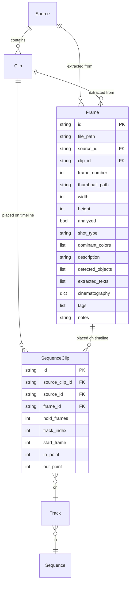

# feat: Add Frames Tab for Frame-Level Workflow

## Overview

Add a new **Frames tab** to Scene Ripper that enables frame-level work — extracting individual frames from videos/clips, importing still images, analyzing frames with existing analysis tools, and sequencing frames into animations or AI/ML frame sequences. This is a significant new capability that introduces a `Frame` data model alongside the existing `Source` and `Clip` models.

## Problem Statement / Motivation

Scene Ripper currently operates at the clip level (multi-frame scenes). Users working on stop-motion animation, AI/ML training data, or frame-by-frame creative work need individual frame control. There is no way to:
- Extract and browse individual frames from a video
- Import still images into the project
- Analyze individual frames (describe, classify, detect objects, etc.)
- Create sequences from individual frames (image slideshows, stop-motion)

## Proposed Solution

A new **Frames tab** (placed after Analyze: Collect, Cut, Analyze, **Frames**, Sequence, Render) with:
1. Frame extraction from videos/clips (every frame, every Nth frame, smart extraction)
2. Direct image import (PNG/JPG/TIFF/BMP/WebP)
3. Virtualized frame browser with adjustable thumbnail density
4. Per-frame analysis using all existing analysis operations
5. Frame-to-sequence integration (extend `SequenceClip` model)
6. Full agent/chat tool support

## Technical Approach

### Architecture

```
┌─────────────────────────────────────────────────────────────────┐
│                      NEW COMPONENTS                             │
├─────────────────────────────────────────────────────────────────┤
│                                                                 │
│  models/frame.py          ← Frame dataclass                    │
│  ui/tabs/frames_tab.py    ← Frames tab UI                      │
│  ui/frame_browser.py      ← Virtualized frame grid (QListView) │
│  ui/frame_thumbnail.py    ← Frame thumbnail delegate            │
│  ui/workers/frame_extraction_worker.py  ← FFmpeg extraction     │
│                                                                 │
├─────────────────────────────────────────────────────────────────┤
│                    MODIFIED COMPONENTS                           │
├─────────────────────────────────────────────────────────────────┤
│                                                                 │
│  models/sequence.py       ← SequenceClip gains frame_id,       │
│                              hold_frames fields                  │
│  core/project.py          ← _frames list, frames_by_id,        │
│                              add_frames(), save/load            │
│  core/gui_state.py        ← selected_frame_ids, frame context  │
│  core/chat_tools.py       ← Frame agent tools                  │
│  core/tool_executor.py    ← Frame tool handlers                 │
│  core/ffmpeg.py           ← Batch frame extraction function     │
│  core/thumbnail.py        ← Image-to-thumbnail (resize, not    │
│                              FFmpeg extract)                    │
│  core/sequence_export.py  ← Handle frame entries in render      │
│  ui/main_window.py        ← Add Frames tab, wire signals       │
│  ui/tabs/cut_tab.py       ← "Extract Frames" button            │
│  ui/tabs/analyze_tab.py   ← Support Frame objects alongside     │
│                              Clips                              │
│  ui/tabs/render_tab.py    ← Render frame sequences              │
│                                                                 │
│  Analysis workers (all)   ← Accept Frame objects (image path)   │
│                              in addition to Clip objects         │
│                                                                 │
└─────────────────────────────────────────────────────────────────┘
```

### Data Flow

```
Source Video / Clip / Uploaded Image
    │
    ├── frame extraction (FFmpeg batch)
    │   └── every frame / every Nth / smart extraction
    │
    ├── direct image import (copy to project/frames/)
    │
    ▼
Frame[] (individual images on disk as PNG)
    │
    ├── file_path, source_id (optional), clip_id (optional)
    ├── frame_number (optional, for extracted frames)
    ├── thumbnail_path (resized version for browser)
    │
    │ analysis operations (same as clips)
    │    ├── Describe → description: str
    │    ├── Classify → shot_type: str
    │    ├── Colors → dominant_colors: list
    │    ├── Text Extract → extracted_texts: list
    │    └── Objects → detected_objects: list
    │
    │ add to sequence
    ▼
SequenceClip (extended with frame_id, hold_frames)
    │
    │ render
    ▼
Output video (FFmpeg concat of clips + frame-to-video segments)
```

### Implementation Phases

#### Phase 1: Data Model & Project Infrastructure

**Goal**: Frame model exists, persists in projects, passes through save/load cycle.

**Tasks:**

- [ ] Create `models/frame.py` with `Frame` dataclass
  ```python
  @dataclass
  class Frame:
      id: str                          # UUID
      file_path: Path                  # Path to image file on disk
      source_id: Optional[str]         # Source video UUID (if extracted)
      clip_id: Optional[str]           # Clip UUID (if extracted from clip)
      frame_number: Optional[int]      # Original frame number in source
      thumbnail_path: Optional[Path]   # Resized thumbnail for browser
      width: Optional[int]             # Image dimensions
      height: Optional[int]
      analyzed: bool = False
      # Analysis metadata (same fields as Clip):
      shot_type: Optional[str] = None
      dominant_colors: Optional[list] = None
      description: Optional[str] = None
      detected_objects: Optional[list] = None
      extracted_texts: Optional[list] = None
      cinematography: Optional[dict] = None
      tags: list = field(default_factory=list)
      notes: str = ""

      def to_dict(self, base_path: Optional[Path] = None) -> dict: ...
      @classmethod
      def from_dict(cls, data: dict, base_path: Optional[Path] = None) -> "Frame": ...
      def display_name(self) -> str: ...
  ```

- [ ] Extend `models/sequence.py` — add to `SequenceClip`:
  ```python
  frame_id: Optional[str] = None      # References Frame.id (if frame-based)
  hold_frames: int = 1                # Number of timeline frames to hold
  ```
  - Make `source_clip_id` optional (None when frame-based)
  - Add `is_frame_entry` property: `return self.frame_id is not None`
  - Update `to_dict()` / `from_dict()` to serialize new fields

- [ ] Extend `core/project.py`:
  - Add `_frames: list[Frame]` alongside `_sources` and `_clips`
  - Add cached properties: `frames_by_id`, `frames_by_source`, `frames_by_clip`
  - Add methods: `add_frames(frames)`, `remove_frames(frame_ids)`, `update_frame(frame_id, **kwargs)`
  - Add signal: `frames_changed = Signal()`
  - Update `save_project()` to include `"frames": [f.to_dict(base_path) for f in self._frames]`
  - Update `load_project()` to load frames with fallback to empty list for old projects
  - Bump `SCHEMA_VERSION` to `"1.1"`
  - Update `_validate_project_structure()` for new schema

- [ ] Write tests for Frame model serialization, Project frame management, backward-compatible loading of old projects

**Effort**: Short (1-2 sessions)

**Success criteria**: Frame objects can be created, added to project, saved, and loaded. Old projects load without frames gracefully.

---

#### Phase 2: Frame Extraction Engine

**Goal**: Extract frames from videos/clips via FFmpeg, stored as PNGs in project directory.

**Tasks:**

- [ ] Add batch extraction to `core/ffmpeg.py`:
  ```python
  def extract_frames_batch(
      video_path: Path,
      output_dir: Path,
      fps: float,
      mode: str = "all",          # "all", "interval", "smart"
      interval: int = 1,          # Every Nth frame (for "interval" mode)
      start_frame: int = 0,       # Start of range
      end_frame: Optional[int] = None,  # End of range (None = entire video)
      progress_callback: Optional[Callable] = None
  ) -> list[Path]:
  ```
  - "all" mode: Single FFmpeg pass with `-vsync vfr` and output pattern `frame_%06d.png`
  - "interval" mode: FFmpeg select filter `select=not(mod(n\,N))` with `-vsync vfr`
  - "smart" mode: Two-pass — (1) scene detection via PySceneDetect to find key frames, (2) perceptual hashing via `imagehash` to deduplicate similar frames within detected scenes
  - All modes: Progress reporting via callback, cancellation via checking a threading.Event

- [ ] Add smart extraction support:
  - Use existing `SceneDetector` to detect scene boundaries
  - Take one representative frame per scene
  - Use perceptual hashing (`imagehash.phash`) to skip near-duplicate frames within threshold
  - Make hash distance threshold configurable (default: 8)

- [ ] Create `ui/workers/frame_extraction_worker.py`:
  ```python
  class FrameExtractionWorker(CancellableWorker):
      progress = Signal(int, int)           # current, total
      frame_ready = Signal(str, str)        # frame_id, thumbnail_path
      extraction_completed = Signal(list)   # list of Frame objects

      def __init__(self, source: Source, clip: Optional[Clip],
                   mode: str, interval: int, output_dir: Path): ...
      def run(self): ...
  ```
  - Create Frame objects as files are extracted
  - Generate thumbnails for each frame (resize, not FFmpeg)
  - Report progress incrementally

- [ ] Add image thumbnail generation to `core/thumbnail.py`:
  ```python
  def generate_image_thumbnail(
      image_path: Path,
      output_path: Path,
      max_size: tuple[int, int] = (220, 160)
  ) -> Path:
  ```
  - Use Pillow for image resize (not FFmpeg — images are already decoded)
  - Handle all supported formats: PNG, JPG, TIFF, BMP, WebP

- [ ] Add disk space estimation utility:
  ```python
  def estimate_extraction_size(
      video_path: Path, fps: float, mode: str, interval: int,
      start_frame: int, end_frame: int
  ) -> tuple[int, int]:  # (estimated_bytes, frame_count)
  ```
  - Show warning dialog if estimated size > 1GB or > 10,000 frames

- [ ] Write tests for batch extraction (using synthetic video), smart extraction, thumbnail generation

**Effort**: Medium (2-3 sessions)

**Success criteria**: Can extract frames from a video in all three modes, frames saved as PNGs, thumbnails generated, progress reported.

---

#### Phase 3: Frames Tab UI

**Goal**: Working Frames tab with frame browser, extraction controls, and image import.

**Tasks:**

- [ ] Create `ui/frame_browser.py` — virtualized frame grid:
  ```python
  class FrameBrowserModel(QAbstractListModel):
      """Backing model for frame browser. Handles thousands of frames."""
      def rowCount(self, parent=QModelIndex()): ...
      def data(self, index, role): ...
      def set_frames(self, frames: list[Frame]): ...
      def get_frame(self, index: QModelIndex) -> Frame: ...

  class FrameThumbnailDelegate(QStyledItemDelegate):
      """Custom delegate for rendering frame thumbnails in the grid."""
      def paint(self, painter, option, index): ...
      def sizeHint(self, option, index): ...

  class FrameBrowser(QWidget):
      frame_selected = Signal(str)          # frame_id
      frames_selected = Signal(list)        # list of frame_ids
      frame_double_clicked = Signal(str)    # frame_id

      def __init__(self, parent=None): ...
      def set_frames(self, frames: list[Frame]): ...
      def set_zoom(self, level: int): ...   # Adjusts thumbnail size
  ```
  - Use `QListView` with `QAbstractListModel` for virtualization (handles 10,000+ frames)
  - `FrameThumbnailDelegate` paints thumbnail + frame info (number, source name)
  - Auto-grouping by source: Insert section headers as special model items
  - Zoom slider controls `sizeHint` of delegate → thumbnails resize dynamically
  - Multi-selection: click, shift-click, cmd-click
  - Drag-drop support for adding frames to sequences

- [ ] Create `ui/tabs/frames_tab.py`:
  ```python
  class FramesTab(BaseTab):
      extract_frames_requested = Signal(str, str, int)  # source_id, mode, interval
      import_images_requested = Signal(list)             # file paths
      analyze_frames_requested = Signal(list)            # frame_ids
      frames_selected = Signal(list)                     # frame_ids
  ```
  Layout:
  ```
  FramesTab
  ├── QVBoxLayout
  │   ├── Controls bar (top)
  │   │   ├── Source selector (QComboBox)
  │   │   ├── Extraction mode (QComboBox: All, Every Nth, Smart)
  │   │   ├── Interval spinner (QSpinBox, shown for "Every Nth")
  │   │   ├── "Extract Frames" button
  │   │   ├── "Import Images..." button
  │   │   ├── Separator
  │   │   ├── "Analyze Selected" button
  │   │   ├── "Add to Sequence" button
  │   │   ├── Stretch
  │   │   └── Zoom slider
  │   ├── Filter bar (collapsible)
  │   │   ├── Shot type filter (QComboBox)
  │   │   ├── Color filter
  │   │   ├── Has description checkbox
  │   │   └── Search by text/description
  │   └── QStackedWidget
  │       ├── State 0: EmptyStateWidget ("No frames yet. Extract from a video or import images.")
  │       └── State 1: FrameBrowser (virtualized grid)
  ```

- [ ] Handle image import flow:
  - File dialog accepting PNG/JPG/TIFF/BMP/WebP
  - Also support drag-drop onto the tab
  - Copy files to `project_dir/frames/uploaded/` subdirectory
  - Generate thumbnails
  - Create Frame objects (no source_id, no clip_id, no frame_number)
  - Add to project

- [ ] Handle frame extraction flow:
  - User selects source and extraction settings
  - Show disk space estimate + frame count before starting
  - If >10,000 frames or >1GB, show warning dialog
  - Start `FrameExtractionWorker`
  - Progress bar during extraction
  - Frames appear in browser incrementally as `frame_ready` signals fire
  - On completion, all frames added to project

- [ ] Handle re-extraction:
  - If frames already exist for the selected source/clip + mode, show dialog:
    "Replace existing frames" / "Add alongside" / "Cancel"
  - "Replace" removes old Frame objects and files, then extracts fresh
  - "Add alongside" keeps old frames, extracts with non-colliding filenames

- [ ] Wire up in `ui/main_window.py`:
  - Add Frames tab at index 3 (after Analyze, before Sequence)
  - Connect signals: extraction, import, analyze, selection
  - Update tab name mapping for agent navigation
  - Update keyboard shortcuts if any are index-based

- [ ] Add "Extract Frames" button to `ui/tabs/cut_tab.py`:
  - New button in the clip controls bar
  - When clicked with clips selected: navigate to Frames tab with clip context
  - Mirrors existing "Analyze Selected" button pattern

- [ ] Write tests for FramesTab state transitions, FrameBrowserModel data handling

**Effort**: Large (3-5 sessions)

**Success criteria**: Frames tab appears in the UI, user can extract frames from a source, import images, browse with adjustable zoom, multi-select frames.

---

#### Phase 4: Frame Analysis Integration

**Goal**: All existing analysis tools work on individual frames.

**Tasks:**

- [ ] Create analysis input abstraction:
  ```python
  @dataclass
  class AnalysisTarget:
      """Unified input for analysis operations — either a Clip or a Frame."""
      target_type: str              # "clip" or "frame"
      id: str                       # clip_id or frame_id
      image_path: Optional[Path]    # Direct image path (for frames)
      video_path: Optional[Path]    # Source video path (for clips)
      start_frame: Optional[int]    # For clips: extract frame
      end_frame: Optional[int]      # For clips: time range
      fps: Optional[float]          # For clips: source FPS
  ```
  - For Frame targets: `image_path` is set, no video extraction needed
  - For Clip targets: same as current behavior (extract from video)

- [ ] Modify analysis workers to accept `AnalysisTarget`:
  - `ColorAnalysisWorker` — for frames, read image directly with OpenCV
  - `ShotClassificationWorker` — for frames, send image to model
  - `DescriptionWorker` — for frames, send image to VLM
  - `ObjectDetectionWorker` — for frames, run YOLO on image
  - `TextExtractionWorker` — for frames, OCR the image directly
  - `CinematographyWorker` — for frames, send to VLM
  - Each worker's `run()` method checks `target.target_type` and branches:
    - "clip": extract representative frame from video (existing logic)
    - "frame": load image directly from `target.image_path` (new, simpler path)

- [ ] Update `core/analysis/color.py`, `core/analysis/shots.py` etc. to accept image paths alongside video paths

- [ ] Update the Analyze tab to support Frame objects:
  - When navigated from Frames tab with selected frame_ids, display frames instead of clips
  - Reuse the same analysis operation picker UI
  - Results written back to Frame objects via `project.update_frame()`

- [ ] Write tests for frame analysis (color analysis on a static image, etc.)

**Effort**: Medium (2-3 sessions)

**Success criteria**: User can select frames in Frames tab, click "Analyze", and all analysis operations work. Results stored on Frame objects and visible in the browser.

---

#### Phase 5: Sequence Integration & Rendering

**Goal**: Frames can be added to sequences and rendered to video.

**Tasks:**

- [ ] Update Sequence tab to accept frames:
  - "Add to Sequence" from Frames tab creates `SequenceClip` entries with `frame_id` set
  - Default `hold_frames = 1` (each frame = 1 timeline frame at sequence FPS)
  - Sorting card (`sorting_card.py`) must display frame thumbnail and info for frame-based entries
  - Card shows frame thumbnail, frame number/filename, hold duration

- [ ] Update timeline widget for frame entries:
  - `ClipItem` in timeline must handle frame-based `SequenceClip` (show thumbnail, no waveform)
  - Duration on timeline = `hold_frames` (default 1 frame)
  - User can adjust `hold_frames` per-entry in the sequence

- [ ] Update sequence export (`core/sequence_export.py`) for frame entries:
  - For frame-based `SequenceClip`: Convert image to video segment using FFmpeg
    ```
    ffmpeg -loop 1 -i frame.png -t <hold_duration_seconds> -vf "scale=W:H" -r <fps> -pix_fmt yuv420p segment.mp4
    ```
  - For clip-based `SequenceClip`: Existing logic (extract from source video)
  - Concat all segments using FFmpeg concat demuxer
  - Handle audio: frame segments are silent; add silent audio stream for concat compatibility

- [ ] Update EDL export for frame entries:
  - Frame entries appear as stills with source = image filename
  - Duration from hold_frames / fps

- [ ] Update SRT export for frame entries:
  - Frame entries include description metadata if available
  - Timecodes calculated from cumulative hold_frames

- [ ] Handle mixed sequence validation:
  - Sequence FPS must be explicitly set (cannot inherit from first source if first item is a frame)
  - Resolution: use first video clip's resolution, or prompt user to set
  - Frame images scaled to match sequence resolution during render

- [ ] Write tests for frame sequence rendering, mixed sequence concat, export format handling

**Effort**: Large (3-5 sessions)

**Success criteria**: User can add frames to a sequence (alone or mixed with clips), render to MP4, export to EDL/SRT. Frame hold duration works correctly.

---

#### Phase 6: Agent Integration

**Goal**: Chat agent can perform all frame operations via tools.

**Tasks:**

- [ ] Add frame tools to `core/chat_tools.py`:
  ```python
  # Extraction
  extract_frames(source_id: str, mode: str = "interval",
                 interval: int = 10, clip_id: str = None) -> dict

  # Import
  import_frames(file_paths: list[str]) -> dict

  # Browsing
  list_frames(source_id: str = None, clip_id: str = None,
              shot_type: str = None, has_description: bool = None) -> dict

  # Selection
  select_frames(frame_ids: list[str]) -> dict

  # Analysis
  analyze_frames(frame_ids: list[str],
                 operations: list[str] = None) -> dict

  # Sequencing
  add_frames_to_sequence(frame_ids: list[str],
                          hold_frames: int = 1) -> dict

  # Navigation
  navigate_to_frames_tab() -> dict

  # Deletion
  delete_frames(frame_ids: list[str]) -> dict
  ```

- [ ] Register tools in `ToolRegistry`

- [ ] Update `core/gui_state.py`:
  - Add `selected_frame_ids: list[str]`
  - Add `frames_tab_frame_ids: list[str]` (visible frames)
  - Add `frame_count: int` to context string
  - Add `frames_tab_source_filter: Optional[str]` (current source filter)

- [ ] Update agent system prompt context to describe frame capabilities

- [ ] Write tests for frame agent tools

**Effort**: Medium (2-3 sessions)

**Success criteria**: Agent can extract frames, list them, analyze them, and add them to sequences via chat commands.

---

### Phase 7 (Future): Advanced Features

Deferred items for later implementation:
- [ ] EXR and RAW format support (requires `OpenEXR`, `rawpy` dependencies)
- [ ] Frame manipulation (crop, resize, rotate, flip)
- [ ] Keyboard-driven frame scrubbing (arrow keys to step through)
- [ ] Custom frame groups / tagging
- [ ] Frame comparison view (side-by-side)
- [ ] Animated WebP frame extraction
- [ ] Frame interpolation integration

---

## Alternative Approaches Considered

### 1. Frames as pseudo-Clips
Wrap each frame as a single-frame `Clip` object, reusing all existing infrastructure. **Rejected** because:
- Clips are semantically different (scenes with start/end in a video)
- Would pollute clip browser with thousands of "clips"
- Clip analysis workers expect video sources, not image files
- Makes it impossible to distinguish between real clips and frame-wrappers

### 2. Separate SequenceFrame model
Create a new `SequenceFrame` dataclass instead of extending `SequenceClip`. **Rejected** because:
- Doubles the surface area in every export/render function
- Timeline widget would need to handle two different item types
- Sorting algorithms would need dual-path logic
- Extending `SequenceClip` is simpler and more maintainable

### 3. Widget-per-frame grid (like ClipBrowser)
Use the same `QGridLayout` + `QFrame` widget pattern as the existing `ClipBrowser`. **Rejected** because:
- Frame counts can reach 10,000+ (vs. 50-500 clips)
- Creating a QWidget per frame exhausts memory and freezes the UI
- QListView with a custom model + delegate only renders visible items
- Virtualization must be built in from the start

## Acceptance Criteria

### Functional Requirements

- [ ] Frame model persists across save/load
- [ ] Frames extracted from video sources as PNG files
- [ ] Frames extracted with "every frame", "every Nth", and "smart" modes
- [ ] Images can be imported directly (PNG/JPG/TIFF/BMP/WebP)
- [ ] Frame browser displays frames grouped by source with adjustable zoom
- [ ] All 8 analysis operations work on individual frames
- [ ] Frames can be added to sequences (frame-only and mixed)
- [ ] Frame sequences render to MP4 correctly
- [ ] Agent can extract, browse, analyze, and sequence frames
- [ ] Old projects load without frames gracefully (backward compatible)
- [ ] Re-extraction offers replace/add-alongside/cancel options

### Non-Functional Requirements

- [ ] Frame browser handles 10,000+ frames without UI freeze (virtualized)
- [ ] Frame extraction provides progress reporting and cancellation
- [ ] Disk space estimate shown before large extractions
- [ ] Uploaded images are copied into project directory for portability

### Quality Gates

- [ ] Tests for Frame model serialization and deserialization
- [ ] Tests for Project frame management (add, remove, update, save, load)
- [ ] Tests for frame extraction (all modes) using synthetic video
- [ ] Tests for frame analysis (at least color analysis on a static image)
- [ ] Tests for frame sequence rendering

## Success Metrics

- Users can create frame-based animations from extracted video frames
- Users can import image sets and sequence them into video
- Frame analysis metadata is filterable/sortable for AI/ML workflows
- No performance regression when projects have 0 frames (existing workflow unaffected)

## Dependencies & Prerequisites

- **Existing**: FFmpeg, PySide6, Pillow, PySceneDetect, imagehash
- **New dependency**: `imagehash` (for perceptual hashing in smart extraction)
  - Already commonly available, pure Python + numpy
  - `pip install imagehash`
- **No new heavy dependencies** for MVP (EXR/RAW deferred)

## Risk Analysis & Mitigation

| Risk | Likelihood | Impact | Mitigation |
|------|-----------|--------|------------|
| Frame browser performance with 10K+ frames | Medium | High | Virtualized QListView from day one |
| Disk space exhaustion during extraction | Medium | High | Estimate + warning before extraction |
| Mixed sequence rendering failures (audio/codec mismatch) | Medium | Medium | Silent audio padding for frame segments, codec normalization |
| Analysis workers not handling Frame objects cleanly | Low | Medium | AnalysisTarget abstraction isolates the branching |
| Tab index changes breaking agent navigation | Low | Medium | Use tab names (strings) not indices for navigation |
| Schema migration for existing projects | Low | Low | Graceful fallback to empty frames list |

## ERD: Data Model Changes



## References & Research

### Internal References

- Tab base class: `ui/tabs/base_tab.py`
- Clip model: `models/clip.py`
- Sequence model: `models/sequence.py`
- Project management: `core/project.py`
- FFmpeg wrapper: `core/ffmpeg.py`
- Thumbnail generator: `core/thumbnail.py`
- Clip browser: `ui/clip_browser.py`
- Analysis operations: `core/analysis_operations.py`
- Agent tools: `core/chat_tools.py`
- GUI state: `core/gui_state.py`
- Worker base: `ui/workers/base.py`
- Sequence export: `core/sequence_export.py`
- Existing plan for similar tab work: `docs/plans/2026-02-02-feat-collapsible-source-headers-clip-grid-plan.md`

### Key Implementation Patterns to Follow

- **Worker pattern**: Inherit `CancellableWorker`, emit progress signals, don't touch GUI from worker thread
- **Project mutation**: Always use `project.add_frames()` etc., never append directly
- **Serialization**: `to_dict(base_path)` / `from_dict(data, base_path)` with relative path support
- **Tab lifecycle**: Override `on_tab_activated()` to refresh data on entry
- **UI sizes**: Use `UISizes` constants from `ui/theme.py` for consistent sizing
